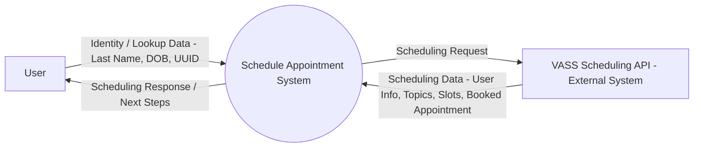
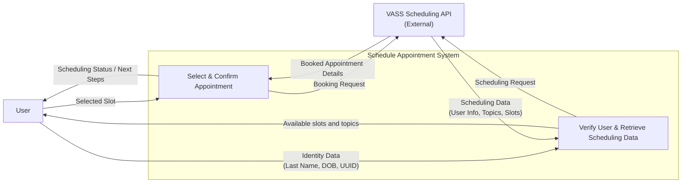
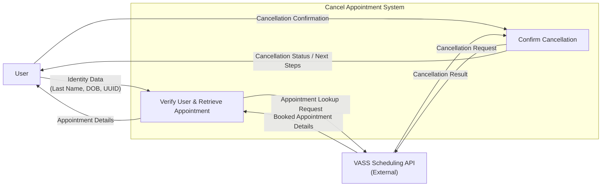
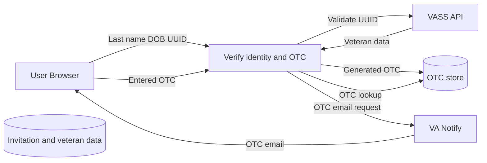

# Context Diagram (Level 0)

```mermaid
flowchart LR
    User["User"] -- "Identity / Lookup Data - Last Name, DOB, UUID" --> Process(("Schedule Appointment System"))
    Process -- Scheduling Request --> VASS["VASS Scheduling API - External System"]
    VASS -- "Scheduling Data - User Info, Topics, Slots, Booked Appointment" --> Process
    Process -- Scheduling Response / Next Steps --> User


```

# Level 1 DFD — Scheduling

```mermaid
flowchart RL
 subgraph Scheduling_System["Schedule Appointment System"]
        P1["Verify User & Retrieve Scheduling Data"]
        P2["Select & Confirm Appointment"]
  end
    User["User"] -- Identity Data<br>(Last Name, DOB, UUID) --> P1
    P1 -- Scheduling Request --> VASS["VASS Scheduling API<br>(External)"]
    VASS -- Scheduling Data<br>(User Info, Topics, Slots) --> P1
    P1 -- Available slots and topics --> User
    User -- Selected Slot --> P2
    P2 -- Booking Request --> VASS
    VASS -- Booked Appointment Details --> P2
    P2 -- Scheduling Status / Next Steps --> User

```
# Level 1 DFD — Cancellation

```mermaid
flowchart LR
    User["User"]
    VASS["VASS Scheduling API<br/>(External)"]

    subgraph Cancellation_System["Cancel Appointment System"]
        P1["Verify User & Retrieve Appointment"]
        P2["Confirm Cancellation"]
    end

    User -->|"Identity Data<br/>(Last Name, DOB, UUID)"| P1
    P1 -->|"Appointment Lookup Request"| VASS
    VASS -->|"Booked Appointment Details"| P1
    P1 -->|"Appointment Details"| User

    User -->|"Cancellation Confirmation"| P2
    P2 -->|"Cancellation Request"| VASS
    VASS -->|"Cancellation Result"| P2
    P2 -->|"Cancellation Status / Next Steps"| User


```
# Level 1 DFD - OTP

```mermaid
flowchart LR
    User["User Browser"]
    VASSAPI["VASS API"]
    VANotify["VA Notify"]

    P1["Verify identity and OTC"]

    D1[("Invitation and veteran data")]
    D2[("OTC store")]

    User -->|Last name DOB UUID| P1
    P1 -->|Validate UUID| VASSAPI
    VASSAPI -->|Veteran data| P1
    P1 -->|Generated OTC| D2
    P1 -->|OTC email request| VANotify
    VANotify -->|OTC email| User

    User -->|Entered OTC| P1
    P1 -->|OTC lookup| D2


```
