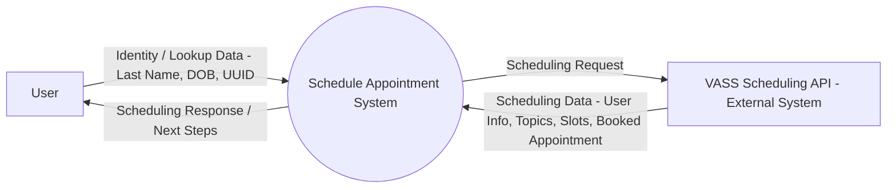
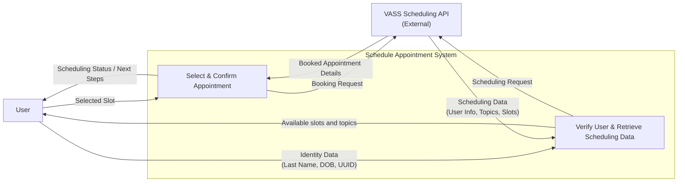
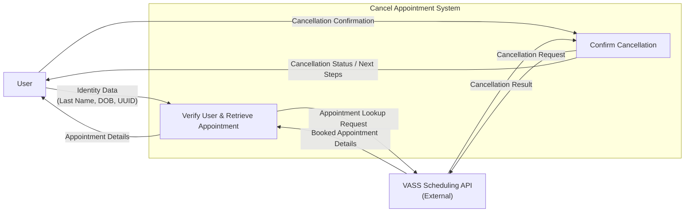
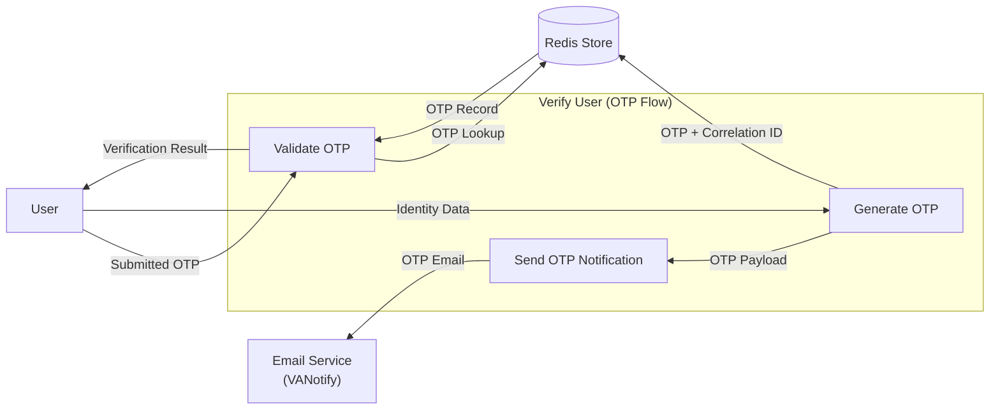

# Data Flow Diagrams
## Context Diagram (Level 0)

    
PNG

    

## Level 1 DFD — Scheduling

    
PNG

    

## Level 1 DFD — Cancellation

    
PNG

    

## Level 2 DFD - OTP

    
PNG

    

---

## Data Collection and Usage

### Data Categories

#### Personal Identifiable Information (PII)
| Data Element | Purpose | Source | Storage Location |
|--------------|---------|--------|------------------|
| Last Name | Identity verification | User input | VASS Backend (permanent) |
| Date of Birth (DOB) | Identity verification | User input | VASS Backend (permanent) |
| Email Address | OTP delivery, notifications | VASS Backend | VASS Backend, VANotify (transient) |
| EDIPI | Veteran identification | VASS Backend | VASS Backend, Redis (1 hour) |

#### Authentication Data
| Data Element | Purpose | Storage | TTL |
|--------------|---------|---------|-----|
| One-Time Passcode (OTP) | Authentication | Redis (hashed temporary) | 10 minutes |
| OAuth Access Token | VASS API authorization | Redis (hashed temporary) | 1 hour |
| JWT Token | vets-api session | Not stored | 1 hour |

#### Application Data
| Data Element | Purpose | Storage | Persistence |
|--------------|---------|---------|-------------|
| UUID | Session identifier, user lookup | Redis, VASS Backend, datadog(logging) | 1 hour |
| appointment_id | Booking reference | Redis (1 hour), VASS Backend | Permanent |
| Appointment slots | Availability data | VASS Backend | Dynamic |
| Topics/Skills | Scheduling categories | VASS Backend | Configuration data |

#### Rate Limiting & Security Data
| Data Element | Purpose | Storage | TTL |
|--------------|---------|---------|-----|
| OTP generation attempts | Rate limiting | Redis | 15 minutes |
| OTP validation attempts | Brute-force prevention | Redis | Session-based |
| Account lockout status | Security enforcement | Redis | 15 minutes |

