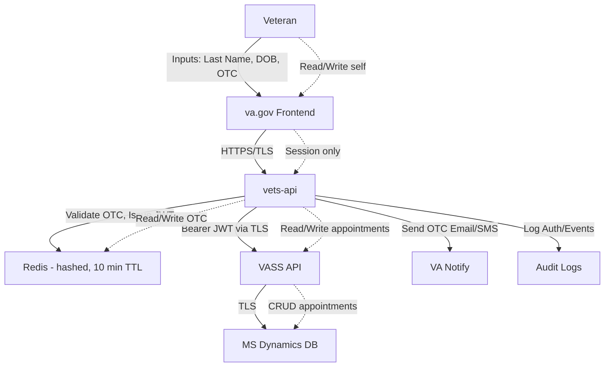

# Data flow diagram

```mermaid
flowchart TD
    Veteran["Veteran"] -->|Inputs: Last Name, DOB, OTC| Frontend["va.gov Frontend"]
    Frontend -->|HTTPS/TLS| VetsAPI["vets-api"]
    VetsAPI -->|Validate OTC, Issue JWT| Redis["Redis - hashed, 10 min TTL"]
    VetsAPI -->|Bearer JWT via TLS| VASSAPI["VASS API"]
    VASSAPI -->|TLS| Dynamics["MS Dynamics DB"]
    VetsAPI -->|Send OTC Email/SMS| VANotify["VA Notify"]
    VetsAPI -->|Log Auth/Events| AuditLog["Audit Logs"]

    %% Data access
    Veteran -.->|Read/Write self| Frontend
    Frontend -.->|Session only| VetsAPI
    VetsAPI -.->|Read/Write OTC| Redis
    VetsAPI -.->|Read/Write appointments| VASSAPI
    VASSAPI -.->|CRUD appointments| Dynamics
```
