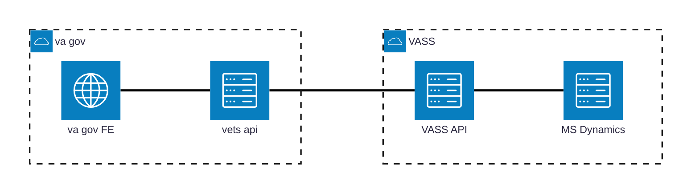

# Architecture

```mermaid
---
config:
      theme: redux
---
architecture-beta 
    group vagov(cloud)[va gov]

    service vetsapi(server)[vets api] in vagov
    service frontend(internet)[va gov FE] in vagov

    frontend:R-- L:vetsapi

    group VASS(cloud)[VASS]

    service msdynamics(server)[MS Dynamics] in VASS
    service vassapi(server)[VASS API] in VASS
    vassapi:R -- L:msdynamics


    vetsapi:R -- L:vassapi
```

