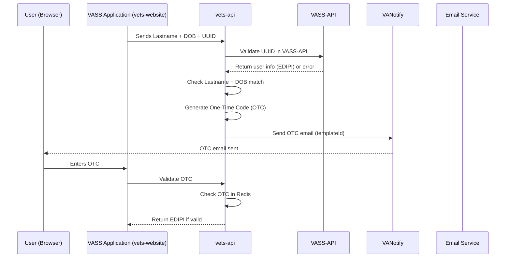

### First touch point (OTC)

``` mermaid
sequenceDiagram
    participant user as User (Browser)
    participant vetsWebsite as VASS Frontend (vets-website)
    participant vetsApi as vets-api
    participant vassBackend as VASS Backend (API + Email)
    participant vaNotify as VANotify

    %% Step 1: Email Invitation
    vassBackend->>user: Sends email invitation with scheduling link (UUID)

    %% Step 2: User validates identity
    user->>vetsWebsite: Opens link, enters last name + date of birth
    Note over user,vassBackend: One-Time Code (OTC) verification flow
    vetsWebsite-->>user: Redirect to scheduling page

    %% Step 3: View available times
    vetsWebsite->>vetsApi: Request appointment availability
    vetsApi->>vassBackend: Fetch available times
    vassBackend-->>vetsApi: Return availability data
    vetsApi-->>vetsWebsite: Return availability
    user->>vetsWebsite: Select preferred time slot

    %% Step 4: Agent skills
    vetsWebsite->>vetsApi: Request agent skills
    vetsApi->>vassBackend: Fetch agent skills
    vassBackend-->>vetsApi: Return agent skills
    vetsApi-->>vetsWebsite: Return agent skills
    user->>vetsWebsite: Select agent skills
    vetsWebsite: Display review page

    %% Step 5: Confirm appointment
    user->>vetsWebsite: Submits appointment (EDIPI)
    vetsWebsite->>vetsApi: Submit appointment request (EDIPI)
    vetsApi->>vassBackend: Save appointment to VASS
    vassBackend->>user: Sends confirmation email (via VANotify)
    vaNotify-->>user: Confirmation email with cancel link
    vassBackend-->>vetsApi: Appointment confirmed

    vetsApi-->>vetsWebsite: Return appointment confirmation
    vetsWebsite-->>user: Display confirmation message
### Cancellation

``` mermaid
sequenceDiagram
    participant U as User (Browser)
    participant F as VASS Application (vets-website)
    participant V as vets-api
    participant S as VASS-API
    participant N as VANotify
    participant E as Email Service(VASS)

    %% Step 1: Confirmation Email
    E->>U: Confirmation with cancel link (UUID)

    %% Step 2: User validates identity
    U->>F: Opens link, enters Lastname + DOB
    Note over U,E: OTC flow (details below)
    F-->>U: Proceed to cancellation page

    %% Step 4: Cancellation Flow
    F->>V: Request appointment details
    V->>S: Get appointment details
    S-->>V: Return appointment details
    V-->>F: Return appointment details
    U->>F: Click cancel button

    %% Step 5: Confirm Cancelled Appointment
    F->>V: Submit appointment id appointment with (EDIPI)
    V->>S: Cancel appointment
    S-->>V: Appointment cancellation confirmed
    V->>N: Send confirmation email (templateId)
    N-->>U: Confirmation email with cancelled appointment info and link to reschedule
    V-->>F: Appointment cancellation confirmed

    %% Step 5: If cancel is successful request appointment details again
    F->>V: Request appointment details
    V->>S: Get appointment details
    S-->>V: Return appointment details
    V-->>F: Return appointment details 
    F-->>U: Show appointment details with cancelled message
```

### One Time Code




### Questions:

Are we going to need to send the confirmation emails?
ANSWER: Yes we do


