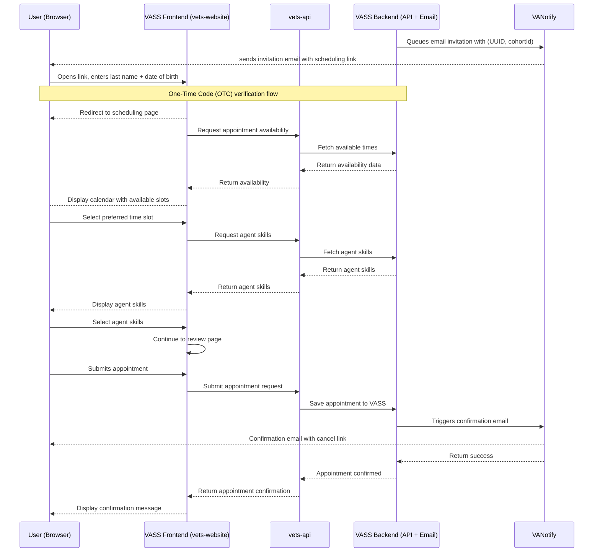
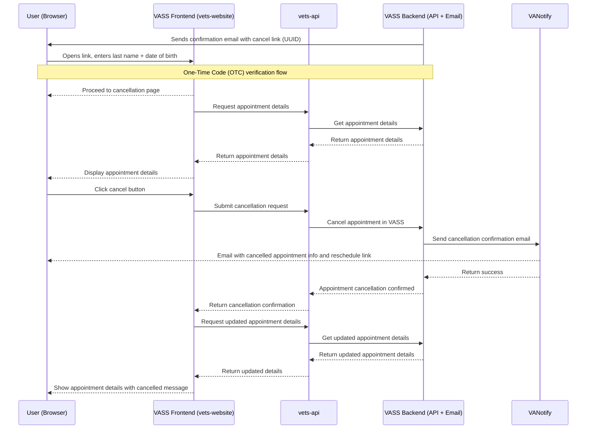
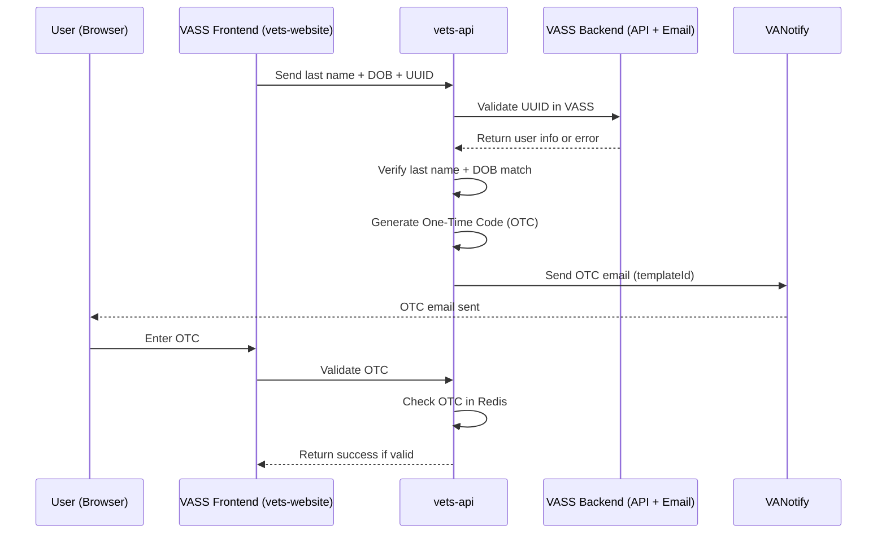

### First touch point

``` mermaid
sequenceDiagram
    participant user as User (Browser)
    participant vetsWebsite as VASS Frontend (vets-website)
    participant vetsApi as vets-api
    participant vassBackend as VASS Backend (API + Email)
    participant vaNotify as VANotify

    %% Step 1: Email Invitation
    vassBackend->>vaNotify: Queues email invitation with (UUID, cohortId)
    vaNotify-->>user: sends invitation email with scheduling link 

    %% Step 2: User validates identity
    user->>vetsWebsite: Opens link, enters last name + date of birth
    Note over user,vassBackend: One-Time Code (OTC) verification flow
    vetsWebsite-->>user: Redirect to scheduling page

    %% Step 3: View available times
    vetsWebsite->>vetsApi: Request appointment availability
    vetsApi->>vassBackend: Fetch available times
    vassBackend-->>vetsApi: Return availability data
    vetsApi-->>vetsWebsite: Return availability
    vetsWebsite-->user: Display calendar with available slots
    user->>vetsWebsite: Select preferred time slot

    %% Step 4: Agent skills
    vetsWebsite->>vetsApi: Request agent skills
    vetsApi->>vassBackend: Fetch agent skills
    vassBackend-->>vetsApi: Return agent skills
    vetsApi-->>vetsWebsite: Return agent skills
    vetsWebsite-->>user: Display agent skills
    user->>vetsWebsite: Select agent skills
    vetsWebsite->>vetsWebsite: Continue to review page

    %% Step 5: Confirm appointment
    user->>vetsWebsite: Submits appointment 
    vetsWebsite->>vetsApi: Submit appointment request
    vetsApi->>vassBackend: Save appointment to VASS
    vassBackend->>vaNotify: Triggers confirmation email
    vaNotify-->>user: Confirmation email with cancel link
    vaNotify-->>vassBackend: Return success
    vassBackend-->>vetsApi: Appointment confirmed

    vetsApi-->>vetsWebsite: Return appointment confirmation
    vetsWebsite-->>user: Display confirmation message
```
### Cancellation

``` mermaid
sequenceDiagram
    participant user as User (Browser)
    participant vetsWebsite as VASS Frontend (vets-website)
    participant vetsApi as vets-api
    participant vassBackend as VASS Backend (API + Email)
    participant vaNotify as VANotify

    %% Step 1: Confirmation Email
    vassBackend->>user: Sends confirmation email with cancel link (UUID)

    %% Step 2: User validates identity
    user->>vetsWebsite: Opens link, enters last name + date of birth
    Note over user,vassBackend: One-Time Code (OTC) verification flow
    vetsWebsite-->>user: Proceed to cancellation page

    %% Step 3: Retrieve appointment details
    vetsWebsite->>vetsApi: Request appointment details
    vetsApi->>vassBackend: Get appointment details
    vassBackend-->>vetsApi: Return appointment details
    vetsApi-->>vetsWebsite: Return appointment details
    vetsWebsite-->>user: Display appointment details
    user->>vetsWebsite: Click cancel button

    %% Step 4: Cancel appointment
    vetsWebsite->>vetsApi: Submit cancellation request
    vetsApi->>vassBackend: Cancel appointment in VASS
    
    vassBackend->>vaNotify: Send cancellation confirmation email
    vaNotify-->>user: Email with cancelled appointment info and reschedule link
    vaNotify-->>vassBackend: Return success
    vassBackend-->>vetsApi: Appointment cancellation confirmed
    vetsApi-->>vetsWebsite: Return cancellation confirmation

    %% Step 5: Refresh appointment details
    vetsWebsite->>vetsApi: Request updated appointment details
    vetsApi->>vassBackend: Get updated appointment details
    vassBackend-->>vetsApi: Return updated appointment details
    vetsApi-->>vetsWebsite: Return updated details
    vetsWebsite-->>user: Show appointment details with cancelled message

```

### One Time Code

```mermaid
sequenceDiagram
    participant user as User (Browser)
    participant vetsWebsite as VASS Frontend (vets-website)
    participant vetsApi as vets-api
    participant vassBackend as VASS Backend (API + Email)
    participant vaNotify as VANotify

    %% Step 1: Request One-Time Code (OTC)
    vetsWebsite->>vetsApi: Send last name + DOB + UUID
    vetsApi->>vassBackend: Validate UUID in VASS
    vassBackend-->>vetsApi: Return user info or error
    vetsApi->>vetsApi: Verify last name + DOB match
    vetsApi->>vetsApi: Generate One-Time Code (OTC)
    vetsApi->>vaNotify: Send OTC email (templateId)
    vaNotify-->>user: OTC email sent

    %% Step 2: User enters OTC
    user->>vetsWebsite: Enter OTC
    vetsWebsite->>vetsApi: Validate OTC
    vetsApi->>vetsApi: Check OTC in Redis
    vetsApi-->>vetsWebsite: Return success if valid
```

