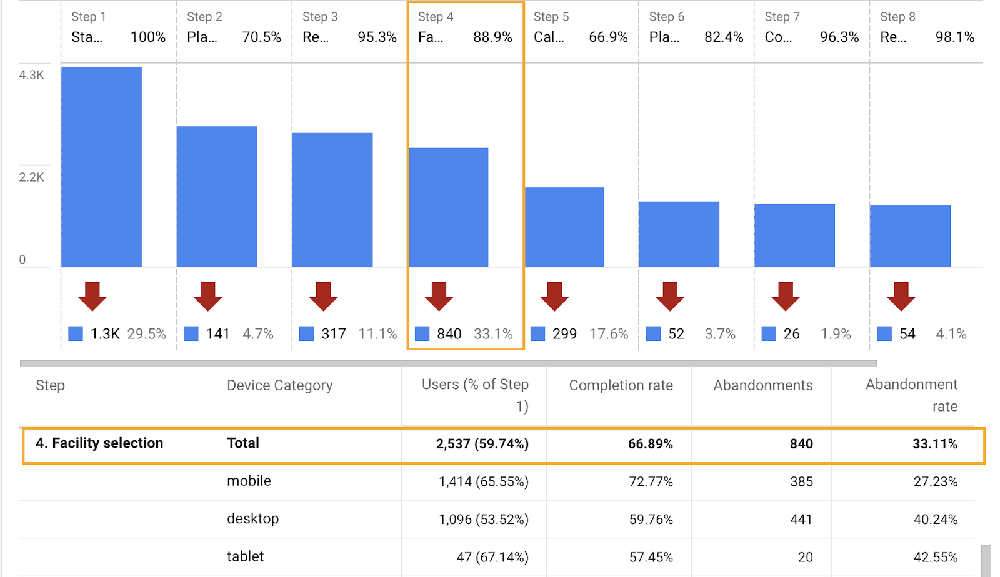
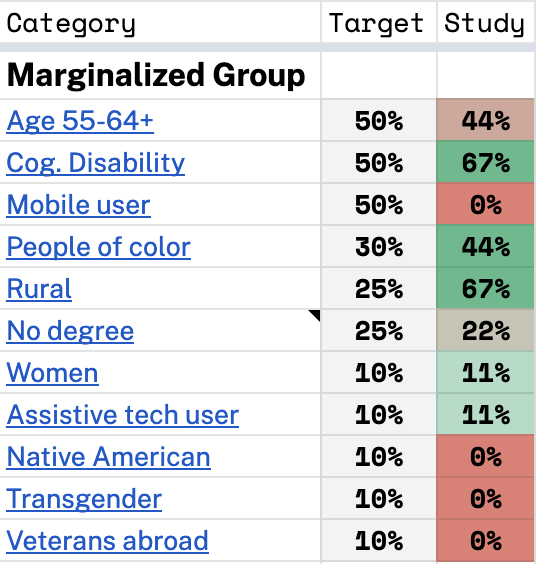
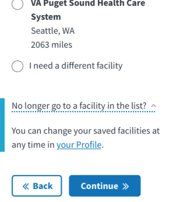
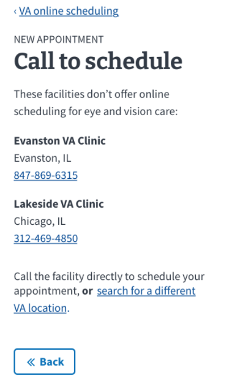
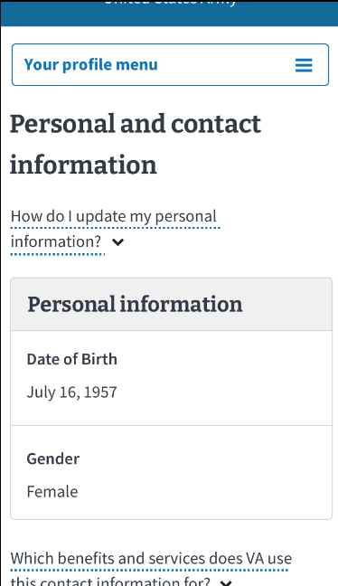

# Veteran preferred facilities research report

A collaborative study by VAOS (Peter Russo, peter.russo@adhocteam.us) and VSA, Authenticated Experience (Liz Lantz, liz.lantz@adhocteam.us), 07/01/2021

View the [research plan](research-plan.md) and [conversation guide](conversation-guide.md).

## Research Goals

Through this research, we sought to learn more about the Veteran mental model around scheduling and their registered health facilities, as well as evaluate the usability of a prototype that would allow Veterans to manage their health facilities. 

The overall VAOS product goal for this work is to improve completion of the VA facility selection step. The abandonment rate for the VA facility selection page is consistently the highest in the VAOS appointment request flow. This page shows every VA facility where a Veteran has registered for care, and includes many that a Veteran has previously visited but where they no longer receive care.   

We believe that if we surface only the facilities where the Veteran currently receives care, they will be able to find relevant facilities more easily and improve their chances of completing this step in the process.  

  

*Above: Chart showing facility selection page has the highest abandonment rate (33.11%) in the VAOS scheduling flow (data from request flow, April 1, 2021 - June 22, 2021)*

## Methodology  

We asked 8 Veterans how they currently select health care facilities, and had them complete tasks in a mobile InVision prototype that we expected would allow them schedule at their current facilities faster without sorting through facilities that weren't relative to them.

For the prototype test, we split our eight veterans into two groups so we could test different scenarios for wayfinding and setting preferences:  

In scenario 1 ([view prototype](https://adhoc.invisionapp.com/console/share/BX2JRZTUR2/621669675)), we asked participants to navigate to the profile from the VAOS facility page to manage their current facilities, then return to VAOS to finish scheduling their appointment. 

<video src="images/preferred-facility-prototype-scenario-1.mp4" controls title="Scenario 1 prototype video"></video>

[Video of scenario 1](images/preferred-facility-prototype-scenario-1.mp4)

In scenario 2 ([view prototype](https://adhoc.invisionapp.com/console/share/B72LX6SPTP/633532185)), we asked participants to save their facilities in VAOS, directly after the facility page 2. Then, at the end of the scheduling flow, we asked them to navigate to the profile to manage their current facilities.  

<video src="images/preferred-facility-prototype-scenario-2.mp4" controls title="Scenario 2 prototype video"></video>

[Video of scenario 2](images/preferred-facility-prototype-scenario-2.mp4)

The rest of the tasks were the same for both scenarios:

* Edit current VA health facilities in the profile
* Schedule an appointment when your saved/current facility does not offer online scheduling
* Find your list of facilities from the VA.gov home page   

## Participant demographics  

| Scenario | Gender | Ethnicity                                                    | Age   | Education                                                    | Branch       | Location |
| -------- | ------ | ------------------------------------------------------------ | ----- | ------------------------------------------------------------ | ------------ | -------- |
| 1        | Male   | White or Caucasian                                           | 45-54 | Master's degree                                              | Marine Corps | TN       |
| 1        | Male   | Hispanic, Latino, or Spanish Origin, Black or African American | 35-44 | Master's degree                                              | Army         | PR       |
| 2        | Male   | White or Caucasian                                           | 65-74 | Associate's degree / trade certificate / vocational training | Army         | MD       |
| 2        | Male   | White or Caucasian                                           | 65-74 | Master's degree                                              | Coast Guard  | OK       |
| 2        | Female | White or Caucasian                                           | 65-74 | Master's degree                                              | Marine Corps | IN       |
| 1        | Male   | White or Caucasian                                           | 45-54 | Master's degree                                              | Army         | KY       |
| 1        | Male   | Hispanic, Latino, or Spanish Origin, Black or African American | 25-34 | Some college (no degree)                                     | Army         | MD       |
| 1        | Male   | Hispanic, Latino, or Spanish Origin, Black or African American | 35-44 | Some college (no degree)                                     | Army         | CT       |
| 2        | Male   | Hispanic, Latino, or Spanish Origin                          | 55-64 | Associate's degree / trade certificate / vocational training | Army         | NM       |

This study may not meet the needs of the following marginalized Veteran groups:

- Age 55-64+
- Mobile users
- Native American
- Transgender
- Veterans Abroad

## Key Findings

Findings are organized around 3 common themes we identified in our analysis:

**Participant expectations and preferences when choosing care at a VA facility:**

1. When choosing care, participants wanted to know what was nearby, more than where they were registered.
2. Participants saw registration as a step in the process to receiving care; not a tool for finding facilities.
3. Participants expected that all VA clinics should be able to easily access their VA medical information.
4. Half of the participants preferred to schedule appointments through a combination of secure messenger and in person.
5. 7 of 8 participants shared a negative perception of calling the VA.

**Usability of the prototype:**

1. Participants easily completed most tasks, but it was not intuitive that they needed to go between VAOS and profile to do so. 
2. No participant was able to find the list of facilities in the profile when starting from the VA.gov homepage without guidance. 
3. In the VAOS facility list view, the content and functionality for the “How do I remove a facility from my list” additional info component didn't align with participant expectations. 
4. Participants clearly understood that they couldn't schedule online at every facility, but they weren't confident as to why. 
5. 6 of 8 participants had a hard time using the profile mobile menu.
6. Participants shared other points of feedback for consideration around the UI and content.

**Findings on value:**

1. Most participants saw value in being able to save facilities to refine scheduling options, send secure messages to their provider, or for travel purposes.
2. Some participants explained it would be better if the process required less work for the Veteran.
3. Seeing recently visited facilities was useful for recognizing the facilities, not for speeding up the scheduling process.

## Participant expectations and preferences when choosing care at a VA facility

### When choosing care, participants wanted to know what was nearby, more than where they were registered.

While this study was too small to answer this question for the broader Veteran population, we did get insight into how our participants choose where they receive care.

#### Health care decisions start and end with their primary care provider (PCP). 

Many participants said that when they need new care they work with their PCP who provides referrals and authorizations to see specialists or community care providers. They prefer to go to only these authorized providers because they feel it ensures their PCP is communicating with these providers, and that costs will be covered by VA health care. 

The most common reason participants went to a facility other than where their PCP practiced is because they needed specialty care, such as a CPAP clinic, or needed to have tests done. 2 participants reported that they received referrals to other providers when appointments were available sooner at another facility. 

#### Once they've established care, participants reported clear preferences for how they choose facilities.

Especially when choosing between VA and civilian care, they considered these factors:

* Ease of access - distance to facility
* How urgent their need is
* Whether they believe they can receive quality care at the facility
* Familiarity with the provider

Participants would make trade-offs depending on the options available. Some may drive further for higher quality care, or a familiar provider, for example.

#### Geographic location is a primary factor for participants when looking for care

> "It's mostly a matter of convenience to go locally. If we have to go to the VA facility downtown, it's about a 1/2 hour away. The other ones are 20-30 minutes. Or I can go to the local doctor that is 5 minutes away - if something more serious happens we can get there quickly." - P6

7 of 8 participants assumed the facilities were in their list because of proximity to their home address. In VAOS and profile, participants expected to be able to see facilities that were close to them, regardless of whether they'd been there before.

3 participants presumed that the list of facilities was based on a mileage radius from their home address that they would be able to change. 2 expected this while looking at the list in VAOS, the other while looking at the profile list.

### Participants saw registration as a step in the process to receiving care; not a tool for finding facilities

For the most part, participants reported that they didn't find it useful to see facilities where they had registered in the past and no longer receive care. 

> Moderator: Would it be useful for you to know where you are registered to receive care?
>
> P13: I would say not really. I think that'd just be added information that wouldn't be necessary. You would think if you're a service connected Veteran you're in the database regardless of where you would go, however they'd track you through your social, you're in there.

When asked to describe the facilities they'd expect to see if the list was based on their own information, they listed facilities near their home, including some that they had never visited. (This assumption also contributed to some people not understanding that the facility list was sorted alphabetically.) No one expected they would see old facilities they had visited in the past.

> "I wouldn't expect to see \[far away facilities\] here. I don't know why I'd want to drive 1,000 miles to a VA facility. If I needed something unique like that I'd expect to go to a little bit of trouble to find it." - P7

3 participants surmised it might be useful to see previously visited facilities in their list if they were traveling back to that area. However, one didn't think this would be helpful because they expected they would need to call any facility in a different network to re-establish care there before scheduling a new appointment online. 

No one had an immediate reason they would need to see this information. Other notes about registration:

* A few understood the Seattle facility was in the list because the Veteran had previously lived there - but didn't think it made sense to see it today.
* One participant had seen their registered facilities in MyHealtheVet and sent secure messages to the wrong provider - they confused the acronym PA with PR.

### Participants expected that all VA clinics should be able to easily access their VA medical information

Participants expect that if they have health care through VA, they can receive health care from any VA facility. They also expect that all VAs will communicate with each other and be able to easily share Veteran data.

Most participants expected to be able to receive care at any VA regardless of where they have been in the past, and understood that a brief registration process (scanning their VA ID card) will be required.

> "If I could just log on to VA.gov and it'd automatically know my facility and I could just schedule just like that, it'd be super easy." - P9

> "I don't know why you really need to register at a new facility since all the VAs are all linked together. In all honesty I think that's a waste of time. Some Veterans would be annoyed...I just see it as an unnecessary step since all the VAs are all linked together." - P11

### Half of the participants preferred to schedule appointments through a combination of secure messenger and in person.

Over the course of the sessions, four participants told us they start with secure messaging their health care provider. There was no common reason as to why they prefer secure messaging, but individual reasons that came up were:

* Easily able to access records of communication
* More convenient and less painful than calling to schedule
* More accessible for those with disabilities:

> "I do better with secure messaging. This way I can see it. With a little bit of hearing loss, I don't always want to be on the phone saying, "Sorry, I didn't hear what you said, Sorry, can you say that again?" It gets annoying for me. I can only imagine what the person on the other end would be thinking." - P11

Half of the participants prefer to make appointments in person. There was no larger theme here, but some unique points included:

* Two mentioned that it was sometimes more convenient to walk in to schedule than call.
* Another said they liked to make their follow-up appointments with the scheduler at the facility right after they completed an appointment.

### 7 of 8 participants shared a negative perception of calling the VA

> "People die on hold when they call the VA. Not from anything but old age." - P1

As we've heard in many previous studies, participants described calling as taking a long time and being inefficient. One participant described lining up multiple activities to do while on hold so they didn't get bored. Another stated:

> "When you call the VA, you're going to listen to a recording that lasts forever, and then it'll tell you this huge address, and most of us, we're uncomfortable anyway; you won't even remember a quarter of it. Then you'll finally get tired and end up wanting to talk to a person. So you'll talk to a VA operator - if you can get through. If they send you to the 800 number, forget it, hang up. \[You'll wait\] forever, or never get through. They say 'call line full.' They haven't \[set up the system\] yet so that, if you don't want to wait in line they can give you a call back." - P13

## Usability of the prototype

### Participants easily completed most tasks, but it was not intuitive that they needed to go between VAOS and profile to do so. 

All participants easily saved a facility in VAOS and modified their facilities in the profile. Participants understood the steps necessary to schedule a new appointment from the VA.gov homepage, and from the VAOS confirmation page. Participants also understood how to edit their facility list in their profile, often editing without prompting.

However, wayfinding between the facility list in VAOS and the profile proved challenging. Across both scenarios we tested, 6 of 8 participants didn’t realize they needed to navigate to profile to edit their facility list. Some that eventually realized it felt that it was an unnecessary extra step. 

> Moderator: Let’s say that for whatever reason you did want to get it off this list, what would you do?
> P11: “I'd [click] ‘no longer go to a facility in the list’ and it would probably show you all of the facilities, and you could check or uncheck it. It would ask if you are sure and see if you really want to delete it, and then you could delete it. *Opens accordion, hovers over continue. Hesitates. Clicks profile.*
> M: It looks like you wanted to hit continue.
> P11: Yeah, instead of doing an extra step, I thought it would automatically pop up to show which ones you don't need, and then you would just be able to check [the facilities]. To me it's just an extra step that you have to go back to go forward to go forward.

*Above: screenshot from prototype showing step in VAOS that sends users to profile to edit their facility list*

Two participants never realized they had gone between two sections of VA.gov. Even after editing their facility list in profile, they thought they were still in the scheduling process:

> "I'm seeing 'profile menu', what do I care about that? I'm going to read a little bit more...it says 'to schedule a health appt online...' I don't understand why it wants me to edit. \[I think this page\] is asking if I want to change my appointment to a different facility. My best guess would be I can't be seen at the first one so I have to go to the next one. I think this screen is leading me down a blind corner and I don't know why I got there." - P13

### No participant was able to find the list of facilities in the profile when starting from the VA.gov homepage without guidance.  

Though all had previously seen and interacted with this list in the profile, all participants stated they would go to the appointment scheduling link on the homepage to find that list again, and had to be guided by the moderator to the personalized menu.   

Once exposed to menu options, 7 of 8 participants weren't confident where to look and had to guess where they might find it. 

- My VA or My Health were the most common guesses.
- Only one participant guessed Profile.  

> "It's not really apparent as to which one of these would show it. I'm just being honest." - P10  

> "I assume My Health has a list of my facilities and in My VA (pauses) they both kind of direct me in the same direction, know what I'm saying? My VA and My Health? Yeah, I'd say one of those two." - P7

We can't be certain where they might have looked if they hadn't first seen the list in VAOS. The fact that the personalized menu was titled "Kim" instead of their name may have also been a contributing factor.  

But even so, participants struggled to come up with a reason they would look for a similar list. A couple participants thought they might use it to start the scheduling process or send a secure message at a particular facility by clicking on the facility name in profile.

### In the VAOS facility list view, the content and functionality for the “How do I remove a facility from my list” additional info component didn't align with participant expectations. 

2 of the 4 participants who saw this expected to be able to select a facility via the radio input in the list, and remove the list within that accordion. One of those participants thought they would be also able to search for a different facility from within that accordion. Both expected to be able to edit the list directly in VAOS.

### Participants clearly understood that they couldn't schedule online at every facility, but they weren't confident as to why. 

> P10: Oh ouch. I'd have to call to schedule that one. It'd be much easier to have the option to \[schedule online\].
> M: Why wasn't your saved facility showing as an option? 
> P10: I was wondering the same thing. I have no idea.

When shown a scenario where they would have to call to schedule, participants understood the facility didn't offer online scheduling, but most weren't sure why not. 

*Above: screenshot of VAOS call to schedule page*

At least one participant thought they had to call because the clinic simply didn't offer the service they were trying to schedule. This caused frustration.

- A few participants indicated they would not select "I need a different facility" the second time. 
- One said they would try to schedule at the facility that was displayed on the previous screen. 
- Another said they go directly to the clinic as a walk-in appointment.

* One participant said specifically that they would have liked to see this information sooner in the scheduling process.

### 6 of 8 participants had a hard time using the profile mobile menu.

Only 2 of 8 participants easily navigated via the profile mobile menu. 

- 2 participants did not see the mobile menu at all.  
- The remaining participants saw it only after scrolling up and down the page multiple times.
- One participant did not realize there was more to profile beyond the page they were looking at (personal and contact information).

> "I saw it \[profile menu, after being guided by moderator\], but I thought it was what I was already looking at below." - P7

*Above: screenshot from prototype of profile mobile menu on profile landing page. Participants needed to open the menu to navigate to their facility list.*

One participant was confused by the profile menu when looking for their list of facilities, even after they had opened it multiple times.

> "There again it's a lot of information I wouldn't need at the moment. And now I'm having to re-study it again, but what I wanted in the first place pretty much isn't there. "- P13

### Participants shared other points of feedback for consideration around the UI and content.

* A few participants didn't like having to select "I need a different facility" multiple times.
* Two participants commented the profile page had too much content, making it difficult to scan.
* One participant expected to pick up in VAOS where they left off on the "Choose facility" page, but it did not cause a major frustration.

## Findings on value

### Most participants saw value in being able to save facilities to refine scheduling options, send secure messages to their provider, or for travel purposes.  

During the study two situations repeatedly came up where changing their preferred facilities would be useful:

1. A Veteran who is seeking health care at their regular clinic.
2. A Veteran who is traveling away from home.

In VAOS, Veterans seeking health care at their regular clinic would find some value limiting their options to clinics they are currently visiting, as it would make their online scheduling process slightly faster. They also had the perception they could search and add other clinics:

> "I like it because it'll keep me updated on the options I have depending on the situation of the treatment that I want. And it also gives me the option of another hospital that I visited. And then if I do have any changes or locations that I want that aren't listed, I can probably do a search and look for a different facility to see what are the different options within my location. So that option is great to know I'm not limited to 1 or 2 options." 

Some participants expected to be able to click on a facility in their profile list and send a secure message directly to that provider, and thought that would be useful.

When a Veteran splits their time between two locations they often have one Primary care doctor at their "home" location, and other doctors at their alternate location. The participants we spoke to who traveled for work, or traveled to different locations for part of the year expected that VA would know about their location preferences and update which facilities are available to them accordingly.  They also stated saving facilities in anticipation of travel would be valuable. It wasn't clear to them why they would only see facilities where they had previously established care.

> \[Anything helpful about what you saw today?\] Yeah, possibly when I travel, it would be useful, because when I'm at home I use the laptop and I don't have to worry about jumping through hoops on the phone and it's easier to print what I need. but if I'm on the road, and I have to find a different facility for some reason, it would be useful. And I travel a lot.

### Some participants explained it would be better if the process required less work for the Veteran.  

> I guess I'd go to edit - \[but this\] should just update once you go to the \[facility\]. It'd be great if these systems communicate with each other once you get established somewhere, and less rely on the Veteran to clear up his own Profile. Cause Vets don't have time. That's why they don't like to do all that. - P9  

It was frustrating to some participants that VA was seemingly asking the Veteran to do work of managing their current facilities, instead of using information VA already presumably had about them. We heard in multiple sessions that participants expect that patient information is shared and accessible across all VA health facilities.  

> Moderator: Would it be useful for you to know where you are registered to receive care?  
> P13: I would say not really. I think that'd just be added information that wouldn't be necessary. You would think if you're a service connected Veteran you're in the database regardless of where you would go.

One participant was annoyed and said they would not spend their time managing their facilities: 

> "Why should a Veteran have to go and do that? I'm not gonna spend my time to update that because it's not really important to me. As long as I can communicate to my primary and I see my primary in there I could care less about the other stuff. - P9

### Seeing recently visited facilities was useful for recognizing the facilities, not for speeding up the scheduling process.

About half of the participants were confused to see recently visited facilities as a separate section in the VAOS facility list. They didn't think that information made sense distinct from the facilities in My VA Health Facilities.  

One participant said it was helpful to know they recently visited a facility because the clinic names were hard to remember - so it would help them recognize that facility to select it.  

One participant mentioned that it wasn't helpful because the list wasn't that long.   

Another was frustrated because it didn't make sense with the process they expected:  

> "If I need to go back \[to a recently visited facility\], that'd be because I have follow-up appointments that were already approved by my primary. Once they send the referral out, like if it's therapy or whatever, she does a consult, I get approved, and I get the initial visit. It usually comes with so many visits. After I use all those appointments I have to go back to my primary.

> "I can't go back to my recently visited, because the doctor needs to know who 'did that work' and they need to reevaluate after. You just can't keep going to new doctors. The doctor here needs to know all the things that are happening." - P9  

## Recommendations

1. We recommend surfacing helpful facility information for the Veteran based on their data, instead of asking them to manually manage facilities in the scheduling flow or their profile.
2. Learn more about how we can support Veterans who have moved or travel regularly.
3. Consider ways to reduce Veteran frustration when calling to schedule.
4. Revisit the design of the profile mobile menu.

### We recommend surfacing helpful facility information for the Veteran based on their data, instead of asking them to manually manage facilities in the scheduling flow or their profile.

While Veterans were able to use the prototype easily, our study reveals that manually updating current facilities does not ease the scheduling process in a meaningful way.  Instead, let’s consider how we might provide Veterans options to contact and schedule appointments with their primary and specialty care providers at key moments in their health care journey:

- When they start scheduling an appointment
- When a Veteran is looking for general information about their health care facilities
- When a Veteran is looking for information about health care in My VA
- At their provider’s office (scheduling annual visits or follow-up appointments)

Also consider showing Veterans how to communicate and schedule with providers that their PCP has given them consults/authorizations/referrals to see. 

The Veterans we spoke to had no expectation of seeing only registered facilities in VAOS, and by asking them to manage the facility list we are actually increasing the cognitive load required to remember to find and update these settings changed during an already stressful time of changing health care providers. As a result, we don’t think it makes sense to forward with designs tested in our study.  

### Learn more about how we can support Veterans who have moved or travel regularly.

Throughout all sessions, participants talked about the importance of location when finding access to care, and many participants cited travel as a potentially valuable use for the prototype they were shown. 

The current tools we offer Veterans to find facilities by particular locations, or define their location have limitations and inconsistencies:

- VAOS offers ability to see facilities near the VA.gov profile home address, or current browser location.
- VA.gov profile offers the ability to define one home address and one mailing address.
- The facility locator offers the ability to search by a manually entered (not saved) location.

We recommend more research in this area to understand how our current tools support the needs of this Veteran population, understand if there are any problems as a result, and identify use cases that offer us an opportunity to provide better support. There’s a specific [program for traveling Veterans](https://www.va.gov/healthbenefits/news/VA_offers_seamless_care_for_traveling_veterans_or_veterans_seeking_care_at_an_alternate_va.asp). We recommend speaking to Veterans in this program, as well as [Veterans living abroad](https://expatresearch.com/files/4915/0501/3576/McNulty_Fisher_Hicks_and_Kane_2014_-_Military_Expatriates-US_Veterans_Living_Abroad_The_Civilian_Lives_of_U.S._Veterans_Part_2.pdf)).

### **Consider ways to reduce Veteran frustration when calling to schedule**.

As we’ve heard in previous research and user feedback, one of the most frustrating situations in VAOS is when we direct the Veteran to call to schedule their appointment because the facility they selected doesn’t support online scheduling. We think the following approaches would improve the Veteran experience when they need to call to schedule:

**Clarify language used to explain why an appointment has to be scheduled over the phone.** Participants were generally confused as to why they couldn’t schedule online with some facilities in the scheduling flow. Consider language that clarifies that they can still schedule other appointments at this facility, just not for the selected type of care. Alternatively, show which care types are available to schedule online at the facility earlier in the flow.

**Consider surfacing facilities that require a Veteran to call earlier in the flow.** Don’t ask Veterans to select “I need a different facility” multiple times to find out that they have to call to schedule. Instead, consider showing Veterans the facilities at which they’ll have to call to get an appointment as early as possible in the scheduling process. 

**Identify the facilities that are the most sought after for online scheduling, but don’t have VA Online Scheduling turned on.** While improving language and interactions will help, this problem will only be solved when most facilities offer online scheduling through VAOS or other channels. Consider gathering data on the facilities that:

- Consistently show up on the facility page before Veterans drop from the scheduling flow at this step.
- Don’t offer online scheduling for the given type of care, so the Veteran has to call to schedule.  
- Use this information to identify any patterns that may exist between facilities that are not commonly available.

### Revisit the design of the profile mobile menu.

Since the majority of participants didn’t intuitively use the profile menu, we recommend evaluating the current design to determine how we might make it easier for Veterans to use.   We might be better off using the existing [side nav component](https://design.va.gov/components/sidenav) (used on benefit hub pages) from our design system, or making changes to our current design.

- Analytics data can be pulled to compare mobile vs desktop usage of profile navigation and identify any discrepancies that may suggest Veterans are having a hard time using it. We can also look at analytics for pages on VA.gov using the side nav component, which has similar but different functionary than our profile mobile menu.
- Our moderated methodology may have impacted participant usage; consider an unmoderated study to evaluate how the 2 side navigation mobile menus works as Veterans go through a natural task.  
- We should look into any research available on the side nav component to see what other teams have learned. This study is the first time this mobile menu pattern has been evaluated, so there isn't anything specific to this component we can refer to.

## Next steps

### Authenticated experience

- Pause FE and design work on adding "Your VA health facilities" to profile.
- Seek to understand if there are other business reasons we should pursue this work.
- Explore ways to improve the profile mobile menu UX.

### VAOS team

-  Determine if we can surface a Veteran's current: 
   -   Primary care **facility**
   -   Primary care **provider or PACT**
-  Improve the UX for selecting how facilities are sorted as a first step toward determining if the sorting options meet user needs.

## Resources

- [VAOS product outline](https://github.com/department-of-veterans-affairs/va.gov-team/blob/master/products/health-care/appointments/va-online-scheduling/README.md)
- [Profile preferred facilities product outline](https://github.com/department-of-veterans-affairs/va.gov-team/blob/master/products/identity-personalization/profile/preferred-facility/README.md)
- [Research plan](research-plan.md)
- [Conversation guide](conversation-guide.md)
- Prototypes
  - [Scenario 1](https://adhoc.invisionapp.com/console/share/BX2JRZTUR2/621669675)
  - [Scenario 2](https://adhoc.invisionapp.com/console/share/B72LX6SPTP/633532185)
- Synthesis Artifacts
  - [Session data](facilities-research-session-data.xlsx)
  - [Affinity Map](https://app.mural.co/t/adhoccorporateworkspace2583/m/adhoccorporateworkspace2583/1623094588406/918ef3279e0fb661409656bdafe06aee2ee098e9)
  - [Presentation (PDF)](preferred-health-facilities-research-report.pdf)
