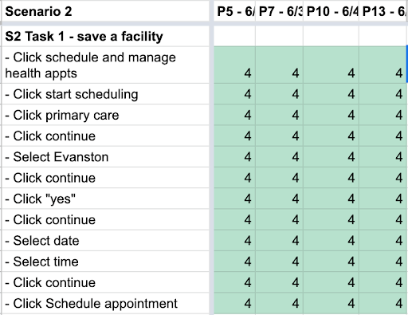
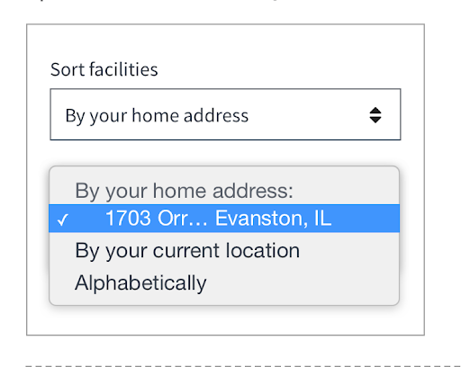
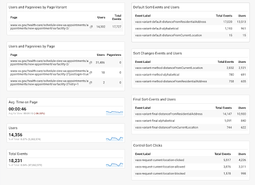

# Facility Selection Variant Test - Research Findings

Lauren Ernest, Product Manager
lauren.ernest@adhocteam.us

Peter Russo, Sr. UX Designer
peter.russo@adhocteam.us

Last update: August 23, 2021

[Slide deck](Sorting%20Facilities%20-%20Variant%20Test%20Report.pdf)

## How this research maps to the Veteran journey

## Problem
The page where Veterans select a VA facility consistently has the highest abandonment rate in the VAOS appointment request flow. 

_Abandonment rate of 27%_

_Data from request flow, April 1 - June 22, 2021_

## Hypothesis
We believe that if we provide simpler interactions and clearer content on the facility selection page, Veterans will be able to more easily understand the task this page is asking them to complete. 

This will help them complete this step: 
- Faster - shorter time spent on page
- More often - lower abandonment rate on page

## Supporting research
“__Content presented the biggest burden to all users.__ Veterans indicated excessive trouble understanding, parsing through, and comprehending the information presented to them. 

“[Veterans] indicated not only was the amount of content a burden, but the variation throughout the content used to describe the same information difficult for them to manage.”

- [VA Online Scheduling: VAOSR and "Express Care" Research Report](https://github.com/department-of-veterans-affairs/va.gov-team/blob/master/products/health-care/appointments/va-online-scheduling/research/july-2020-user-research/2020-july-VAOSR-EC-research-report.md), July 2020
- Showed redesign during the [preferred facilities research sessions](https://github.com/department-of-veterans-affairs/va.gov-team/blob/master/products/health-care/appointments/va-online-scheduling/research/may-2021-facilities-personalization-research/research-findings.md).
- Saw no major pain points around navigating the page.

## OCTO-DE goals this research supports

## Setting up the test
- Dev team built the facility page variation under a feature flag.
- PM set up analytics event labels and created visualizations in GA.
- Analytics team helped troubleshoot some of the visualizations, but setup was mostly self-service.

## Running the test
- Released this variant to 50% of VA.gov users (not VAOS specifically) 
- Test ran for 2 weeks, from July 28 to August 11th.
- Turned the variant off to analyze the data.

## Results

### Participants
- 31,572: Total users in the study 
- 14,355: (45%) Users saw the variant

### Time on page

51 seconds: Avg. for 3mos ahead of test

During test:
- 46 seconds: All users (avg)
- 43 seconds: (-3s) Variant users 
- 49 seconds: (+3s) Control users

### Abandonment
24%: All users (avg) 
18%: (-6%) Variant users 
28%: (+4%) Control users

Note: In the middle of the test we turned on direct scheduling, which resulted in two paths that = completion

#### Abandonment trending higher?

From 8/5 - 8/11, before the variant was released, abandonments were 27%. 

Average for the year has been 26%.

Follow-up research question: Was 28% for the control group part of a trend, or a blip? 

### Note on statistical significance
- Didn't calculate statistical significance for this study.
   - Having two different sample sizes added complexity to the abandonments (or conversions) calc.
   - Unclear how to calculate statistical significance for time on page.
- Goal was to simplify page and “do no harm.”

### Sorting facilities

Sorting in the control

Sorting in the variant

Results (described below)

#### Default sort - variant
As expected, most users saw the list sorted by residential address first.

- By default, the list sorts by closest to home address for both variant and control.
- If no home address is on file, both lists default to alphabetical sort.

Follow-up research: We didn’t set intentional logic for a current location default, so we’re not sure how 15 users ended up in this state (especially since it requires browser permission…)

#### Sorting changes - variant
As expected, **most users who did switch the sort method changed it to current location**.

Roughly the same number of users switched the sorting method to alphabetical and residential address.

####  Final sort - variant

As expected, residential address was the final sort order for most users.

**Alphabetical sort slightly beat out current location.**

Follow-up research: Was alphabetical sort more useful (or usable) than current location? Or, did users just not want to share their location? 

#### Sorting facilities - control

**Twice as many control users attempted to sort by location.**

Control - 4,226 users clicked “sort by current location” 5,517 times

This is higher than the average for the past 4 months, where users have clicked that option 1997 times per week ( ~4000 clicks every two weeks.)

Variant - 2,121 users clicked “sort by current location” 2,832 times
20

Follow-up research:
- Was it easier to find the location option on the control (not in a dropdown)?
- Or, was the variant page easier to understand so fewer Veterans tried that option?

## Next steps
- Track time on page and abandonment for two weeks after the variant is taken down.
- If time on page and abandonment continue pre-test trends, release the updated page.
- Align CC provider selection to facility selection.
In future studies, look at tools for calculating statistical significance.

