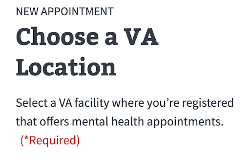
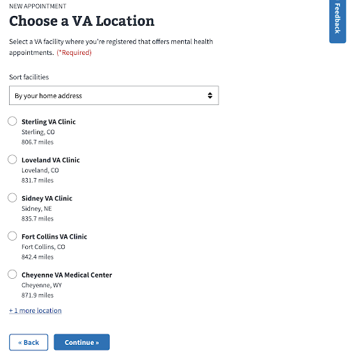
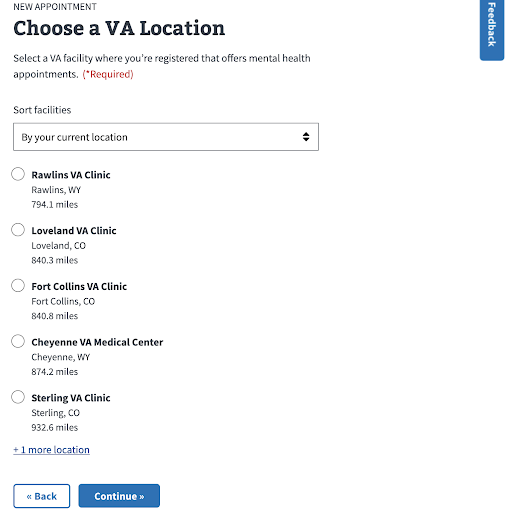
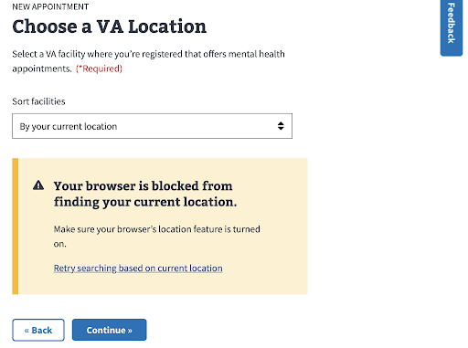
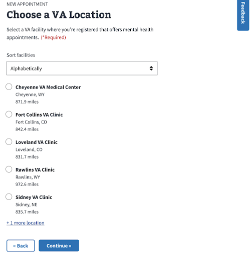

# Research Plan - Facility Selection Variant Test

Peter Russo, Sr. UX Designer
peter.russo@adhocteam.us

Lauren Ernest, Product Manager
lauren.ernest@adhocteam.us

July 27, 2021

[Slide deck](./Variant%20Test%20Overview%20_%20Sorting%20Facilities.pdf)

## Problem
Veterans are more often than not registered at more than one VA facility. It can be confusing for them when they have to select from a list of facilities that they are registered at. The list can be overwhelming and may include facilities they no longer visit to receive care (e.g. moved to another state" /></kbd>.

Currently, in the VA request flow, approximately 74% of users who land on the facility's page move to the next step. We want to raise the completion rate on this page and increase the speed at which those who complete the page move on to the next step.

## Hypothesis
We believe that if we provide simpler interactions and clearer language on the facility selection page, Veterans will be able to more easily understand their options.

- Help them complete the facility selection step more quickly, whether they move on to the next step, or drop-off
- Help them complete the step successfully slightly more often

## Control - Facility Selection Page

### Content

- Heading 1 includes type of care
- Includes Heading 2 for sort type when sorted by home address or current - location
- Body copy describes list
- Additional copy for CTA for 
- Displays home address reference

<kbd><image alt="alt text" width="200" src="images/facility-select-variant-overview.png" /></kbd>

<kbd><image alt="alt text" width="200" src="images/facility-select-variant-overview-1.png" /></kbd>

### Sort by home address
- Default when user has home address in Profile
- Can choose to sort by current location
- Cannot choose to sort alphabetically
- Nearest to farthest from address displayed

<kbd><image alt="alt text" width="400" src="images/facility-select-variant-overview-2.png" /></kbd>

### Sort by current location
- Never a default
- Selection made from sort by home address
- Can choose to sort by home address
- Cannot choose to sort alphabetically
- Nearest to farthest from geolocation

<kbd><image alt="alt text" width="400" src="images/facility-select-variant-overview-3.png" /></kbd>

### Current location blocked
- Alert displays
- Sort remains by home address

<kbd><image alt="alt text" width="400" src="images/facility-select-variant-overview-4.png" /></kbd>

### Sort alphabetically
- Default when user doesn’t have home address in Profile
- Cannot choose another sort option
- A to Z

<kbd><image alt="alt text" width="400" src="images/facility-select-variant-overview-5.png" /></kbd>

## Variant - Facility Selection Page

### Content
- Simplified Heading 1
- Heading 1 doesn’t include type of care
- Simplified intro copy

<kbd></kbd>

### Sort by home address
- Default when user has home address in Profile
- Nearest to farthest from address displayed
- Can choose to sort by current location or alphabetically

<kbd></kbd>

### Sort by current location
- Never a default
- Nearest to farthest from geolocation
- Can choose to sort by home address or alphabetically

<kbd></kbd>

### Current location blocked
- Alert displays
- No results
- Can update browser settings and retry
- Can choose another sort option  

<kbd></kbd>

### Sort alphabetically
- Default when user doesn’t have home address in Profile
- A to Z
- Can choose to sort by current location
- Cannot choose to sort by home address

<kbd></kbd>
