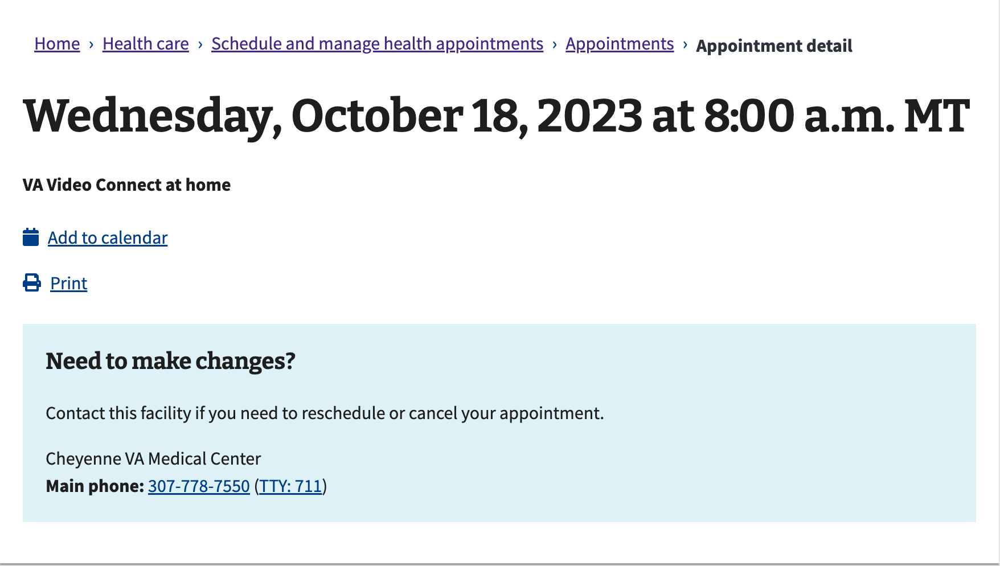

# 2023 Appointments List Screen Reader Usability Research Findings

Office of the CTO - Digital Experience (OCTO-DE), Appointments

Date: 05/31/2023

Ciera Maddox [ciera.maddox@adhocteam.us](mailto:ciera.maddox@adhocteam.us) , Peter Russo [peter.russo@adhocteam.us](mailto:peter.russo@adhocteam.us) 

[Research readout](TODO: link here)]

Jump to:

[Hypotheses and conclusions](#hypotheses-and-conclusions)

[Key findings](#key-findings)

[Recommendations](#recommendations)

[Who we talked to](#who-we-talked-to)

[Further research needed](#further-research-needed)

## Research Goals

Veterans use the Appointments tool on VA.gov  to schedule and manage health care appointments. They might come to this tool to check upcoming appointments, get information about past appointments, or schedule new appointments.

The goals of this research were to: 

* Evaluate screen reader usability and value of the appointment list redesign.
* Improve navigation of the newly updated appointments lists for screenreader users.

However, due to difficulty recruiting screen reader users (detailed in the findings) we were unable to focus on screen reader usability. Instead, we looked at general usability.

## Research Questions

* Does the information for each appointment make sense?
* Can Veterans differentiate between appointments?
* Can Veterans navigate to Past appointments?
* Can Veterans navigate to Pending appointments?
* What would Veterans' next steps be?
* How do Veterans typically manage their appointments?

## Methodology

We conducted hour-long remote moderated research sessions via Zoom from April 4-20, 2023. We used a feature flag to enable the new appointment list for participants, then asked them to log into their account and run through a series of tasks and answer questions about how they manage appointments.

Recruiting challenges made it impossible to speak only to screen reader users. These challenges are detailed in our findings. In the end we were able to test the feature with seven participants, two of which were expert screen reader users. We broadened our goals to focus on general usability instead of screen reader users specifically.

## Hypotheses and Conclusions

**When Veterans use a screen reader on the appointment list, they will be able to easily navigate their appointments.**

_Not enough information._

We were only able to test the feature with 2 expert screen reader users, so we can’t prove this hypothesis for that population. However,  this statement is_ likely true_ from a general sense, as the 7 participants who were able to test the feature found the upcoming and past appointments lists easy to navigate. Pending appointments were a challenge for these participants, all but one of whom had never requested an appointment online.

**When Veterans use a screen reader on the appointment list, they will be able to find the information they need to attend/join their appointments.**

_Not enough information._

For the same reasons as in the first hypothesis, we can’t prove this is true for screen reader users. In a general sense, this hypothesis could be characterized as _maybe true_. When key appointment data was available, like type of care, participants easily understood their appointments. When it was missing, like the details for video appointments, participants were unable to find any information that would help them attend their appointments.

## Key Findings

1. [Recruiting and technical challenges made it difficult to test with screen reader users](#recruiting-and-technical-challenges-made-it-difficult-to-test-with-screen-reader-users)
2. [Participants easily navigated to and understood the upcoming and past appointment lists](#most-participants-easily-navigated-to-and-understood-the-upcoming-and-past-appointment-lists)
3. [Participants struggled to navigate to and understand appointment requests](#participants-struggled-to-navigate-to-and-understand-appointment-requests)
4. [Missing, confusing appointment information makes the lists difficult to use](#missing-confusing-appointment-information-makes-the-lists-difficult-to-use)
5. [Logging in was the biggest navigation challenge for participants](#logging-in-was-the-biggest-navigation-challenge-for-participants)

## Details of Findings

### Recruiting and technical challenges made it difficult to test with screen reader users 

Perigean recruited 12 participants for this study. 2 were no-shows and 1 couldn’t complete the session due to technical issues. In the end we were able to speak to nine who met the screening criteria. Of these:

* Four were screen reader users:
    * Two were not able to test the feature due to login issues. 
    * The other two were advanced screen reader users.
* Five were not users of assistive technology of any kind.

**Recruitment issues**

It was unclear how so many non-screen reader users were able to get through the screener questions, with Perigean confirming over the phone that they use a screen reader. One hypothesis is that by listing specific screen readers in our questions, study participants were able to repeat those back instead of volunteering them on their own. 

One participant told us a family member used a screen reader, and he was joining the test because of his experience helping her.

**Technical issues**

2 of the 3 participants who couldn’t log in were using screen readers.  For the 1 who was not using a screen reader, the facilitator was able to share their screen while that participant drove. This points to a bias toward non-AT users in our testing methodology, since we had a pivot for sighted participants, but nothing for screen reader users.  

Though they couldn’t access the feature, we included these participants' feedback about login and general comments on managing appointments in these findings.

**How this affected the study**

In the end we were able to test the feature with 7 participants. While we were unable to validate our original hypotheses, which were centered on screen reader users, these 7 participants provided enough data to answer our usability questions generally. 

#### Breakdown of participants who were able to test the feature, and used screen readers

<table>
  <tr>
   <td colspan="7" ><strong>Able to test feature</strong>
   </td>
   <td colspan="2" ><strong>Couldn't access feature</strong>
   </td>
  </tr>
  <tr>
   <td colspan="2" ><strong>Screen reader user</strong>
   </td>
   <td colspan="5" ><strong>Not a screen reader user</strong>
   </td>
   <td colspan="2" ><strong>Screen reader user	</strong>
   </td>
  </tr>
  <tr>
   <td><strong>P09</strong>
   </td>
   <td><strong>P12</strong>
   </td>
   <td><strong>P01</strong>
   </td>
   <td><strong>P02</strong>
   </td>
   <td><strong>P04</strong>
   </td>
   <td><strong>P05</strong>
   </td>
   <td><strong>P07</strong>
   </td>
   <td><strong>P03</strong>
   </td>
   <td><strong>P11</strong>
   </td>
  </tr>
</table>

### Participants easily navigated to and understood the upcoming and past appointment lists

All but 1 participant easily found and understood the upcoming and past appointments lists. 

* All participants were able to recognize appointments in the lists and understand the information that was presented.
* One screen reader did not announce the date and time information. The participant was able to find this information in the details link.
* One participant didn’t see the sub-navigation menu. They said that their vision was blurry that day. This may indicate the font was too small to be easily legible.

We saw similar results in an earlier study where we tested a prototype of the list redesign:

* [The appointment list was easy for participants to scan for information](https://github.com/department-of-veterans-affairs/va.gov-team/blob/4698f0f19f26bd512cf8dd1cff578c712d7da3eb/products/health-care/appointments/va-online-scheduling/research/2022-09-appts-list-usability/research-findings.md#1-the-appointment-list-was-easy-for-participants-to-scan-for-information) - 2022-09 Appointments List Usability Study

#### Participant quotes

> “A lot of times you want to see what your future is. But they're all right here for you and at least you know the day and the time and all the information. So I think that's good. From being able to see what's upcoming and past as well. I like the future of seeing all the year or even a certain time frame if you're trying to narrow down your search.” 

— P4

> “The layout of the appointment list, how they have things arranged; all of that is very neat, it's to the point, and it helps the Voiceover to not be jumbled. I'm able to swipe, double-tap, navigate, and hear clearly what I'm tapping on. And if I need to get any further information, you can quickly double-tap the details and it'll let you know everything about that appointment. So everything is clear for a visually impaired person to navigate on an iPhone or on a computer. It's simple, it's straight to the point.” 

— P9, screen reader user

#### Task analysis: navigate to and understand upcoming appointments

*Task: Find the appointments list*

<table>
  <tr>
   <td>
   </td>
   <td><strong>P9</strong>
   </td>
   <td><strong>P12</strong>
   </td>
   <td><strong>P3</strong>
   </td>
   <td><strong>P11</strong>
   </td>
   <td><strong>P1</strong>
   </td>
   <td><strong>P4</strong>
   </td>
   <td><strong>P5</strong>
   </td>
   <td><strong>P2</strong>
   </td>
   <td><strong>P7</strong>
   </td>
  </tr>
  <tr>
   <td>Navigate to appointment list
   </td>
   <td>Success with minor issue
   </td>
   <td>Complete success
   </td>
   <td>N/A
   </td>
   <td>N/A
   </td>
   <td>Complete success
   </td>
   <td>Success with minor issue
   </td>
   <td>Success with minor issue
   </td>
   <td>Complete success
   </td>
   <td>Complete success
   </td>
  </tr>
</table>

*Task: Understand Upcoming Appointments*
<table>
  <tr>
   <td>
   </td>
   <td><strong>P9</strong>
   </td>
   <td><strong>P12</strong>
   </td>
   <td><strong>P3</strong>
   </td>
   <td><strong>P11</strong>
   </td>
   <td><strong>P1</strong>
   </td>
   <td><strong>P4</strong>
   </td>
   <td><strong>P5</strong>
   </td>
   <td><strong>P2</strong>
   </td>
   <td><strong>P7</strong>
   </td>
  </tr>
  <tr>
   <td>Review appointments landing page
   </td>
   <td>Complete success
   </td>
   <td>Success with minor issue
   </td>
   <td>N/A
   </td>
   <td>N/A
   </td>
   <td>Complete success
   </td>
   <td>Complete success
   </td>
   <td>Complete success
   </td>
   <td>Complete success
   </td>
   <td>Success with major issue
   </td>
  </tr>
  <tr>
   <td>Review upcoming appointments list
   </td>
   <td>Complete success
   </td>
   <td>Complete success
   </td>
   <td>N/A
   </td>
   <td>N/A
   </td>
   <td>Complete success
   </td>
   <td>Complete success
   </td>
   <td>Complete success
   </td>
   <td>Complete success
   </td>
   <td>Complete success
   </td>
  </tr>
  <tr>
   <td>Open an appointment details page
   </td>
   <td>Complete success
   </td>
   <td>Complete success
   </td>
   <td>N/A
   </td>
   <td>N/A
   </td>
   <td>Complete success
   </td>
   <td>Complete success
   </td>
   <td>Complete success
   </td>
   <td>Complete success
   </td>
   <td>Complete success
   </td>
  </tr>
</table>

#### Task analysis: navigate to and understand past appointments

*Task: Navigate to Past Appointments*

<table>
  <tr>
   <td>
   </td>
   <td><strong>P9</strong>
   </td>
   <td><strong>P12</strong>
   </td>
   <td><strong>P3</strong>
   </td>
   <td><strong>P11</strong>
   </td>
   <td><strong>P1</strong>
   </td>
   <td><strong>P4</strong>
   </td>
   <td><strong>P5</strong>
   </td>
   <td><strong>P2</strong>
   </td>
   <td><strong>P7</strong>
   </td>
  </tr>
  <tr>
   <td>Navigate back to your appointments
   </td>
   <td>Complete success
   </td>
   <td>Complete success
   </td>
   <td>N/A
   </td>
   <td>N/A
   </td>
   <td>Complete success
   </td>
   <td>Complete success
   </td>
   <td>Failure
   </td>
   <td>Success with major issue
   </td>
   <td>N/A
   </td>
  </tr>
  <tr>
   <td>Click Past link
   </td>
   <td>Complete success
   </td>
   <td>Complete success
   </td>
   <td>N/A
   </td>
   <td>N/A
   </td>
   <td>Complete success
   </td>
   <td>Complete success
   </td>
   <td>Failure
   </td>
   <td>Success with major issue
   </td>
   <td>Complete success
   </td>
  </tr>
</table>

*Task: Understand Past Appointments*
<table>
  <tr>
   <td>
   </td>
   <td><strong>P9</strong>
   </td>
   <td><strong>P12</strong>
   </td>
   <td><strong>P3</strong>
   </td>
   <td><strong>P11</strong>
   </td>
   <td><strong>P1</strong>
   </td>
   <td><strong>P4</strong>
   </td>
   <td><strong>P5</strong>
   </td>
   <td><strong>P2</strong>
   </td>
   <td><strong>P7</strong>
   </td>
  </tr>
  <tr>
   <td>Review past appointments list
   </td>
   <td>Complete success
   </td>
   <td>Complete success
   </td>
   <td>N/A
   </td>
   <td>N/A
   </td>
   <td>Complete success
   </td>
   <td>Complete success
   </td>
   <td>Complete success
   </td>
   <td>Complete success
   </td>
   <td>Complete success
   </td>
  </tr>
  <tr>
   <td>Open a details page
   </td>
   <td>Complete success
   </td>
   <td>Complete success
   </td>
   <td>N/A
   </td>
   <td>N/A
   </td>
   <td>Complete success
   </td>
   <td>Complete success
   </td>
   <td>Complete success
   </td>
   <td>Complete success
   </td>
   <td>Complete success
   </td>
  </tr>
</table>

### Participants struggled to navigate to and understand appointment requests

3 participants were able to view requests - two of these because the facilitator was able to share demo data. The other participant submitted their first appointment request during the session. The rest of the participants were only able to view the empty state, not the requests.

4 participants were unable to find the link to appointment requests without help from the study facilitator.  None of those had previously requested an appointment. 

When prompted to look for pending appointments, 4 participants started by searching for Secure Messaging. There was a strong association between sending a request via secure messaging and sending an appointment request.

Only 1 participant clearly confirmed that they had requested appointments before. They stopped requesting appointments because  the facility never responded to their requests.  They were able to comment on the requests page when the  facilitator demo data, and the participant’s response was positive, saying it should be the standard for the rest of the pages because it contained the right data (see quote).

#### Related past studies

Confusion about appointment requests has been a theme in past studies:

* [The term “pending” was confusing for some participants](https://github.com/department-of-veterans-affairs/va.gov-team/blob/4698f0f19f26bd512cf8dd1cff578c712d7da3eb/products/health-care/appointments/va-online-scheduling/research/2022-09-appts-list-usability/research-findings.md#1-the-term-pending-was-confusing-for-some-participants), Appointments List Usability Study, 09-2022
* [Some participants found the word “Pending” confusing in the concept](https://github.com/department-of-veterans-affairs/va.gov-team/blob/52460de0c1639959c8b933ae75a8a931a36aa0d2/products/health-care/appointments/va-online-scheduling/research/2022-01-mhv-and-vaos-appts-list-discovery/research-findings.md#some-participants-found-the-word-pending-confusing-in-the-concept), MHV and VAOS Appointments List Study, 01-2022
* [Participants need feedback that their request was received, and expect a call back within 1-2 days](https://github.com/department-of-veterans-affairs/va.gov-team/blob/c9aa60340a018268e81f679627e6dd4ea2513e22/products/health-care/appointments/va-online-scheduling/research/2021-11-request-clarification-research/research-findings.md#participants-need-feedback-that-their-request-was-received-and-expect-a-call-back-within-1-2-days) - Request Clarification Study, 11-2021
* [Appointment requests continue to create confusion](https://github.com/department-of-veterans-affairs/va.gov-team/blob/4698f0f19f26bd512cf8dd1cff578c712d7da3eb/products/health-care/appointments/va-online-scheduling/research/2021-01-appts-list-test/research-findings.md#appointment-requests-continue-to-create-confusion) - Appointments List Usability Study, 01-2021
* “...**some participants did not understand they were requesting an appointment** until close to the end of the prototype. When they did realize this, they were frustrated, indicating that they would prefer to schedule over the phone because it’s faster.” -  [Community Care Provider Selection Usability Study](https://github.com/department-of-veterans-affairs/va.gov-team/blob/4698f0f19f26bd512cf8dd1cff578c712d7da3eb/products/health-care/appointments/va-online-scheduling/research/2020-10-cc-provider-selection-usability/research-findings.md#L82), 10-2020
* “Veterans stated a significant frustration upon initiating scheduling a request in VAOSR, only to learn and/or realize after interacting with VAOSR that the tool does not *actually* complete the scheduling request.” - [VAOS MVP and Express Care User Research](https://github.com/department-of-veterans-affairs/va.gov-team/blob/c9aa60340a018268e81f679627e6dd4ea2513e22/products/health-care/appointments/va-online-scheduling/research/2020-07-vaos-mvp-and-express-care-user-research/research-findings.md#L67), 07-2020

#### Participant quotes

> "I'm sorry I don't use online that much. I think it should just be scheduled. If it needs to be rescheduled or canceled, that makes sense, but it shouldn't be pending. I've never seen that before. I wouldn't have a pending like that. Because it's showing 13 pending appointments. That don't make sense to me"

— P2 (Facilitator shared list on staging).

> "The pending appointments should be the kind of standard I'm looking for. You know you've got the clinic to the left in this case Podiatry and then you got community care then the doctor's name and then details. That's actually perfect because obviously the difference would be when it's an upcoming it would have a date but the way this is set up is perfect. Honestly. It gives you a much more comprehensive picture of everything."

— P7

#### Task analysis: navigate and understand pending appointments

*Task: Navigate to Pending Appointments*
<table>
  <tr>
   <td>
   </td>
   <td><strong>P9</strong>
   </td>
   <td><strong>P12</strong>
   </td>
   <td><strong>P3</strong>
   </td>
   <td><strong>P11</strong>
   </td>
   <td><strong>P1</strong>
   </td>
   <td><strong>P4</strong>
   </td>
   <td><strong>P5</strong>
   </td>
   <td><strong>P2</strong>
   </td>
   <td><strong>P7</strong>
   </td>
  </tr>
  <tr>
   <td>Find Pending link
   </td>
   <td>Failure
   </td>
   <td>Complete success
   </td>
   <td>N/A
   </td>
   <td>N/A
   </td>
   <td>Failure
   </td>
   <td>Success with minor issue
   </td>
   <td>Failure
   </td>
   <td>Failure
   </td>
   <td>Complete success
   </td>
  </tr>
  <tr>
   <td>Navigate to pending appointments list
   </td>
   <td>Failure
   </td>
   <td>Complete success
   </td>
   <td>N/A
   </td>
   <td>N/A
   </td>
   <td>Failure
   </td>
   <td>Success with minor issue
   </td>
   <td>Failure
   </td>
   <td>Failure
   </td>
   <td>Complete success
   </td>
  </tr>
</table>

*Task: Understand Pending Appointments*
<table>
  <tr>
   <td>
   </td>
   <td><strong>P9</strong>
   </td>
   <td><strong>P12</strong>
   </td>
   <td><strong>P3</strong>
   </td>
   <td><strong>P11</strong>
   </td>
   <td><strong>P1</strong>
   </td>
   <td><strong>P4</strong>
   </td>
   <td><strong>P5</strong>
   </td>
   <td><strong>P2</strong>
   </td>
   <td><strong>P7</strong>
   </td>
  </tr>
  <tr>
   <td>Review pending appointments list
   </td>
   <td>N/A
   </td>
   <td>N/A
   </td>
   <td>N/A
   </td>
   <td>N/A
   </td>
   <td>Success with major issue
   </td>
   <td>N/A
   </td>
   <td>N/A
   </td>
   <td>Success with major issue
   </td>
   <td>Complete success
   </td>
  </tr>
  <tr>
   <td>Open a details page
   </td>
   <td>N/A
   </td>
   <td>N/A
   </td>
   <td>N/A
   </td>
   <td>N/A
   </td>
   <td>Complete success
   </td>
   <td>N/A
   </td>
   <td>N/A
   </td>
   <td>Complete success
   </td>
   <td>Complete success
   </td>
  </tr>
  <tr>
   <td>Q. Do they have any pending appointments?
   </td>
   <td>No
   </td>
   <td>No
   </td>
   <td>N/A
   </td>
   <td>N/A
   </td>
   <td>Yes, after submitting a request during session
   </td>
   <td>No
   </td>
   <td>No
   </td>
   <td>Yes (viewed on staging)
   </td>
   <td>Yes (viewed on staging)
   </td>
  </tr>
  <tr>
   <td>Q. Have they requested appointments before?
   </td>
   <td>Unclear
   </td>
   <td>No
   </td>
   <td>
   </td>
   <td>
   </td>
   <td>No
   </td>
   <td>Unclear
   </td>
   <td>No
   </td>
   <td>No
   </td>
   <td>Yes
   </td>
  </tr>
</table>

### Missing, confusing appointment information makes the lists difficult to use

While participants were able to understand appointment information that they were provided, they pointed out some information that was clearly missing:

* As we’ve heard in many other studies, participants needed **type of care**  to understand their appointments. They also noted:
    * Clinic name and physical location
    * Provider name
* When appointments are missing this information they can be very difficult to identify in the list, especially past appointments.
* Missing appointments also create challenges. Participants said they trust the list less when it doesn’t represent a full picture of their appointments, and tend not to use it as a source of truth. They call the facility instead.
* 3 participants had video appointments that were missing almost all details information. Even the instructions dropdown, when clicked, was empty.

Additionally, participants noted some information was confusing:

* When clinic names looked like a code full of acronyms.
* Staff-entered data under the “You shared these reasons about your concern” field.
* 1 participant had 3 duplicate community care appointments. We couldn’t contact after the session to troubleshoot the issue.

#### Related past studies

* [Participants wanted to be able to easily differentiate between appointments](https://github.com/department-of-veterans-affairs/va.gov-team/blob/52460de0c1639959c8b933ae75a8a931a36aa0d2/products/health-care/appointments/va-online-scheduling/research/2022-01-mhv-and-vaos-appts-list-discovery/research-findings.md#participants-wanted-to-be-able-to-easily-differentiate-appointments-in-vaos) - MHV and VAOS Appointments List Study, 01-2022
    * Top requests from this study:
        * 7/9 Type of care
        * 4/9 Clinic name - as it is called at the VA facility.
        * 2/9 Whether the appointment was for, or connected to, labs.
* [Clinic names confused participants](https://github.com/department-of-veterans-affairs/va.gov-team/blob/52460de0c1639959c8b933ae75a8a931a36aa0d2/products/health-care/appointments/va-online-scheduling/research/2022-01-mhv-and-vaos-appts-list-discovery/research-findings.md#clinic-names-confused-participants) - MHV and VAOS Appointments List Study, 01-2022
* Appointments list top requests from the [Request Clarification Study](https://github.com/department-of-veterans-affairs/va.gov-team/blob/c9aa60340a018268e81f679627e6dd4ea2513e22/products/health-care/appointments/va-online-scheduling/research/2021-11-request-clarification-research/research-findings.md#appointment-list-and-details-pages-data), 11-2021:
    * Type of care - 5/8
    * Whether appointment was for labs - 4/8
    * Clinic name - 3/8
    * Clinic location - 3/8
* [Participants need specific information to identify and prepare for their appointments.](https://github.com/department-of-veterans-affairs/va.gov-team/blob/4698f0f19f26bd512cf8dd1cff578c712d7da3eb/products/health-care/appointments/va-online-scheduling/research/2020-10-cc-provider-selection-usability/research-findings.md#participants-need-specific-information-to-identify-and-prepare-for-their-appointments) - Community Care Provider Selection Usability Study, 10-2020
* “include additional details about each appointment, to include: date, provider, location, type of care, status, type of appointment.”  - [VAOS MVP and Express Care User Research](https://github.com/department-of-veterans-affairs/va.gov-team/blob/c9aa60340a018268e81f679627e6dd4ea2513e22/products/health-care/appointments/va-online-scheduling/research/2020-07-vaos-mvp-and-express-care-user-research/research-findings.md#L67), 07-2020

#### Participant quotes and screenshots

> _Facilitator_
> 
> So, thinking about everything you saw today, what were the most confusing things that we looked at?
> 
> _Participant 5_
> 
> Some of the acronyms they use for the clinics.  If you're not familiar with those clinics and you have no idea what you're looking at. And we have a lot of old veterans so you know they have no clue what these acronyms stand for or mean. Let's see. Some people may not know about the PMR initials so it would probably be best to spell it out and then put PMR in parentheses. If I didn't know that I already been seeing PMR pain management then I would have been confused too. Like “what is this for”?

— P5

> _Participant 12 navigates to “share these details about your concern” heading. _
> 
> _Facilitator_
> 
> You did not  enter that information?                
> 
> _Participant 12_
> 
> I don't even know what that is. I don't even know what PID means. So it's probably a code for what the doctor put in. I don't know.

— P12

**Example of a telehealth appointment missing information (from staging)**

> “I mean if you're doing a video connect appointment, this tells you nothing. Who am I meeting with and what's this for? Because there aren't aren't many veterans who come to the VA who aren't there for multiple different appointments for different things.** So this doesn't really help. It gives you the date and time. Those are important. But it kind of needs the five W's. Not just two W's.**” 

— P7

#### Data issues that participants mentioned

<table>
  <tr>
   <td><strong>Data issue</strong>
   </td>
   <td><strong>Number of participants who mentioned the issue (out of 7)</strong>
   </td>
  </tr>
  <tr>
   <td>Type of care missing
   </td>
   <td>5
   </td>
  </tr>
  <tr>
   <td>Staff-entered data in Veteran comments field
   </td>
   <td>4
   </td>
  </tr>
  <tr>
   <td>Video appointments missing data
   </td>
   <td>3
   </td>
  </tr>
  <tr>
   <td>List of appointments is unreliable
   </td>
   <td>3
   </td>
  </tr>
  <tr>
   <td>Clinic name confusing
   </td>
   <td>2
   </td>
  </tr>
  <tr>
   <td>Clinic name missing
   </td>
   <td>2
   </td>
  </tr>
  <tr>
   <td>Clinic physical location missing
   </td>
   <td>2
   </td>
  </tr>
  <tr>
   <td>Provider name missing
   </td>
   <td>2
   </td>
  </tr>
  <tr>
   <td>Duplicate community care appointments
   </td>
   <td>1
   </td>
  </tr>
  <tr>
   <td>Labs information missing
   </td>
   <td>1
   </td>
  </tr>
</table>

### Logging in was the biggest navigation challenge for participants

All but 1 participant experienced difficulties logging in, and 3 could not log in at all.  Some of the issues they encountered when logging in:

* Multi-factor authentication posed the biggest challenge
    * 2 participants didn’t receive an MFA code during the session (1 reported that the code arrived 2.5 hours after the session ended.)
* Validation/verification was confusing, or was considered a frustrating extra step.
* Participants were confused by too many login options.
* One participant, who was a beginner screen reader user, spent 45 minutes attempting to login only to be blocked by a server error.

#### Participant quotes

> _Facilitator_
> 
> As an accessibility advocate where do you encounter the most issues that you've seen, especially with VA.gov?
>
> _Participant 3_
>
> Well first of all just getting into the system. I mean you saw what we just went through. And for those that don't know they give you four different options to login. Why not just have one system? Why do you have to have four different systems?

— P3

> “Unfortunately it's not like one system necessarily reads the other so it makes you sign in twice. That's so weird but it happens all the time.”

— P7

> “I don't normally go through this stuff. Normally I don't check online for anything. This is usually an extra step that you have to go through.  I normally don't go through this step. I'm pretty good at keeping up with my information [without going online]. 

— P2

> “I mean don't get me wrong I know you're trying to keep things secure but I don't need Fort Knox to get into my own stuff.” 

— P12, screen reader user

#### Task analysis: log in

*Task: Log in to VA.gov*
<table>
  <tr>
   <td>
   </td>
   <td>P9
   </td>
   <td>P12
   </td>
   <td>P3
   </td>
   <td>P11
   </td>
   <td>P1
   </td>
   <td>P4
   </td>
   <td>P5
   </td>
   <td>P2
   </td>
   <td>P7
   </td>
  </tr>
  <tr>
   <td><strong>Navigate to VA.gov</strong>
   </td>
   <td>Complete success
   </td>
   <td>Complete success
   </td>
   <td>Complete success
   </td>
   <td>Success with major issue
   </td>
   <td>Complete success
   </td>
   <td>Complete success
   </td>
   <td>Success with minor issue
   </td>
   <td>Complete success
   </td>
   <td>Success with major issue
   </td>
  </tr>
  <tr>
   <td><strong>Log in</strong>
   </td>
   <td>Success with major issue
   </td>
   <td>Success with minor issue
   </td>
   <td>Failure
   </td>
   <td>Failure
   </td>
   <td>Complete success
   </td>
   <td>Success with minor issue
   </td>
   <td>Success with minor issue
   </td>
   <td>Failure
   </td>
   <td>Success with major issue
   </td>
  </tr>
</table>

## Recommendations

### Work with Virtual Care Manager team to fix video care appointments

Veterans need instructions on how to attend their video care appointments, and details about what those appointments are for and where they’re scheduled. The missing data could cause issues with patients missing scheduled telehealth appointments. Work with the VCM team to identify the cause of the missing information.

### Investigate and fix the issue with staff-entered data in “You shared these details about your concern” field

This field is clearly showing incorrect data, as it’s intended to contain only information Veterans share when they schedule or request an appointment. Additionally, staff may not understand that the data they’re entering is being displayed to Veterans. Work with the Appointments BE team to identify the cause of the incorrect information.

### Display type of care for all appointments

Veterans need this information to know what the appointment is for, recognize their past appointments, and find their way once they get to the facility. The appointment lists are not complete without this information. Work with the appointments BE team to show type of care for all appointments.

### Use the word “requests” as the noun, and “pending” or “canceled” as modifiers when describing appointment requests

Change page titles and navigation to refer to “requests”. Use “pending” as a modifier only when differentiating between requests that haven’t been scheduled yet, and those that have been canceled. This, along with the planned content changes to the request flows should help clarify the appointment request process.

### Improve how we communicate appointment requests to Veterans who haven’t requested appointments

Even after clarifying the request language, Veterans who can’t, or don’t, request appointments will not be familiar with the term. It’s confusing and only learnable through going through the request process. The best place to familiarize Veterans with requests is in the request flow. 

* Complete the work to improve content in the VA and CC request flows.
* Add messaging to the empty state explaining what appointment requests are.
* Consider displaying request information in the list only when a Veteran has requested appointments. 

### Continue to improve the semantic layout of the appointments lists

During these sessions it was especially concerning to see one screen reader skip the time information in the first column altogether. While they were able to recover, this should be fixed. 

 Also during the study accessibility experts pointed out that a common navigation tool for screen reader users was not working. If structured properly, screen reader users should be able to navigate by heading.

* Fix the heading structure so the lists are navigable by screen readers when scanning through headings.
* Fix the date/time column so it’s not skipped by screen readers.

### Consider connecting appointments that are requested in Secure Messaging with requests in Appointments

Participants had a strong connection between sending a secure message and appointment requests. Review the flow for requesting appointments through Secure Messaging and consider ways to connect the two.

### During recruitment, don’t prompt specific assistive technology in screener questions or when confirming with participants that they use AT

Instead, ask what they use and record the answer.

### Continue testing on production with Veterans

This surfaced many data issues that we wouldn’t have seen otherwise.

## Next Steps

* We reached out to the Platform Research-ops team to help improve recruitment in future studies. They created a list of effective screener questions, sourced from other studies. 
* We’re also  tracking 17 issues across 3 teams that surfaced during the sessions:

<table>
  <tr>
   <td>
<strong>Issue</strong>
   </td>
   <td><strong>Participant reported</strong>
   </td>
   <td><strong>VFS Team</strong>
   </td>
   <td><strong>How to recreate</strong>
   </td>
   <td><strong>How it's being addressed</strong>
   </td>
   <td><strong>Other notes</strong>
   </td>
  </tr>
  <tr>
   <td>"Something went wrong" error doesn't include a path forward. Should provide link to facility locator.
   </td>
   <td>P04
   </td>
   <td>Appts-FE
   </td>
   <td>
   </td>
   <td>
   </td>
   <td>
   </td>
  </tr>
  <tr>
   <td>Canceled appointments missing print button
   </td>
   <td>P05
   </td>
   <td>Appts-FE
   </td>
   <td>
   </td>
   <td>
   </td>
   <td>
   </td>
  </tr>
  <tr>
   <td>Lists mobile layout broken
   </td>
   <td>P04
   </td>
   <td>Appts-FE
   </td>
   <td>Unknown
   </td>
   <td>N/A
   </td>
   <td>Unable to reproduce, tested on Pixel 7, increased font sizes
   </td>
  </tr>
  <tr>
   <td>Screen reader skipping date info at beginning of row
   </td>
   <td>P12
   </td>
   <td>Appts-FE
   </td>
   <td>
   </td>
   <td>Ticket:<a href="https://app.zenhub.com/workspaces/vaos---productdesign-5fff340c2d80a4000fb6f69c/issues/gh/department-of-veterans-affairs/va.gov-team/57827"> 57287</a>
   </td>
   <td>Participant was likely using NVDA, need to confirm. We've also seen this issue in Talkback. Will address after release with semantic improvements.
   </td>
  </tr>
  <tr>
   <td>Spacing old list (the version currently in prod) is broken
   </td>
   <td>P07
   </td>
   <td>Appts-FE
   </td>
   <td>This was fixed.
   </td>
   <td>Ticket:<a href="https://github.com/department-of-veterans-affairs/va.gov-team/issues/57446"> 57446</a>
   </td>
   <td>Participant was on the network so new feature didn't load - the current prod "grey card style" version did. Spacing was broken on that version
   </td>
  </tr>
  <tr>
   <td>Video connect appointment details - instructions dropdown is present, but empty when it's clicked
   </td>
   <td>P04, 07
   </td>
   <td>Appts-BE
   </td>
   <td>
   </td>
   <td>
   </td>
   <td>
   </td>
  </tr>
  <tr>
   <td>Video connect appointment details page has no data
   </td>
   <td>P04, 07, 12
   </td>
   <td>Appts-BE
   </td>
   <td>
   </td>
   <td>
   </td>
   <td>This also affects the add to calendar ICS file, which shows only the appointment date for these appointments.
   </td>
  </tr>
  <tr>
   <td>Staff-entered data in Veteran comments field
   </td>
   <td>P01, 05, 07, 12
   </td>
   <td>Appts-BE
   </td>
   <td>
   </td>
   <td>Ticket:<a href="https://app.zenhub.com/workspaces/vaos-team-603fdef281af6500110a1691/issues/gh/department-of-veterans-affairs/va.gov-team/58400"> 58400</a>
   </td>
   <td>Ticket is looking into data coming back through Loki to understand which appointment types are displaying staff-entered data.
   </td>
  </tr>
  <tr>
   <td>Type of care missing
   </td>
   <td>Many
   </td>
   <td>Appts-FE+BE
   </td>
   <td>
   </td>
   <td>Ticket:<a href="https://app.zenhub.com/workspaces/vaos-team-603fdef281af6500110a1691/issues/gh/department-of-veterans-affairs/va.gov-team/57255"> 57255</a>
   </td>
   <td>Currently assessing which clinics don't display type of care
   </td>
  </tr>
  <tr>
   <td>Upcoming appointments list showed 3 duplicate community care appointments
   </td>
   <td>P05
   </td>
   <td>Appts-FE+BE
   </td>
   <td>Unknown
   </td>
   <td>Unable to recreate
   </td>
   <td>Unable to recreate, or contact participant for help recreating.
   </td>
  </tr>
  <tr>
   <td>Login (MHV): Forces focus to User ID field
   </td>
   <td>P11
   </td>
   <td>Login
   </td>
   <td>
   </td>
   <td>
   </td>
   <td>Issue for screenreaders, each time page is refreshed, User ID field has focus
   </td>
  </tr>
  <tr>
   <td>Login (MHV): Link to show password is "Show" - doesn't announce what happens when clicked. Easy to click and reveal password.
   </td>
   <td>P11
   </td>
   <td>Login
   </td>
   <td>
   </td>
   <td>
   </td>
   <td>
   </td>
  </tr>
  <tr>
   <td>Login: DS Logon not mobile-friendly
   </td>
   <td>P09
   </td>
   <td>Login
   </td>
   <td>
   </td>
   <td>
   </td>
   <td>Didn't affect this participant, but DS Logon page has to be scrolled left/right to be viewed on mobile
   </td>
  </tr>
  <tr>
   <td>Login: MFA code didn't arrive until hours after test
   </td>
   <td>P09, P03
   </td>
   <td>Login
   </td>
   <td>
   </td>
   <td>
   </td>
   <td>This happened with DS Logon and MHV logins
   </td>
  </tr>
  <tr>
   <td>Login (MHV): Repeated "progress" dots add noise during login.
   </td>
   <td>P03
   </td>
   <td>Login (MHV)
   </td>
   <td>
   </td>
   <td>
   </td>
   <td>each time the participant navigates through the login pages they hit the step process 123 showing which step they're on. This is repeated each time.
   </td>
  </tr>
  <tr>
   <td>My VA misreports unavailable appointments
   </td>
   <td>P05
   </td>
   <td>My VA
   </td>
   <td>
   </td>
   <td>Reported to Authenticated Experience:<a href="https://dsva.slack.com/archives/C909ZG2BB/p1684959925174409"> Slack thread</a>
   </td>
   <td>My VA page said "you don't have appts in the next 30 days" but participant had CC appts

Session was on 04/05 and they had upcoming appts on 05/01
   </td>
  </tr>
  <tr>
   <td>Large icons when CSS doesn't load
   </td>
   <td>P07
   </td>
   <td>Platform Design System
   </td>
   <td>Load appointments list with CSS turned off
   </td>
   <td>TBD
   </td>
   <td>Probably more of a discussion point for platform - should our designs generally work when CSS doesn't load?
   </td>
  </tr>
</table>

## Further research needed

**In future studies, test features with beginner screen reader users**

Expert screen reader users were able to navigate the feature with relative ease. But the 1 beginner screen reader user fought login for 45 minutes, which revealed many issues about that flow.

**In future studies, test  with assistive technology that wasn’t used during this study**

We were only able to see the feature navigated with Voiceover and JAWS. In the future, we’d like to test with participants who use magnification, especially as table-like layouts can be problematic for those groups.

## Appendix

[Research plan](https://github.com/department-of-veterans-affairs/va.gov-team/blob/master/products/health-care/appointments/va-online-scheduling/research/2023-02-appt-list-usability-screenreader/research-plan.md#research-plan-for-vaos-appointments-list-screenreader-usability-test)

[Conversation guide](https://github.com/department-of-veterans-affairs/va.gov-team/blob/master/products/health-care/appointments/va-online-scheduling/research/2023-02-appt-list-usability-screenreader/conversation-guide.md)

[Interview transcripts](https://github.com/department-of-veterans-affairs/va.gov-team-sensitive/tree/master/products/health-care/appointments/research/research-transcripts/transcripts-2023-02-appt-list-usability-screenreader)

## Tools used for Synthesis

[Task tracker spreadsheet](https://github.com/department-of-veterans-affairs/va.gov-team-sensitive/blob/master/products/health-care/appointments/research/research-transcripts/transcripts-2023-02-appt-list-usability-screenreader/2023%20Appt%20list%20redesign%20Screenreader%20task%20tracker.xlsx)

[Equity checker](https://docs.google.com/spreadsheets/d/1pq7TSHZonfpzAQBJj6B2geGHlNUwZEs4DzEvxcRgu0o/edit#gid=2086806454)

## Who we talked to

**We talked to 9 participants.**

Audience segment:	

* Veterans: 	9
* Caregivers: 	1
* Family members of a Veteran: 	3

Gender:	

* Male: 4
* Female: 5
* LGBTQ+: 0
* Transgender: 0
* Nonbinary, gender fluid, gender queer, Two-Spirit (Indigenous only), or another gender beyond man or woman: 0
* Gay, lesbian, or bisexual: 0

Devices used during study:	

* Desktop/laptop: 7
* Tablet: 0
* Smart phone: 	2
* Assistive Technology: 4

Age:	

* 25-34: 1
* 35-44: 3
* 45-54: 1
* 55-64: 3
* 65+: 1	

Education:	

* High school degree or equivalent: 0
* Some college (no degree): 2
* Associate's degree, trade certificate or vocational training: 3
* Bachelor's degree: 2
* Master's degree: 2
* Doctorate degree: 0

Geographic location:	

* Unknown: 	9

Race:	

* White: 5
* Black: 4
* Hispanic: 0
* Biracial: 0
* Asian: 0
* Native: 0

Disability and Assistive Technology (AT):	

* Cognitive:  Unknown
* AT beginner: 1
* AT advanced user: 3
* Desktop screen reader: 3
* Mobile screen reader: 1
* Magnification/Zoom: 	0
* Speech Input Technology like Siri/Dragon Naturally Speaking: 0
* Hearing aids: 	Unknown
* Sighted keyboard: 0
* Captions: 0

## Underserved groups we haven’t talked to

This was our first study with screen reader users. In future studies we’d like to speak to:

* Beginner screen reader users
* Users of other Assistive Technology

Looking across all of our studies, we have never spoken to:

* Native participants
* Other than honorable discharge
* Expats that live abroad

We’d like to speak to some underrepresented groups who we’ve only spoken to a few times:

* Veterans with cognitive disabilities
* Mobile users
* Rural Veterans

<table>
  <tr>
   <td colspan="13" >
<strong>Appointments - All studies</strong>
   </td>
   <td>
   </td>
   <td>
   </td>
   <td>
   </td>
   <td>
   </td>
  </tr>
  <tr>
   <td>Total # of participants
   </td>
   <td>
   </td>
   <td><strong>89</strong>
   </td>
   <td>
   </td>
   <td># of AT users
   </td>
   <td>
   </td>
   <td>
   </td>
   <td>
   </td>
   <td>
   </td>
   <td><strong>3</strong>
   </td>
   <td>
   </td>
   <td colspan="5" ># of no shows
   </td>
   <td><strong>2</strong>
   </td>
  </tr>
  <tr>
   <td>Category
   </td>
   <td>%
   </td>
   <td>Target
   </td>
   <td>Study
   </td>
   <td><a href="https://github.com/department-of-veterans-affairs/va.gov-team/blob/master/products/health-care/appointments/va-online-scheduling/research/2020-07-vaos-mvp-and-express-care-user-research/README.md">1</a>
   </td>
   <td><a href="https://github.com/department-of-veterans-affairs/va.gov-team/blob/master/products/health-care/appointments/va-online-scheduling/research/2020-10-cc-provider-selection-usability/README.md">2</a>
   </td>
   <td><a href="https://github.com/department-of-veterans-affairs/va.gov-team/blob/master/products/health-care/appointments/va-online-scheduling/research/2021-01-appts-list-test/README.md">3</a>
   </td>
   <td><a href="https://github.com/department-of-veterans-affairs/va.gov-team/blob/master/products/health-care/appointments/va-online-scheduling/research/2021-02-vaos-vaccine-concept-test/README.md">4</a>
   </td>
   <td><a href="https://github.com/department-of-veterans-affairs/va.gov-team/blob/master/products/health-care/appointments/va-online-scheduling/research/2021-05-facilities-personalization-research/README.md">5</a>
   </td>
   <td><a href="https://github.com/department-of-veterans-affairs/va.gov-team/blob/master/products/health-care/appointments/va-online-scheduling/research/2021-11-request-clarification-research/README.md">6</a>
   </td>
   <td><a href="https://github.com/department-of-veterans-affairs/va.gov-team/blob/master/products/health-care/appointments/va-online-scheduling/research/2022-01-mhv-and-vaos-appts-list-discovery/README.md">7</a>
   </td>
   <td><a href="https://github.com/department-of-veterans-affairs/va.gov-team/blob/master/products/health-care/appointments/va-online-scheduling/research/2022-09-appts-list-usability/README.md">8</a>
   </td>
   <td><a href="https://github.com/department-of-veterans-affairs/va.gov-team/blob/master/products/health-care/appointments/va-online-scheduling/research/2023-02-appt-list-usability-screenreader/README.md">9</a>
   </td>
   <td>10
   </td>
   <td>11
   </td>
   <td>12
   </td>
   <td>13
   </td>
  </tr>
  <tr>
   <td><strong>Veterans</strong>
   </td>
   <td>
   </td>
   <td>Based on current VA statistics
   </td>
   <td>
   </td>
   <td>
   </td>
   <td>
   </td>
   <td>
   </td>
   <td>
   </td>
   <td>
   </td>
   <td>
   </td>
   <td>
   </td>
   <td>
   </td>
   <td>
   </td>
   <td>
   </td>
   <td>
   </td>
   <td>
   </td>
   <td>
   </td>
  </tr>
  <tr>
   <td><a href="https://www.va.gov/VETDATA/docs/SurveysAndStudies/VETPOP.pdf">Age 55-64+</a>
   </td>
   <td><strong>50.00%</strong>
   </td>
   <td><strong>45</strong>
   </td>
   <td><strong>42</strong>
   </td>
   <td>9
   </td>
   <td>3
   </td>
   <td>2
   </td>
   <td>6
   </td>
   <td>4
   </td>
   <td>4
   </td>
   <td>4
   </td>
   <td>6
   </td>
   <td>4
   </td>
   <td>0
   </td>
   <td>0
   </td>
   <td>0
   </td>
   <td>0
   </td>
  </tr>
  <tr>
   <td><a href="https://www.census.gov/content/dam/Census/library/working-papers/2016/demo/Holder-2016-01.pdf">Cognitive Disability</a>
   </td>
   <td><strong>50.00%</strong>
   </td>
   <td><strong>45</strong>
   </td>
   <td><strong>6</strong>
   </td>
   <td>0
   </td>
   <td>0
   </td>
   <td>0
   </td>
   <td>0
   </td>
   <td>6
   </td>
   <td>0
   </td>
   <td>0
   </td>
   <td>0
   </td>
   <td>0
   </td>
   <td>0
   </td>
   <td>0
   </td>
   <td>0
   </td>
   <td>0
   </td>
  </tr>
  <tr>
   <td><a href="https://www.ncbi.nlm.nih.gov/pmc/articles/PMC6125614/#:~:text=The%20rate%20of%20smartphone%20ownership,low%20levels%20of%20current%20engagement.">Mobile user</a>
   </td>
   <td><strong>50.00%</strong>
   </td>
   <td><strong>45</strong>
   </td>
   <td><strong>10</strong>
   </td>
   <td>0
   </td>
   <td>0
   </td>
   <td>0
   </td>
   <td>0
   </td>
   <td>0
   </td>
   <td>0
   </td>
   <td>3
   </td>
   <td>5
   </td>
   <td>2
   </td>
   <td>0
   </td>
   <td>0
   </td>
   <td>0
   </td>
   <td>0
   </td>
  </tr>
  <tr>
   <td><a href="https://www.ruralhealth.va.gov/aboutus/ruralvets.asp">Rural</a>
   </td>
   <td><strong>25.00%</strong>
   </td>
   <td><strong>23</strong>
   </td>
   <td><strong>8</strong>
   </td>
   <td>0
   </td>
   <td>0
   </td>
   <td>0
   </td>
   <td>0
   </td>
   <td>6
   </td>
   <td>0
   </td>
   <td>2
   </td>
   <td>0
   </td>
   <td>0
   </td>
   <td>0
   </td>
   <td>0
   </td>
   <td>0
   </td>
   <td>0
   </td>
  </tr>
  <tr>
   <td><a href="https://www.luminafoundation.org/wp-content/uploads/2019/10/veterans-without-degrees.pdf">No degree</a>
   </td>
   <td><strong>25.00%</strong>
   </td>
   <td><strong>23</strong>
   </td>
   <td><strong>19</strong>
   </td>
   <td>3
   </td>
   <td>4
   </td>
   <td>0
   </td>
   <td>3
   </td>
   <td>2
   </td>
   <td>2
   </td>
   <td>1
   </td>
   <td>1
   </td>
   <td>3
   </td>
   <td>0
   </td>
   <td>0
   </td>
   <td>0
   </td>
   <td>0
   </td>
  </tr>
  <tr>
   <td><a href="https://veteransaidbenefit.org/correcting_military_discharge.htm#:~:text=Honorable%3A%2078.29%20percent,Bad%20Conduct%3A%200.49%20percent">Other than honorable</a>
   </td>
   <td><strong>21.00%</strong>
   </td>
   <td><strong>19</strong>
   </td>
   <td><strong>0</strong>
   </td>
   <td>0
   </td>
   <td>0
   </td>
   <td>0
   </td>
   <td>0
   </td>
   <td>0
   </td>
   <td>0
   </td>
   <td>0
   </td>
   <td>0
   </td>
   <td>0
   </td>
   <td>0
   </td>
   <td>0
   </td>
   <td>0
   </td>
   <td>0
   </td>
  </tr>
  <tr>
   <td><a href="https://www.migrationpolicy.org/article/immigrant-veterans-united-states-2018">Immigrant origin</a>
   </td>
   <td><strong>17.00%</strong>
   </td>
   <td><strong>16</strong>
   </td>
   <td><strong>1</strong>
   </td>
   <td>0
   </td>
   <td>0
   </td>
   <td>0
   </td>
   <td>0
   </td>
   <td>0
   </td>
   <td>0
   </td>
   <td>1
   </td>
   <td>0
   </td>
   <td>0
   </td>
   <td>0
   </td>
   <td>0
   </td>
   <td>0
   </td>
   <td>0
   </td>
  </tr>
  <tr>
   <td><a href="https://www.womenshealth.va.gov/womenshealth/latestinformation/facts.asp#:~:text=Women%20Veterans%20Health%20Care,-Facts%20and%20Statistics&text=The%20current%20projected%20percentage%20of,years%20for%20their%20male%20counterparts.">Women</a>
   </td>
   <td><strong>10.00%</strong>
   </td>
   <td><strong>9</strong>
   </td>
   <td><strong>31</strong>
   </td>
   <td>4
   </td>
   <td>4
   </td>
   <td>4
   </td>
   <td>3
   </td>
   <td>1
   </td>
   <td>2
   </td>
   <td>2
   </td>
   <td>6
   </td>
   <td>5
   </td>
   <td>0
   </td>
   <td>0
   </td>
   <td>0
   </td>
   <td>0
   </td>
  </tr>
  <tr>
   <td><a href="https://expatresearch.com/files/4915/0501/3576/McNulty_Fisher_Hicks_and_Kane_2014_-_Military_Expatriates-US_Veterans_Living_Abroad_The_Civilian_Lives_of_U.S._Veterans_Part_2.pdf#:~:text=How%20Many%20U.S.%20Veterans%20Live%20Abroad%3F&text=today%E2%80%94about%2021.6%20million.,Veterans%20Analysis%20and%20Statistics%202015).">Expat (living abroad)</a>
   </td>
   <td><strong>0.40%</strong>
   </td>
   <td><strong>1</strong>
   </td>
   <td><strong>0</strong>
   </td>
   <td>0
   </td>
   <td>0
   </td>
   <td>0
   </td>
   <td>0
   </td>
   <td>0
   </td>
   <td>0
   </td>
   <td>0
   </td>
   <td>0
   </td>
   <td>0
   </td>
   <td>0
   </td>
   <td>0
   </td>
   <td>0
   </td>
   <td>0
   </td>
  </tr>
  <tr>
   <td>
   </td>
   <td>
   </td>
   <td>
   </td>
   <td>
   </td>
   <td>
   </td>
   <td>
   </td>
   <td>
   </td>
   <td>
   </td>
   <td>
   </td>
   <td>
   </td>
   <td>
   </td>
   <td>
   </td>
   <td>
   </td>
   <td>
   </td>
   <td>
   </td>
   <td>
   </td>
   <td>
   </td>
  </tr>
  <tr>
   <td><strong><a href="https://www.va.gov/HEALTHEQUITY/Race_Ethnicity.asp">Race</a></strong>
   </td>
   <td>
   </td>
   <td>Based on VA's projected statistics
   </td>
   <td>
   </td>
   <td>
   </td>
   <td>
   </td>
   <td>
   </td>
   <td>
   </td>
   <td>
   </td>
   <td>
   </td>
   <td>
   </td>
   <td>
   </td>
   <td>
   </td>
   <td>
   </td>
   <td>
   </td>
   <td>
   </td>
   <td>
   </td>
  </tr>
  <tr>
   <td>Black
   </td>
   <td><strong>15.00%</strong>
   </td>
   <td><strong>14</strong>
   </td>
   <td><strong>17</strong>
   </td>
   <td>1
   </td>
   <td>1
   </td>
   <td>0
   </td>
   <td>1
   </td>
   <td>3
   </td>
   <td>3
   </td>
   <td>2
   </td>
   <td>2
   </td>
   <td>4
   </td>
   <td>0
   </td>
   <td>0
   </td>
   <td>0
   </td>
   <td>0
   </td>
  </tr>
  <tr>
   <td>Hispanic
   </td>
   <td><strong>12.00%</strong>
   </td>
   <td><strong>11</strong>
   </td>
   <td><strong>10</strong>
   </td>
   <td>3
   </td>
   <td>1
   </td>
   <td>0
   </td>
   <td>0
   </td>
   <td>4
   </td>
   <td>0
   </td>
   <td>1
   </td>
   <td>1
   </td>
   <td>0
   </td>
   <td>0
   </td>
   <td>0
   </td>
   <td>0
   </td>
   <td>0
   </td>
  </tr>
  <tr>
   <td>Biracial
   </td>
   <td><strong>3.90%</strong>
   </td>
   <td><strong>4</strong>
   </td>
   <td><strong>6</strong>
   </td>
   <td>3
   </td>
   <td>0
   </td>
   <td>0
   </td>
   <td>0
   </td>
   <td>3
   </td>
   <td>0
   </td>
   <td>0
   </td>
   <td>0
   </td>
   <td>0
   </td>
   <td>0
   </td>
   <td>0
   </td>
   <td>0
   </td>
   <td>0
   </td>
  </tr>
  <tr>
   <td>Asian
   </td>
   <td><strong>3.00%</strong>
   </td>
   <td><strong>3</strong>
   </td>
   <td><strong>3</strong>
   </td>
   <td>1
   </td>
   <td>1
   </td>
   <td>0
   </td>
   <td>0
   </td>
   <td>0
   </td>
   <td>0
   </td>
   <td>0
   </td>
   <td>0
   </td>
   <td>1
   </td>
   <td>0
   </td>
   <td>0
   </td>
   <td>0
   </td>
   <td>0
   </td>
  </tr>
  <tr>
   <td>Native
   </td>
   <td><strong>0.30%</strong>
   </td>
   <td><strong>1</strong>
   </td>
   <td><strong>0</strong>
   </td>
   <td>0
   </td>
   <td>0
   </td>
   <td>0
   </td>
   <td>0
   </td>
   <td>0
   </td>
   <td>0
   </td>
   <td>0
   </td>
   <td>0
   </td>
   <td>0
   </td>
   <td>0
   </td>
   <td>0
   </td>
   <td>0
   </td>
   <td>0
   </td>
  </tr>
  <tr>
   <td>
   </td>
   <td>
   </td>
   <td>
   </td>
   <td>
   </td>
   <td>
   </td>
   <td>
   </td>
   <td>
   </td>
   <td>
   </td>
   <td>
   </td>
   <td>
   </td>
   <td>
   </td>
   <td>
   </td>
   <td>
   </td>
   <td>
   </td>
   <td>
   </td>
   <td>
   </td>
   <td>
   </td>
  </tr>
  <tr>
   <td><strong><a href="https://www.va.gov/HEALTHEQUITY/docs/LGBT_Veterans_Disparities_Fact_Sheet.pdf">LGBTQ+</a></strong>
   </td>
   <td>
   </td>
   <td>LGBTQ+ Veterans are 5 times as likely to have PTSD
   </td>
   <td>
   </td>
   <td>
   </td>
   <td>
   </td>
   <td>
   </td>
   <td>
   </td>
   <td>
   </td>
   <td>
   </td>
   <td>
   </td>
   <td>
   </td>
   <td>
   </td>
   <td>
   </td>
   <td>
   </td>
   <td>
   </td>
   <td>
   </td>
  </tr>
  <tr>
   <td>Gay, lesbian, or bisexual
   </td>
   <td><strong>--%</strong>
   </td>
   <td><strong>1</strong>
   </td>
   <td><strong>1</strong>
   </td>
   <td>0
   </td>
   <td>0
   </td>
   <td>0
   </td>
   <td>0
   </td>
   <td>0
   </td>
   <td>0
   </td>
   <td>0
   </td>
   <td>1
   </td>
   <td>0
   </td>
   <td>0
   </td>
   <td>0
   </td>
   <td>0
   </td>
   <td>0
   </td>
  </tr>
  <tr>
   <td>Transgender
   </td>
   <td><strong>--%</strong>
   </td>
   <td><strong>1</strong>
   </td>
   <td><strong>1</strong>
   </td>
   <td>0
   </td>
   <td>0
   </td>
   <td>0
   </td>
   <td>0
   </td>
   <td>0
   </td>
   <td>0
   </td>
   <td>0
   </td>
   <td>1
   </td>
   <td>0
   </td>
   <td>0
   </td>
   <td>0
   </td>
   <td>0
   </td>
   <td>0
   </td>
  </tr>
  <tr>
   <td>Nonbinary, gender fluid, gender queer, Two-Spirit (Indigenous only), or another gender beyond man or woman
   </td>
   <td><strong>--%</strong>
   </td>
   <td><strong>1</strong>
   </td>
   <td><strong>1</strong>
   </td>
   <td>0
   </td>
   <td>0
   </td>
   <td>0
   </td>
   <td>0
   </td>
   <td>0
   </td>
   <td>0
   </td>
   <td>0
   </td>
   <td>1
   </td>
   <td>0
   </td>
   <td>0
   </td>
   <td>0
   </td>
   <td>0
   </td>
   <td>0
   </td>
  </tr>
  <tr>
   <td>
   </td>
   <td>
   </td>
   <td>
   </td>
   <td>
   </td>
   <td>
   </td>
   <td>
   </td>
   <td>
   </td>
   <td>
   </td>
   <td>
   </td>
   <td>
   </td>
   <td>
   </td>
   <td>
   </td>
   <td>
   </td>
   <td>
   </td>
   <td>
   </td>
   <td>
   </td>
   <td>
   </td>
  </tr>
  <tr>
   <td><strong><a href="https://github.com/department-of-veterans-affairs/va.gov-team/blob/master/teams/vsa/accessibility/research/assistive-tech/FAQ.md">Assistive Tech (AT)</a></strong>
   </td>
   <td>
   </td>
   <td>Ask an a11y specialist to help you complete this. Targets are for a general AT study.
   </td>
   <td>
   </td>
   <td>
   </td>
   <td>
   </td>
   <td>
   </td>
   <td>
   </td>
   <td>
   </td>
   <td>
   </td>
   <td>
   </td>
   <td>
   </td>
   <td>
   </td>
   <td>
   </td>
   <td>
   </td>
   <td>
   </td>
   <td>
   </td>
  </tr>
  <tr>
   <td>Beginner AT User
   </td>
   <td><strong>50.00%</strong>
   </td>
   <td><strong>2</strong>
   </td>
   <td><strong>1</strong>
   </td>
   <td>0
   </td>
   <td>0
   </td>
   <td>0
   </td>
   <td>0
   </td>
   <td>0
   </td>
   <td>0
   </td>
   <td>0
   </td>
   <td>0
   </td>
   <td>1
   </td>
   <td>0
   </td>
   <td>0
   </td>
   <td>0
   </td>
   <td>0
   </td>
  </tr>
  <tr>
   <td>Experienced AT User
   </td>
   <td><strong>50.00%</strong>
   </td>
   <td><strong>2</strong>
   </td>
   <td><strong>2</strong>
   </td>
   <td>0
   </td>
   <td>0
   </td>
   <td>0
   </td>
   <td>0
   </td>
   <td>0
   </td>
   <td>0
   </td>
   <td>0
   </td>
   <td>0
   </td>
   <td>2
   </td>
   <td>0
   </td>
   <td>0
   </td>
   <td>0
   </td>
   <td>0
   </td>
  </tr>
  <tr>
   <td>Desktop Screen Reader (SR)
   </td>
   <td><strong>20.00%</strong>
   </td>
   <td><strong>1</strong>
   </td>
   <td><strong>3</strong>
   </td>
   <td>0
   </td>
   <td>0
   </td>
   <td>0
   </td>
   <td>0
   </td>
   <td>0
   </td>
   <td>0
   </td>
   <td>0
   </td>
   <td>0
   </td>
   <td>3
   </td>
   <td>0
   </td>
   <td>0
   </td>
   <td>0
   </td>
   <td>0
   </td>
  </tr>
  <tr>
   <td>Mobile Screen Reader (SR)
   </td>
   <td><strong>20.00%</strong>
   </td>
   <td><strong>1</strong>
   </td>
   <td><strong>2</strong>
   </td>
   <td>0
   </td>
   <td>0
   </td>
   <td>0
   </td>
   <td>0
   </td>
   <td>0
   </td>
   <td>0
   </td>
   <td>0
   </td>
   <td>0
   </td>
   <td>2
   </td>
   <td>0
   </td>
   <td>0
   </td>
   <td>0
   </td>
   <td>0
   </td>
  </tr>
  <tr>
   <td>Magnification/Zoom
   </td>
   <td><strong>20.00%</strong>
   </td>
   <td><strong>1</strong>
   </td>
   <td><strong>0</strong>
   </td>
   <td>0
   </td>
   <td>0
   </td>
   <td>0
   </td>
   <td>0
   </td>
   <td>0
   </td>
   <td>0
   </td>
   <td>0
   </td>
   <td>0
   </td>
   <td>0
   </td>
   <td>0
   </td>
   <td>0
   </td>
   <td>0
   </td>
   <td>0
   </td>
  </tr>
  <tr>
   <td><a href="https://www.w3.org/WAI/perspective-videos/voice/">Speech Input Tech (Siri, Dragon)</a>
   </td>
   <td><strong>20.00%</strong>
   </td>
   <td><strong>1</strong>
   </td>
   <td><strong>0</strong>
   </td>
   <td>0
   </td>
   <td>0
   </td>
   <td>0
   </td>
   <td>0
   </td>
   <td>0
   </td>
   <td>0
   </td>
   <td>0
   </td>
   <td>0
   </td>
   <td>0
   </td>
   <td>0
   </td>
   <td>0
   </td>
   <td>0
   </td>
   <td>0
   </td>
  </tr>
  <tr>
   <td>Hearing Aids
   </td>
   <td><strong>20.00%</strong>
   </td>
   <td><strong>1</strong>
   </td>
   <td><strong>0</strong>
   </td>
   <td>0
   </td>
   <td>0
   </td>
   <td>0
   </td>
   <td>0
   </td>
   <td>0
   </td>
   <td>0
   </td>
   <td>0
   </td>
   <td>0
   </td>
   <td>0
   </td>
   <td>0
   </td>
   <td>0
   </td>
   <td>0
   </td>
   <td>0
   </td>
  </tr>
  <tr>
   <td>Sighted Keyboard
   </td>
   <td><strong>10.00%</strong>
   </td>
   <td><strong>1</strong>
   </td>
   <td><strong>0</strong>
   </td>
   <td>0
   </td>
   <td>0
   </td>
   <td>0
   </td>
   <td>0
   </td>
   <td>0
   </td>
   <td>0
   </td>
   <td>0
   </td>
   <td>0
   </td>
   <td>0
   </td>
   <td>0
   </td>
   <td>0
   </td>
   <td>0
   </td>
   <td>0
   </td>
  </tr>
  <tr>
   <td>Captions
   </td>
   <td><strong>--%</strong>
   </td>
   <td><strong>1</strong>
   </td>
   <td><strong>0</strong>
   </td>
   <td>0
   </td>
   <td>0
   </td>
   <td>0
   </td>
   <td>0
   </td>
   <td>0
   </td>
   <td>0
   </td>
   <td>0
   </td>
   <td>0
   </td>
   <td>0
   </td>
   <td>0
   </td>
   <td>0
   </td>
   <td>0
   </td>
   <td>0
   </td>
  </tr>
  <tr>
   <td>Switch Device
   </td>
   <td><strong>--%</strong>
   </td>
   <td><strong>1</strong>
   </td>
   <td><strong>0</strong>
   </td>
   <td>0
   </td>
   <td>0
   </td>
   <td>0
   </td>
   <td>0
   </td>
   <td>0
   </td>
   <td>0
   </td>
   <td>0
   </td>
   <td>0
   </td>
   <td>0
   </td>
   <td>0
   </td>
   <td>0
   </td>
   <td>0
   </td>
   <td>0
   </td>
  </tr>
  <tr>
   <td>Braille Reader
   </td>
   <td><strong>--%</strong>
   </td>
   <td><strong>1</strong>
   </td>
   <td><strong>0</strong>
   </td>
   <td>0
   </td>
   <td>0
   </td>
   <td>0
   </td>
   <td>0
   </td>
   <td>0
   </td>
   <td>0
   </td>
   <td>0
   </td>
   <td>0
   </td>
   <td>0
   </td>
   <td>0
   </td>
   <td>0
   </td>
   <td>0
   </td>
   <td>0
   </td>
  </tr>
</table>

## Research repository labels

**Product**

* PRDT: VAOS
* PRDT: Login
* PRDT: My VA

**Research method**

* RESRCH: Usability
* RESRCH: Remote	

**Audience**

* AUD: Veterans		

**Channels**

* OMNI: Appointments		

**Tasks**

* TASK: Manage appointments		

**Hardware**

* HDW: Desktop
* HDW: Laptop
* HDW: Smartphone

**Software**

* SFTW: Website
* SFTW: Screenreader	

**Specific group	**

* SPG: Blind/Visually Impaired		
