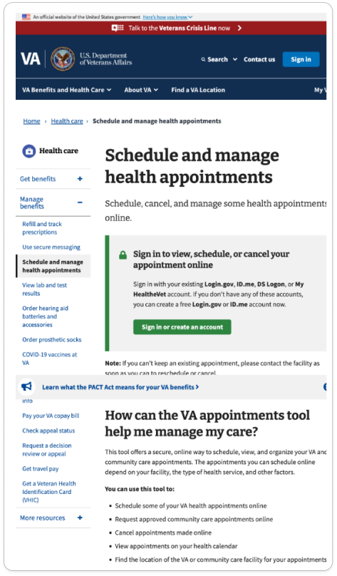
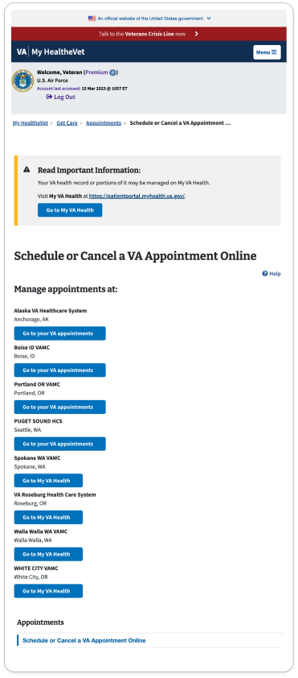
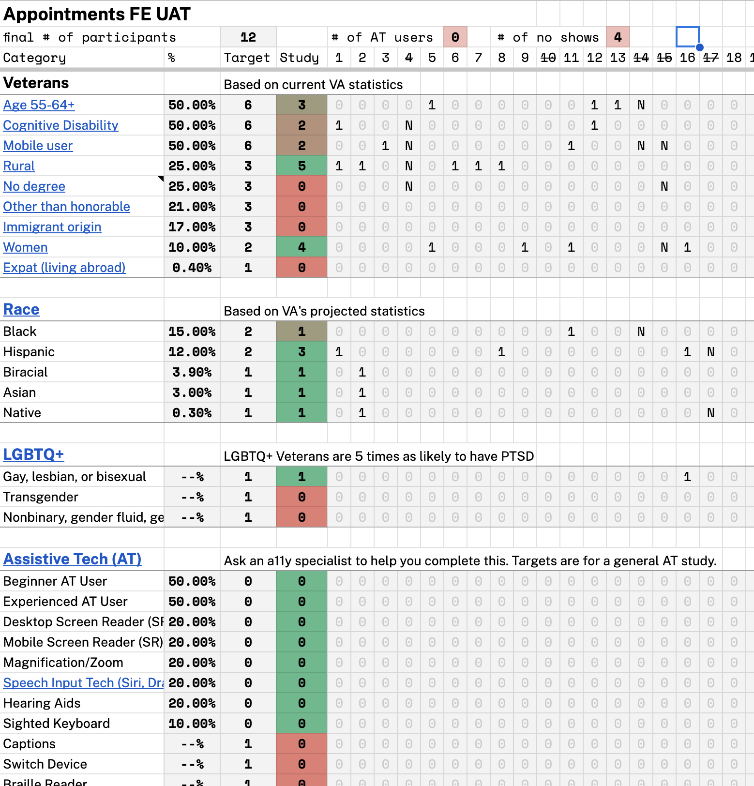

# Appointments on MHV on VA.gov UAT Research Findings

**Office of the CTO - Digital Experience (OCTO-DE), Appointments, Appointments FE**

Final Report Date: 01/17/2024

Peter Russo - peter.russo@adhocteam.us

<!--_Once you've presented your research readout to your team, if you have a deck, insert a link to it here_ [Research readout](link here)-->

**Jump to:**

- [Hypotheses and conclusions](#hypotheses-and-conclusions)
- [Key findings](#key-findings)
- [Recommendations](#recommendations)
- [Further research needed](#further-research-needed)
- [Who we talked to](#who-we-talked-to)

## Research Goals

This test helped us achieve two goals:
1. Verify via UAT that logged in Veterans are able to utilize recently added features and data is populating as expected.
2. Understand Veteran's expectations as they choose a facility or provider when scheduling an appointment. 

### Moments that matter

These goals consider the different stages in life where Veterans may interact with the Appointments tool across their [health care experience](https://github.com/department-of-veterans-affairs/va.gov-team/blob/master/platform/design/va-product-journey-maps/Veteran%20Journey%20Map.pdf).

**Starting up**

- Attending to health needs

**Taking care of myself**

- Recognizing and addressing mental health needs
- Managing health issues

**Putting down roots**

- Maintaining my emotional health
- Engaging VA to access benefits and services

**Retiring**

-  Taking care of my health
-  Managing my declining health

## Research Questions

**UAT**  
1. Are participants able to navigate between to the appointments feature from My VA and MHV on VA.gov?
1. Are participants able to navigate their appointments lists?
1. Can participants easily print their appointments lists?
1. Are users at Oracle Health facilities able to navigate to My VA Health?

**Mental Model Inquiry**  
1. Does the process of selecting a clinic (VistA) or provider (community care) meet participant expectations?
1. What other information would be helpful when scheduling with a provider or clinic?

## Methodology 

We asked 12 participants to log in to their VA.gov account and complete a series of tasks. 2 of the participants were registered at facilities that use Oracle Health/Cerner. 

The sessions were run remotely, over Zoom.

## Hypotheses and Conclusions

_**Participants will be able to easily navigate to the appointments tool from all entry points.**_

_Definitely False_

Participants struggled with logging in and navigating to the Appointments tool from the My HealtheVet National Health Portal. Participants who were registered at Oracle Health facilities struggled to navigate to the Appointments tool, though this is working as intended; most paths redirect them to the Oracle Health portal.

My VA was the easiest entry point for participants, followed by the MHV on VA.gov portal home.

_**Participants at Oracle Health facilities will be able to easily navigate to My VA Health.**_

_Likely True, Not enough information_

We only spoke to two participants who were registered at Oracle Health facilities, so we don't have enough information to draw a conclusion. However, we saw many points where those participants were redirected to the Oracle Health portal from VA.gov and My HealthVet, so we believe this is likely true.

_**The process of selecting a facility, clinic, or provider during scheduling will meet participant expectations.**_

_Likely False, not enough information_

We weren't able to study the same experience across all participants because clinic configurations create different scheduling experiences. We also were unable to find a path to community care with any participant, so were unable to test expectations around that process. 

However, we did find that aspects of scheduling we were able to test didn't meet participant expectations, especially around the facilities we show for each type of care. 

_**Participants will be able to easily print a list of their appointments.**_

_Definitely True_

No participant had any trouble finding and using the print button.

## Key Findings

1. Most participants struggled with login.

2. Most participants were confused when navigating across multiple portals to find the appointments list.

3. All participants easily navigated appointment details pages.

4. Most participants easily found their past appointments.

5. Some participants struggled to understand their pending appointments.

6. All participants were able to easily use the print feature.

7. Participants expected a more personalized experience for selecting facilities.

**Additional insights:**

1. Missing or confusing data was the biggest frustration when using the appointments list.

2. Participants were confused by the request calendar.

3. Participants were confused by the alert that told them Community Care was unavailable for podiatry.

## Details of Findings 

### Most participants struggled with login

Labels: `login`  
Themes: [Login stories](../themes.md#login-stories)

<abbr title="9 out of 12">Most</abbr> participants reported that they generally find login to be frustrating. <abbr title="5 out of 12">About half</abbr> had some trouble logging in during their session. The two that had no trouble logging in were both mobile users.

Participants found 2-factor authentication to be the most frustrating issue. Logging in multiple times to different portals, and confusion around the multiple methods for logging also caused frustration.

> I had a problem with this the other day, where it asked me to log on again. That made no sense to me 'cause it already knew I was logged on, because up at the top right screen it says, "log out" and on the left side of the top screen it has my name, and my military service, and when I last accessed my account. So I have a go to My VA appointments, where it says 'Manage Appointments at...' And then it says, "Go to My Appointments" - where it asked me to log in again. And I never got to where I wanted to go. So you can see that the very next page is "Sign in to view/schedule/cancel your appointments online." This sucks. Why? Why do I have to sign in again? - P12

### Most participants were confused when navigating across multiple portals to find the appointments list

Labels: `IA`, `navigation`
Themes: [Finding the appointments tool](../themes.md#finding-the-appointments-tool)

We started off by asking participants to go to VA.gov and find their appointments. Later, we asked them to find other health tools, then navigate back to appointments. This required that they navigate across 2-3 health portals:
- My HealtheVet on VA.gov 
- My HealtheVet National Portal
- My VA Health - the Oracle Health portal (only accessible to the 2 participants who were registered at Oracle Health facilities.)

In general, participants struggled when navigating across these portals, but some paths to the Appointments tool were more challenging than others. 

> I feel like the goal, at least initially, was just to find my appointments. And that was so challenging. I felt like there was some run around, and in the end, if you asked me right now to go back and find that scheduling screen I don't know if I could do it. At least not confidently in one go, because I there was just so much all-over-the-place that I don't feel confident in finding those appointments. Of course, that nice screen that we eventually got on where it did say appointments -- and it did say specifically what I had on the eleventh and what I have next year -- that's a great screen, that's great. But just finding it felt like a frustrating process alone. - P9

An assessment follows of the key issues from different flows.

**Oracle Health portal (My VA Health)**  
The 2 participants who were registered at Oracle Health facilities easily navigated to the Oracle Health portal. Once they were in that portal, they could not easily navigate back to VA.gov. This is by design, as the Oracle Health portal opens in a new tab from VA.gov, and has no links back to VA.gov.

**My HealtheVet National Portal**  
5 participants complained of information overload in this portal, both on the "Manage your VA Appointments" page and the My HealtheVet NP appointments list. Both pages required a lot of reading and scrolling to get to the tool or main call to action.

3 participants struggled to use the "Manage appointments at" page, which directs users to either VA.gov or Oracle Health. They noted that it wasn't clear where the buttons would lead, or if the different choices would create different outcomes. It was also confusing to see facilities they don't currently attend in the list.

  
_Page that moves users to VAOS. List of five facilities, where each is followed by a Go to your VA appointments button. These buttons all functionally navigate to the same URL._

**VA.gov "Schedule and Manage Appointments" page**. 

<abbr title="9 out of 12">Most participants</abbr> navigated through this page at some point during the session. 5 complained about information overload. Another 5 said that it was frustrating to land on this page after logging in, instead of being sent directly to the Appointments tool. 4 were frustrated that they had to return to this page and click another option after logging in to access the Appointments tool. One said that it was so frustrating they would have abandoned the process at this page if they were dealing with this outside the context of a study.

> If I have to scroll down the screen, I get angry. I'm like 'where the crap is this?!' One of the biggest things I do hate, and I'm gonna bring it up because I think it's relevant, is every time I click on 'learn about how to do appointments'I get sent to this page telling me all about it, everything about it, except what the f- do I click to get to it? That's the only thing I wanted. You're telling me when they started it, the history of it, and how Lincoln wants to serve Veterans. Great man! But I don't get what I need! - P6

**MHV on VA.gov portal home page.**
All but one participant were able to easily navigate to the MHV on VA.gov home page from the Appointments tool without prompting:
- 9 used the My HealtheVet button on the main site navigation.
- 7 used the breadcrumb.
- 2 used the dropdown in the Profile menu.

The one who couldn't find a path to the page was using a mobile device.

When navigating back to the Appointments tool from this page, half of the participants clicked the "Schedule and Manage Appointments" link. Only 1 clicked the "Upcoming appointments" link. The rest went into the MHV National Portal to review other health tools, and never returned to this page.

3 participants said that they had expected to go directly to the appointments tool when they clicked the link to "Schedule and manage appointments" and were confused when they landed on this page.

**My VA**
We tested this path with 11 participants. 10 navigated from My VA to the Appointments tool without any problems. 

The one who struggled was an Oracle Health user who didn't have a direct path to the appointments tool from My VA.

### All participants easily navigated appointment details pages

Labels: `IA`, `list view`, `details view`  
Themes: [List navigation stories](../themes.md#list-nav-stories)

All participants quickly understood how to open details pages. 

Most participants used the descriptive back link. Of the 2 who didn't use the link:
- One was on a mobile device, and favored using the browser back button at the bottom of their screen. 
- The other was on desktop and also used the browser back button.  

Neither showed any sign of being confused about navigating back to the list view with their preferred method.

### Most participants easily found their past appointments

Labels: `IA`, `subnavigation`  
Themes: [List navigation stories](../themes.md#list-nav-stories)

Of those that had trouble: 
- 2 left the appointments tool to look for their past appointments in their health history.
- 1 didn't see the navigation links.

### Some participants struggled to understand their pending appointments

Labels: `Content`, `requests`, `pending appointments`  
Themes: [List navigation stories](../themes.md#list-nav-stories), [Pending appointment stories](../themes.md#pending-appointment-stories)

- 2 participants expected that the number next to Pending (0) should refer to their upcoming appointments.
- 1 associated pending appointments with those requested through secure messages.

### All participants were able to easily use the print feature

Labels: `Print`, `tertiary button`

Participants were able to easily find and use the print button.

### Participants expected a more personalized experience for selecting facilities

Labels: `Scheduling`, `personalization`

3 participants saw unfamiliar or unexpected facilities in the list, such as those that were very far away. 3 wanted to see the facility they currently go to listed first. And 2 were confused that the facility where they currently receive Primary Care wasn't the first or only one listed when they selected Primary Care. 

1 mentioned they'd like to have availability as the first option to choose from. Another participant said that their provider changes much more often than location, so they would prefer to choose from providers based on their availability. 

2 said that it was easy to find the distance to the facility, and 2 others called out that they easily found their desired facility.

## Additional Insights

### Missing or confusing data was the biggest frustration when using the appointments list

Labels: `Missing data`  
Themes: [Data needs](../themes.md#data-needs)

All participants struggled with data that was missing or confusing. Type of care and provider name were the most requested, along with a link to the after-visit summary, or another way to find medical history.

Without this information, participants did not know what the appointments were for, or where to go.

> I don't think there's anything challenging about navigating. It's extremely easy, you know, the buttons are right here on the screen everything that you all the questions you asked me. Everything's right here in front of me. So it's not so much the navigation. It's just more the missing information. - P3

> They all say "VA appointment", then I have to click into it to see what it is. If it just said "VA appointment with dentist" in the description, it would be easier, instead of having to click through each one to figure out which one is which. Like some months where I have multiple appointments. Say I'm trying to find my head and neck appointment; I have to click on each one, and then figure out which one it is. If it said, "VA appointment with head and neck clinic" or "VA appointment with dental clinic" that would make it a lot easier to try and decipher these. - P2

### Participants were confused by the request calendar

Labels: `Scheduling`, `request`, `date picker`  
Themes: [Pending appointment stories](../themes.md#pending-appointment-stories)

4 participants thought the request calendar was showing the clinic's availability for scheduling an appointment. 1 said they didn't trust that scheduling in this way would lead to an actual appointment.

> I was initially surprised that I could make an appointment, you know, in such a short amount of time. 'Cause I'm just so used to making appointments pretty far out ahead of time. So I mean I'd just be curious if I could actually make, or that an appointment could be made on the eleventh, you know, in the am, for something routine, or even something new. I am honestly curious if it would let me do that if it would give me a date and a time. - P9

## Participants were confused by the alert that told them Community Care was unavailable for podiatry.

Labels: `Scheduling`, `community care`, `alerts`

2 participants said that they currently receive community care for podiatry, and were frustrated that this message said they were not eligible.

## Recommendations

All in all, the navigation features added to move Appointments under MHV on VA.gov worked well. These recommendations are focused on other issues and ideas that came up during the study that were not part of these changes.

### Improve the "Schedule and manage appointments" page. 

This page is acting as public-facing information about appointments for SEO purposes, a help/FAQ page for appointments, and the entry point from help hubs. Consider separating the general appointments help/FAQ information, similar to how My HealtheVet National Portal has a separate site for help content. This will let Veterans seek out help content as they need it, instead of overwhelming them with information when they're trying to log in.

On the MHV on VA.gov portal, the link to this page is confusing because it redirects users from one entry point to another entry point for the same tool. Remove the link to this page.

Finally, it's confusing to return to this page after going through the login flow. Consider redirecting Veterans directly to the Appointments home page after they log into the Schedule and Manage appointments page. 

### On the MHV National Portal, remove the page that transitions users to VA.gov appointments.

The "Schedule appointments at" page is an additional decision point before Veterans are redirected to VA.gov. If all the functionality on this page is handled when the user arrives at VA.gov, remove this page. 

### Clarify pending appointments
As we saw in this and other studies, Veterans who have never requested an appointment will be confused when they see the Pending(0) link.
* Consider hiding the link to the Pending page only if the Veteran currently has pending or canceled appointment requests. 
* Consider treating pending appointments as a "notification" or "task" - a temporary situation the Veteran can track. Look at the check-in and travel pay work for ideas.

### Consider ways to surface medical history on past appointments
Some participants went directly to their medical history when asked to find information about their past appointments. Along with the in progress AVS work, consider linking directly to Veterans medical history from the Past Appointments list page.

### Start a working group to focus on the data issues. 
A group who could surface type of care and provider name for all or most appointments would immediately increase the usability and trustworthiness of the list views. This group could also work with the VVC teams to fix video appointment pages that currently show no information about the appointment.

### Simplify the process of selecting a location
On the facility selection page, consider showing a Veterans "current" facilities first. This could be any facility they've received care at in the past two years. Also, identify the facility where they have a Patient Aligned Care Team. 

## Next Steps

Follow up on [technical issues identified during sessions](#appendix-technical-issues-identified-during-sessions) with relevant owners/teams

## Appendix: Resources

[Research plan](research-plan.md)

[Conversation guide](conversation-guide.md)

[Interview transcripts](https://github.com/department-of-veterans-affairs/va.gov-team-sensitive/tree/master/products/health-care/appointments/research/research-transcripts/2023-11-mhv-on-va-gov-phase-2b-vaos-uat)

### Tools used for Synthesis

[Synthesis spreadsheet](2023%20Appts%20on%20MHV%20on%20VA%20synthesis.xlsx)

[Observer Note Mural board](https://app.mural.co/t/departmentofveteransaffairs9999/m/departmentofveteransaffairs9999/1689954776087/f9c46f95011f1ba2bbe090a71496336e8cf98718?sender=ufbf7b24834e1195c028f5337)

## Appendix: Technical Issues Identified During Sessions

| Issue | Team | Next steps |
|-------|------|--------|
| On the Secure Messaging Inbox link the new message notification was wrong - some participants had no new messages | MHV on VA.gov Portal | Reach out to Secure Messaging Team |
| In the appointment list empty states the start scheduling link is broken | Appointments FE | Filed issue [71713](https://app.zenhub.com/workspaces/appointments-team-603fdef281af6500110a1691/issues/gh/department-of-veterans-affairs/va.gov-team/71713) |
| My VA doesn't show the Oracle Health redirect for some Cerner users | Authenticated Experience | Reach out to Authenticated Experience team |
| Mobile: Print buttons doesn't work on iPhone | Appointments FE | Validate |
| Mobile: appointments in list are shifting slightly on focus | Appointments FE | Validate |
| Mobile: new pages are scrolling to the bottom/footer | Appointments FE | Validate |
| Typo in title tag on MHV on VA.gov portal | MHV Portal Team | [Reported in Slack](https://dsva.slack.com/archives/C04GDQSHD1R/p1704473264360119) |

## Who we talked to 

**Primary recruitment criteria**

- All participants must have upcoming appointments at the time of the study.
- All participants must be willing to log into their account and share information about their appointments with the research team.
- At least 2 participants must have upcoming appointments at facilities that use the Oracle Health EHR.

**Secondary criteria:**

- At least 4 participants who attend sessions on a mobile device.
- At least 4 participants with a cognitive disability
- At least 2 screen reader users
- At least 2 screen magnification users
- At least 1 LGBTQ+ Veteran
- At least 1 Native Veteran
- At least 1 who lives in a rural area

We talked to **12 participants.**

Audience segment:
* Veterans: 12 
* Caregivers: 0 
* Family members of a Veteran: 0  

Gender:
* Male: 8 
* Female: 4 

LGBTQ+:
* Part of the LGBTQ+ community: 1
* Transgender: Unknown
* Nonbinary, gender fluid, gender queer, Two-Spirit (Indigenous only), or another gender beyond man or woman: Unknown
* Gay, lesbian, or bisexual: Unknown

Devices used during study: 
* Desktop/laptop: 10 
* Tablet: 0 
* Smartphone: 2 
* Assistive Technology: 0

Age:
* 25-34: 0
* 35-44: 8
* 45-54: 1
* 55-64: 0
* 65+: 3

Education:
* High school degree or equivalent: 0
* Some college (no degree): 0
* Associate's degree, trade certificate or vocational training: 1
* Bachelor's degree: 4
* Master's degree: 6
* Doctorate degree: 1

Geographic location:
* Urban: 7
* Rural: 5

Race:
* White: 9
* Black: 1
* Hispanic: 3
* Biracial: 2
* Asian: 1
* Native: 1

Disability and Assistive Technology (AT): 
* Cognitive: 2
* AT beginner: 0
* AT advanced user: 0
* Desktop screen reader: 0
* Mobile screen reader: 0
* Magnification/Zoom: 0
* [Speech Input Technology](https://www.w3.org/WAI/perspective-videos/voice/) like Siri/Dragon Naturally Speaking: 0
* Hearing aids: 0
* Sighted keyboard: 0
* Captions: 0

## Underserved groups we haven’t talked to 
This research does not include the perspectives of the following marginalized Veteran groups:

* Assistive tech
* No degree
* Other than honorable
* Immigrant origin
* Expat

[Recruitment checker results](https://docs.google.com/spreadsheets/d/1pq7TSHZonfpzAQBJj6B2geGHlNUwZEs4DzEvxcRgu0o/edit#gid=379060411)

