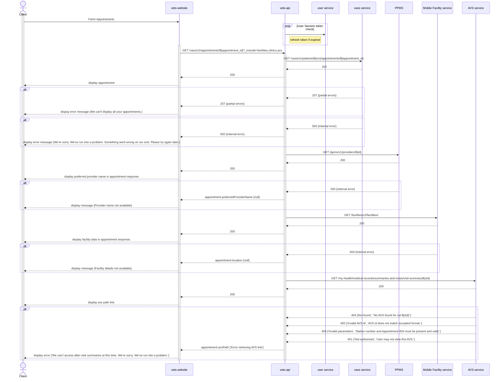
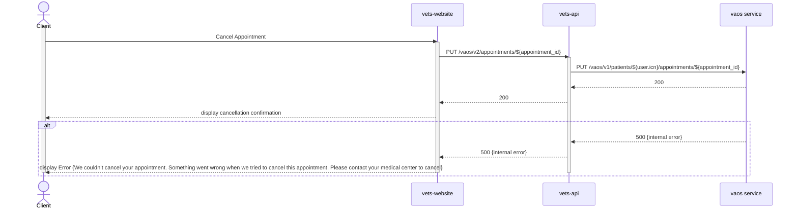
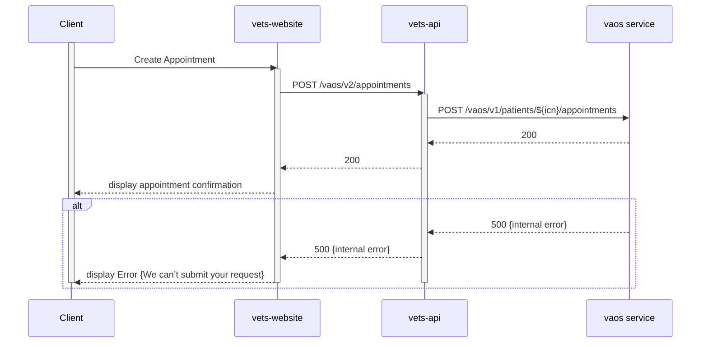

# VA Online Scheduling - Zero Silent Failures Checklist
*Last updated: 2024-10-02*

## Team Questions

### Does your application have a user-facing transaction that is submitted to a back-end system?

- VA Direct Schedule Flow
    - [x] Yes 
    - [ ] No
- COVID Vaccine Flow
    - [x] Yes 
    - [ ] No
- VA Request Flow
    - [x] Yes 
    - [ ] No
- CC Request Flow
    - [X] Yes 
    - [ ] No
- Manage Appointments Flow (view Appointment List and Details) 
    - [ ] Yes
    - [X] No
- Cancellation Flows
    - [x] Yes 
    - [ ] No

> [!NOTE]
> This is not limited to online forms! Other examples can include:
> - Uploads of documents and/or attachments
> - Performing an action (Such as refilling a prescription or ordering supplies)

### Are you using any of the following APIs

> - [VA Facilities API](https://developer.va.gov/explore/api/va-facilities)
> - Any others?

- VA Direct Schedule Flow
    - [x] Yes 
    - [ ] No
- COVID Vaccine Flow
    - [x] Yes 
    - [ ] No
- VA Request Flow
    - [x] Yes 
    - [ ] No
- CC Request Flow
    - [x] Yes 
    - [ ] No
- Manage Appointments Flow
    - [x] Yes 
    - [ ] No
- Cancellation Flows
    - [x] Yes
    - [ ] No

- All `/vaos/v2/appointments/` calls will hit the facilities and clinics APIs since we augment each appointment retrieved/created/updated with location information and service/friendly names. Here's a list of all the non-appointments APIs we hit I've found so far:
    ```
    From vets-website:
    (note: I'm not including APIs to appointments APIs maintained by us)
    GET /facilities_api/v1/ccp/provider?latitude=${latitude}&longitude=${longitude}&radius=${radius}&per_page=${perPage}&page=${page}&${bboxQuery}&${specialtiesQuery}&trim=true
    GET /vaos/v2/epsApi/referralDetails?facilityId=${facilityId}&clinicId=${clinicId}&start=${startDate}&end=${endDate} (Not used yet, WIP feature)
    GET /vaos/v2/epsApi/referralDetails/${referralId} (Not used yet, WIP feature)
    From vets-api:
    GET/POST /vaos/v1/patients/#{user.icn}/appointments
    GET/POST /vpg/v1/patients/#{user.icn}/appointments (Turned off via Flipper)
    /my-health/medical-records/summaries-and-notes/visit-summary/#{sid} (Not used yet, WIP feature)
    GET/PUT /vaos/v1/patients/#{user.icn}/appointments/#{appointment_id}
    GET/PUT /vpg/v1/patients/#{user.icn}/appointments/#{appointment_id} (Turned off via Flipper)
    GET /vaos/v1/locations/#{station_id}/clinics
    GET /facilities/v2/scheduling/configurations
    GET /facilities/v2/facilities
    GET /facilities/v2/facilities/#{id}
    GET /ppms/v1/providers/#{id}
    GET /vaos/v1/patients/#{user.icn}/eligibility
    GET /vpg/v1/patients/#{user.icn}/eligibility (Turned off via Flipper)
    GET /vpg/v1/patients/#{user.icn}/relationships (I don't think we use this yet @cferris32? A: Correct, this is not yet in use [CF])
    GET /vaos/v1/locations/#{location_id}/clinics/#{clinic_id}/slots
    GET /vpg/v1/slots (Turned off via Flipper)
    GET /cce/v1/patients/#{user.icn}/eligibility/#{service_type}
    GET /var/VeteranAppointmentRequestService/v4/rest/patient/ICN/#{user.icn}/preference (I don't think we use this PreferenceService @cferris32? A: Correct, this endpoint is not called anywhere in our VAOS code [CF])
    GET /users/v2/session/jwts
    POST /users/v2/session?processRules=true
    ```
The v1 endpoints as they are defined in the VAOS routes have virtually never been used. From our routes perspective, we went straight from v0 to v2 (v0 has long since been    deleted). We cannot find any evidence that these endpoints are currently being used even by stray clients, but this might be worth additional investigation and possibly shutting off the routes if we believe they aren't needed and don't want to chance them being hit. 

Summary of above: our vets-api v1 endpoints have been inactive and unused for years so we are excluding them from this list.

### Does your application submit to an API that relies on Sidekiq (or another background job processor)?

- VA Direct Schedule Flow
    - [ ] Yes
    - [x] No 
- COVID Vaccine Flow
    - [ ] Yes
    - [x] No 
- VA Request Flow
    - [ ] Yes
    - [x] No 
- CC Request Flow
    - [ ] Yes
    - [x] No 
- Manage Appointments Flow
    - [ ] Yes
    - [x] No 
- Cancellation Flows
    - [ ] Yes
    - [x] No 

- Sidekiq documentation and the code [here](https://github.com/department-of-veterans-affairs/vets-api/blob/master/modules/vaos/app/services/vaos/user_service.rb#L26). [JL]
- We confirmed the sidekiq job for the user session should not be breaking failure in our flow today. 
- Sidekiq job that validates appointments_index schema [here](https://github.com/department-of-veterans-affairs/vets-api/blob/master/modules/vaos/app/services/vaos/v2/appointments_service.rb#L43) but this is currently turned off via Flipper.
- We don't have visibility to downstream services so we can only confirm that we don't use Sidekiq in the Appointments FE (src/applications/vaos) and BE (modules/vaos).

Summary of above: we have no sidekiq jobs that are at risk of blocking our user flow or being critical failures.

If you answered yes to any of these questions then go through the following [checklist](#checklist) as a team exercise to determine if your application has silent failures.

## Checklist

### Start

- [X] Do you know when your applications shipped to production? (*If not, use Github to determine, roughly, when your application shipped to users.*)
    August 2021 - Community Care and VA Request Submission
    August 2021 - Direct Scheduling
    March 2021 - Vaccine Scheduling 

- [X] Do your applications use the same APIs when it shipped as it does today?
 - We have fully migrated from v0 to v2 APIs.

If not, then you'll need to consider the path user data took through both the current architecture and the previous architecture. You will need to account for potential failures in all paths since your application shipped.

### Monitoring
- [x] Do you monitor the APIs that you submit to via Datadog?

- VA Direct Schedule Flow
    - [x] Yes 
    - [ ] No
- COVID Vaccine Flow
    - [x] Yes 
    - [ ] No
- VA Request Flow
    - [x] Yes 
    - [ ] No
- CC Request Flow
    - [x] Yes 
    - [ ] No
- Manage Appointments Flow
    - [x] Yes 
    - [ ] No
- Cancellation Flows
    - [x] Yes 
    - [ ] No

- The dashboard is located [here](https://vagov.ddog-gov.com/dashboard/7t4-7fw-pgj/vaos-alerts?fromUser=false&refresh_mode=sliding&view=spans&from_ts=1726685791928&to_ts=1726858591928&live=true).

If not, [set up monitoring in Datadog](#set-up-monitoring-in-datadog).

- [x] Does your Datadog monitoring use the appropriate tagging?

    - VA Direct Schedule Flow
        - [x] Yes 
        - [ ] No
    - COVID Vaccine Flow
        - [x] Yes 
        - [ ] No
    - VA Request Flow
        - [x] Yes 
        - [ ] No
    - CC Request Flow
        - [x] Yes 
        - [ ] No
    - Manage Appointments Flow
        - [x] Yes 
        - [ ] No
    - Cancellation Flows
        - [x] Yes 
        - [ ] No

 - Updates in our slack channel [here](https://vagov.ddog-gov.com/monitors/manage?q=notification%3Aslack-appointments-alerts&order=desc). 
   Here are the tags we set:
   - VAOS Vets API Errors Per Second, VAOS Vets API Error Rate, VAOS Request Rate is Low, VAOS Breakers Outage
    ```
    env:eks-prod
    team:mhv-appointments
    itportfolio:health-delivery
    service:mhv-appointments
    ```
   - Composite Number of Partial Responses from VAOS Service is High
    ```
    env:eks-prod
    team:mhv-appointments
    itportfolio:health-delivery
    service:external
    dependency:map
    ```

If not, [implement tagging standards](https://depo-platform-documentation.scrollhelp.site/developer-docs/monitor-tagging-standards). Adding the [dependency tag](https://depo-platform-documentation.scrollhelp.site/developer-docs/monitor-tagging-standards#MonitorTaggingStandards-Recommended:dependency) is highly recommended!

- [x] Do errors detected by Datadog go into a Slack notifications channel?

 - We have this set up too. Messages go to [#appointments-alerts](https://dsva.slack.com/archives/C016QB6T340) channel.

If not, start directing errors in Datadog to a dedicated Slack channel. See [#veteran-facing-forms-notifications](https://dsva.slack.com/archives/C063SM22J3H) for an example.

Link to channel where alerts are populated: [#appointments-alerts](https://dsva.slack.com/archives/C016QB6T340)

- [x] Does more than one person look at the Slack notifications channel containing errors on a daily basis?
    - [x] Yes
    - [ ] No

  - Our team has a dedicated slack channel #appointments-alerts and we have team members monitoring issues that come up for the application. 

If not, then follow this [guide on managing errors](https://github.com/department-of-veterans-affairs/va.gov-team-sensitive/blob/master/platform/practices/zero-silent-failures/managing-errors.md)

- [x] Do the team members monitoring the Slack channel have a system for acknowledging and responding to the errors that appear there?
    - [x] Yes
    - [ ] No
  - Yes we do. While we usually acknowledge issues in the slack channel directly using comments and threads, we can adopt the recommended methods listed in the linked document. We will work with our OCTO Product Owners to see how we will respond to issues given the platform recommendations. 

If not, then follow this [guide on managing errors](https://github.com/department-of-veterans-affairs/va.gov-team-sensitive/blob/master/platform/practices/zero-silent-failures/managing-errors.md)

Link to Playbook:

> [!WARNING]
> **Failure to have endpoint monitoring in place is a blocking QA standard at Staging review as of 9/10/24.**
> If you answered no to any of the questions above, you will be blocked from shipping at the Staging review touchpoint in Collab Cycle.

### Reporting errors
- [X] Have you filed issues for errors that are appearing in Datadog / Slack?

 - We have filed issues using data from our DataDog monitoring tools in the past when additional backend work was needed. If there is an issue on the frontend, we will open a GitHub ticket. If there is an issue with the backend/services, we will open a MASUP or JIRA ticket when needed. 

If not, then start filing Github issues for new categories of errors following [this guidance](#file-silent-errors-issues-in-github)

- [X] Do all fatal errors thrown in your application end up visible to the end user either in the user interface or via email?
 - We currently have alerts in the Appointments application
 - 500 error state - We follow the design system guidlines for displaying alert/error to display an alert with this message. "We’re sorry. We’ve run into a problem. Something went wrong on our end. Please try again later."
 - 400 error state - We follow the design system guidlines for displaying alert/error to display an alert with this message. "We’re sorry. We’ve run into a problem. Something went wrong on our end. Please try again later."
 - [FE alerts diagram](https://www.figma.com/design/ugE1APC20v8OcArGB2IMQy/User-Flows-%7C-Appointments-FE?node-id=1-2&node-type=canvas&t=T08zTlyRrfLtzViJ-0) 

If not, then file Github issues to capture error categories following [this guidance](#file-silent-errors-issues-in-github)

### Documentation

- [X] Do you have a diagram of the submission path that user data your application accepts takes to reach a system of record?

Our [architecture diagram](https://github.com/department-of-veterans-affairs/va.gov-team/blob/master/products/health-care/appointments/va-online-scheduling/engineering/architecture/vaos_2024_v1.png) 

If not, then [create a user data flow diagram](https://github.com/department-of-veterans-affairs/va.gov-team-sensitive/blob/master/platform/practices/zero-silent-failures/how-to-create-a-user-data-flow-diagram.md) that captures this information.


- [X] Do you understand how the error is handled when each system in the submission path fails, is down for maintenance, or is completely down? This should be captured in the data flow diagram or a separate document.

 - Our team understands when we recieved an error from the upstream services. We cannot tell what caused the issue from the upstream services.  

If not, then create documentation that captures how errors in each system are handled. Detail which systems retry a submission and what happens when those retries exhaust. Show this in your diagram.

- [X] Has the owner of the system of record receiving the user's data indicated in writing that their system notifies or resolves 100% of fatal errors once in their custody?
 - The owner of the system of record does not recieve the the user data indiciation of when the application has a failure. Our team will notify the services team when we come into a issue with any of the upstream services. 
   
If not, work with OCTO to meet with the owner of the system and get their agreement in writing.
Please document the outcome of this conversation in your product's documentation in Github and link here:

### User experience

- [X] Do you capture all of the potential points of failure and make those errors known to the user via email notification and/or through the application on VA.gov or the mobile application?
-  We have alerts in the UI that displays when there is an issue with the application. 

### Possible silent errors
- Clinic phone numbers being disabled or mis-entered
- Staff data coming through the "details about your concern" field
- Data missing from video appointments
- Staff-canceled appointments disappearing from the list/no email notification
- [Long standing requests without response?
- Does not break user flow upon failure
- Turned off via Flipper
- We display an alert indicating to the user that not all appointments were loaded
- Display unknown data to the user. For example, if we receive “1-128" as the clinic name, we pass the information to the frontend. That information may not be clear since it's not in plain language. 
- When user gets dropped to request flow due to ineligibility for direct schedule, no message is shown to end user. 

If not, don't worry. Few teams are doing this and we'll be providing resources to help you do this in your application. Proceed to [create a user data flow diagram](https://github.com/department-of-veterans-affairs/va.gov-team-sensitive/blob/master/platform/practices/zero-silent-failures/how-to-create-a-user-data-flow-diagram.md). That diagram will help us to help you and your team to create this user experience.

### Link to user flow diagram:

- [VA Direct Schedule Flow](https://www.figma.com/design/ugE1APC20v8OcArGB2IMQy/User-Flows-%7C-Appointments-FE?node-id=1-3649&t=cc4aBjvQIeqdAjYg-1)
- [COVID Vaccine Flow](https://www.figma.com/design/ugE1APC20v8OcArGB2IMQy/User-Flows-%7C-Appointments-FE?node-id=1-3569&t=cc4aBjvQIeqdAjYg-1)
- [VA Request Flow](https://www.figma.com/design/ugE1APC20v8OcArGB2IMQy/User-Flows-%7C-Appointments-FE?node-id=1-3877&t=cc4aBjvQIeqdAjYg-1)
- [CC Request Flow](https://www.figma.com/design/ugE1APC20v8OcArGB2IMQy/User-Flows-%7C-Appointments-FE?node-id=1-3760&t=cc4aBjvQIeqdAjYg-1)
- [Manage Appointments Flow](https://www.figma.com/design/ugE1APC20v8OcArGB2IMQy/User-Flows-%7C-Appointments-FE?node-id=1-2696&t=cc4aBjvQIeqdAjYg-1)
- [Cancellation Flow: Upcoming](https://www.figma.com/design/ugE1APC20v8OcArGB2IMQy/User-Flows-%7C-Appointments-FE?node-id=1-2925&t=cc4aBjvQIeqdAjYg-1)
- [Cancellation Flow: Requests](https://www.figma.com/design/ugE1APC20v8OcArGB2IMQy/User-Flows-%7C-Appointments-FE?node-id=1-3518&t=cc4aBjvQIeqdAjYg-1)
- [Technical FE Diagram](https://app.mural.co/t/departmentofveteransaffairs9999/m/departmentofveteransaffairs9999/1726688922423/1707b7c34332fa682664d69ee7e9e4489a05f7f0?sender=u8eb77785aa402b60d2e17927)


### Sequence diagrams:

## Fetch Appointments



## Cancel Appointment



## Create Appointment

