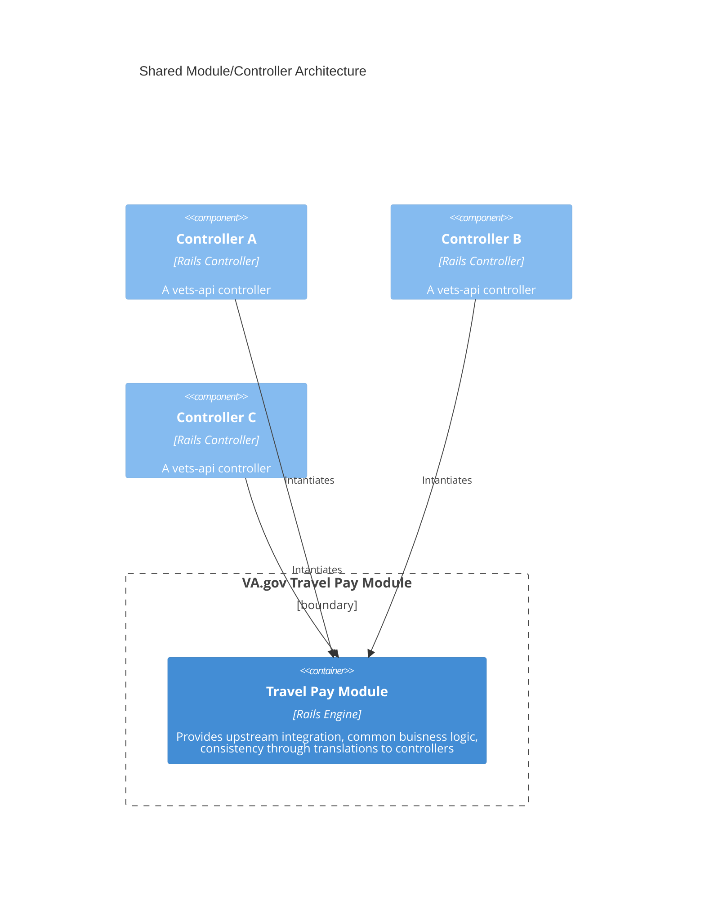
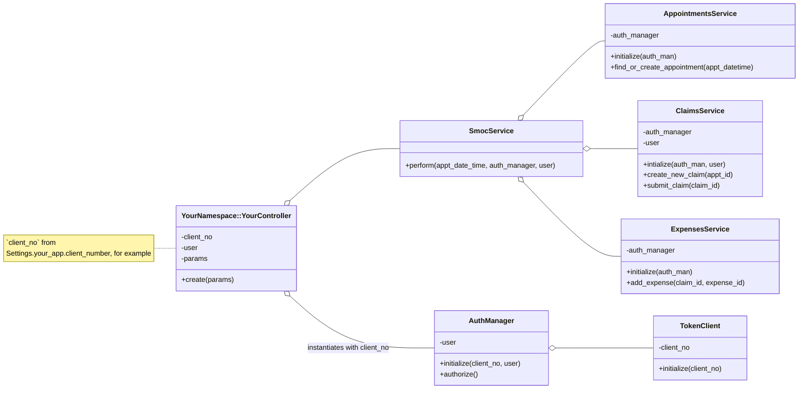

# Decision: Each product line will use their own controller to access the shared travel pay module
Status: Accepted

## Context
The BTSSS (Travel Pay) system is building an API to support an omnichannel experience and further scalability. Vets-api integrates with this API through a Ruby on Rails engine (in the `/modules/travel_pay` folder). 
The module contains a client, for making requests to the API, a service, for applying business logic, serialization, and other translations, and a controller for handling requests. Multiple products or experiences
may want to leverage the shared travel pay module to augment their applications with travel pay features. [Our integration guide]() explains how to do this in more detail.

Coordination and a general intergration plan will be useful between the core travel pay team and teams interested in integrating for a few reasons. 

One reason is that the travel pay product on VA.gov is fairly new. We have not yet built out a fully customizable integration experience. In order to be able to iterate on a plan, we need to have the plan in the
the first place. We value your thoughts on the integration experience. Please reach out in [our slack channel]() to provide constructive feedback.

The other reason to have a defined integration plan is that as we integrate with more partners, the need for an organized architecture grows. This ADR is a first step in working toward an organized integration 
architecture.

## Decision
We will provide a configurable, shared module for integration with the travel pay API. Integrating parties will build their own controller(s) to integrate with the shared module.

# Custom Controllers, Shared Services
To use a shared service with the travel pay api, each system needs to have its own client number. The diagram/description below describes how teams can achieve this. Note, as of 5/13/2025, the `SmocService` does not yet exist.

> Custom controllers, shared services

The basic idea behind this approach is that each application should use their own controller and integrate with the services defined in the `travel_pay` vets-api module. The slogan for this approach is "Custom controllers, shared services."

## Pros of this approach
- Simple to define and use your own app's client number (e.g. your client_number is defined in your app's config in `settings.yml`)
- Simple to maintain ownership/accountability over your own application
- Follows patterns defined elsewhere in VA.gov
- Backend-only work - nothing changes on the frontend

## Cons of this approach
- Duplication of code if your controller very closely matches the `TravelPay::ClaimsController`
- Potentially more of an defined contract established between the owner of the services and the owner(s) of the controllers

We feel the cons of this approach are minimal or can be mitigated easily.

## Class Diagram

## Consequences
Our decision is in line with other integration patterns on VA.gov. It has the benefits of being familiar with VFS teams and straightforward to implement.

We wish to provide a consistent experience for Veterans when integrating with the upstream travel pay API. To this effect, we'll add common business logic and sensible translations to the common travel pay module.
However, it is possible that logic and translations specific to our own VA.gov travel pay experience will slip into the code unnoticed. If this happens, integrating controllers will inadvertently get some of our
experience decisions.
