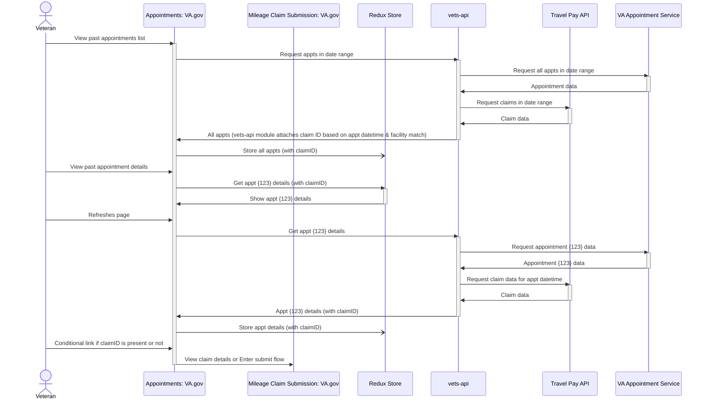

# Appointment Association Recommendation

## Background

In order to submit a travel pay reimbursement claim, the Travel Pay API (TP-API) requires the internal BTSSS appointment ID. The user also needs to be aware of whether or not a claim has already been submitted for that facility for that day (i.e. whether or not the "appointment" has an associated claim). 

There are two approaches we can take for associating an appointment with a claim in the appointment list (or detail) page, both with pros and cons.

There is also a Mobile app consideration (Mobile designs currently show the claim status in the appointments list), that is not applicable to VA.gov - but since VA.gov and Mobile are sharing backend logic the team must make a decision on how to approach matching `VAOS appointment > BTSSS appointment > travel claim` logic that can be shared between all modalities.

The appointments team has made the technical decision to retrieve all VAOS appointments for the specified date range selected by the user, store them in `redux`, and display them in the appointments list. Because all the required data is already retrieved, when a user selects an appointment from the list to navigate to the details page, all the data is already present and a new call is not made unless the user refreshes the page. This same pattern is utilized by the Mobile app (storing the appointment data in the `ReactQuery` cache).

The plan for associating appointments to claims is to add Travel Pay specific attributes to the appointment object in the initial appointments list call, thereby providing the necessary claim information in the appointments list and appointment details page.

## Recommendation (10/08/24)

It is the team's recommendation that the appointment association logic is performed in a separate module based on the BTSSS appointment list. This will have the most comprehensive data returned to associate the VAOS appointment to any existing travel claims as well as the necessary data requirements to submit the claim without additional API calls. In the appointments list we can show a `yes/no` indication of whether or not a travel pay claim has been submitted for the appointment date-time and facility, allowing users to submit a claim if no claim is associated with the given appointment.

By separating the appointment-to-claim association logic into a separate "Appointment Association Module" (or class) it can be shared across all modalities for an omni-channel "appointments" experience, while leaving the Travel Pay Reimbursement claim logic itself a standalone concern.

### Update 10/18/24

With integration questions still under discussion, the team has decided to move forward with an appointment > claim association with VAOS appointments > BTSSS claims association approach.

Using shared logic in the Travel Pay module of `vets-api`, the Travel Pay team retrieves the claims for the specified date range sent in with the initial appointments list API call. The claims and appointments for that date range are associated, returning a new array of appointments with the `associatedTravelPayClaim` ID appended. The appointments team can then show either a link to the claim details page (if a claim ID is present) or a link to the submit flow (if a claim ID is not included).

## Appointment association data flow

## Risks, Questions, Considerations
1. What is the exact policy surrounding Travel Pay claims?
  - For example, we know that the Rules Engine will flip a claim into the "In Manual Review" status if it's the second one of the day (but the Veteran can still _submit_ that second claim for a second appointment)
  - So should we associate _any_ appointment on that date at that facility to a claim for that date/facility, resulting in a potential `many:1` (`appt:claim`) association? Or match only on the exact datetime and facility (i.e. the exact appointment for which the claim was submitted) and leave the policy decisions around multiple submissions to the Rules Engine/Travel Clerks?
2. What are the ramifications of including the claim status in the appointment response object?
  - Depending on the answer to question 1, how should we associate the status of a claim with an appointment if there might be multiple appointments associated with the same claim (which appointment gets the "status" attached to the appointment object? Or do they all get the same status?)
3. What is the risk to the Mobile App backwards compatibility requirement if we change the response later?
  - KISS: simpler is better
  - Additive changes are ok, but if we add status and other Travel Pay attributes now, harder to remove later

## Technical feasibility research

### Use the `/appointments` TP-API endpoint

One option the team has discussed is to use the TP-API `/appointments` endpoint to retrieve a collection of the user's BTSSS appointments for the same date range (past 3 months, past 6 months, etc.) and associate those to the VAOS appointments in the appointments list. 
 
The data return from this endpoint includes:

- The BTSSS internal appointment ID (which is required to submit a claim if one does not already exist) 
- The status of the appointment (they can only submit if the appointment has been "completed")
- The date and time of the appointment and the facility ID (proposed - current docs show only facility name) allowing us to match to other appointments at the same facility on the same day (since Veterans can only claim one reimbursement per day per facility) 
- And, if a claim has been submited, an `associatedClaimId` (if a claim has not been requested for the appointment this attribute returns null, allowing us to show the user whether or not they are allowed to submit for that appointment)

#### Pros

- For this approach, we will have everything necessary to submit a claim as well as show whether or not a claim has been submitted. 
- We will have the claim ID, which we can use to make a call to the `/claims/{claimID}` endpoint to retrieve the claim status if we wish to display it on the appointment detail page, or to add a link to the claim details page if navigating away from appointments.
- We will have the appointment status to determine whether or not the appointment is considered completed (a requirement to receive reimbursement)

#### Cons

- We will not have the claim status to show on the appointment list, only whether or not a claim has been submitted (`!!{associatedClaimID}`)

### Use the `/claims` TP-API endpoint

Another option would be to retrieve all the user's Travel Pay claims and associate those by date and facility to the VAOS appointments.

The data return from this endpoint includes:

- The claim ID
- Claim status
- Appointment date-time (to associate with a VAOS appointment)
- The facility ID (proposed - currently only returns the facility name) to match the appointment facility ID
- The total cost requested for the claim
- The external appt ID (currently this is _not_ being returned by VAOS appointments, however, so it not as helpful unless VAOS adjusts their appointments response)

#### Pros

- We will have the claim status to display in the appointment list
- Finding the BTSSS appointment ID can happen in the Sidekiq job and does not need to be displayed to the user

#### Cons

- When moving to the appointment details page to allow them to submit the claim we will need to make a separate call to the `/appointments` endpoint to retrieve all appointments and search by appointment date-time to retrive the BTSSS appointment ID to submit the claim (but this can happen in the background and does not necessarily need to be shown on the frontend)
- The status of the appointment might be unknown (it must be marked as "completed" in BTSSS before a Travel Pay claim can be submitted) 
    - Unknown whether or not this is a requirement for VA.gov and the Mobile app or if we allow claims to be submitted and let the Rules Engine determine if the appointment is not valid

