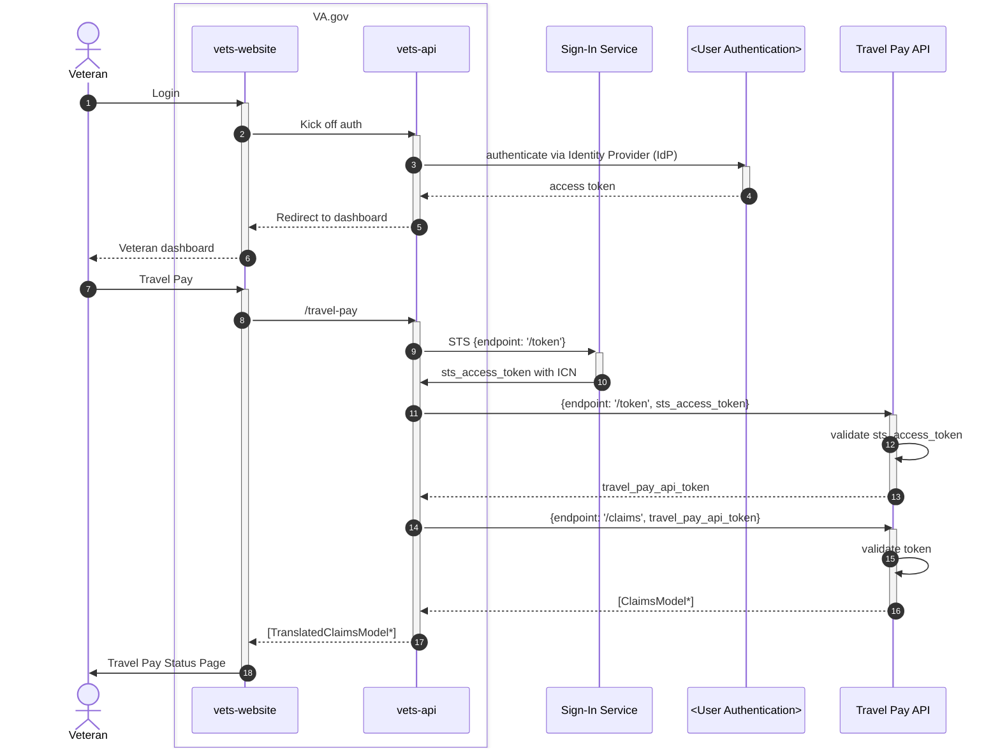

```mermaid
sequenceDiagram
autonumber
  actor v as Veteran
  box VA.gov
    participant vweb as vets-website
    participant vapi as vets-api
  end
  participant sis as Sign-In Service
  participant uauth as <User Authentication>
  participant tpapi as Travel Pay API


  v->>vweb: Login
  activate vweb
    vweb->>vapi: Kick off auth
    activate vapi
    vapi->>uauth: authenticate via Identity Provider (IdP)

    activate uauth
      uauth-->>vapi: access token
    deactivate uauth
    vapi-->>vweb: Redirect to dashboard
    deactivate vapi
    vweb-->>v: Veteran dashboard
    deactivate vweb

    v->>vweb: Travel Pay
    activate vweb
    vweb->>vapi: /travel-pay

    activate vapi
    vapi->>+sis: STS {endpoint: '/token'}
    sis->>-vapi: sts_access_token with ICN

    vapi->>tpapi: {endpoint: '/token', sts_access_token}
    activate tpapi
      tpapi->>tpapi: validate sts_access_token
      tpapi-->>vapi: travel_pay_api_token
    deactivate tpapi

    vapi->>tpapi: {endpoint: '/claims', travel_pay_api_token}

    activate tpapi
      tpapi->>tpapi: validate token

      tpapi-->>vapi: [ClaimsModel*]
    deactivate tpapi
    
    vapi-->>vweb: [TranslatedClaimsModel*]
    deactivate vapi

    vweb->>v: Travel Pay Status Page
  deactivate vweb
```
