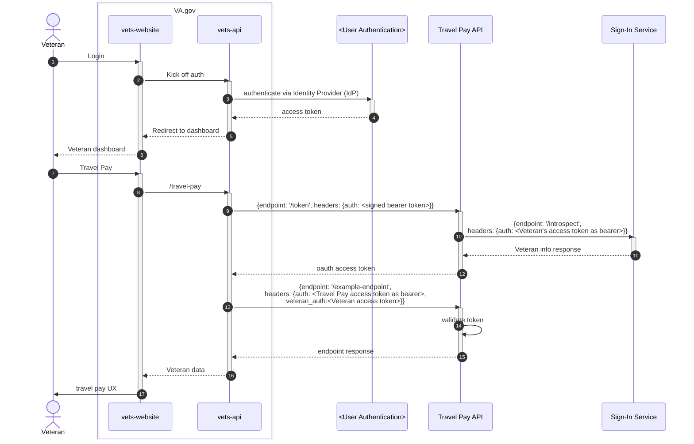

```mermaid
sequenceDiagram
autonumber
  actor v as Veteran
  box VA.gov
    participant vweb as vets-website
    participant vapi as vets-api
  end
  participant uauth as <User Authentication>
  participant tpapi as Travel Pay API
  participant sis as Sign-In Service

  v->>vweb: Login
  activate vweb
    vweb->>vapi: Kick off auth
    activate vapi
    vapi->>uauth: authenticate via Identity Provider (IdP)

    activate uauth
      uauth-->>vapi: access token
    deactivate uauth
    vapi-->>vweb: Redirect to dashboard
    deactivate vapi
    vweb-->>v: Veteran dashboard
    deactivate vweb

    v->>vweb: Travel Pay
    activate vweb
    vweb->>vapi: /travel-pay
    activate vapi

      vapi->>tpapi: {endpoint: '/token', headers: {auth: <signed bearer token>}}
      activate tpapi
      tpapi->>sis: {endpoint: '/introspect',<br/>headers: {auth: <Veteran's access token as bearer>}}
      activate sis
        sis-->>tpapi: Veteran info response
      deactivate sis

      tpapi-->>vapi: oauth access token
    deactivate tpapi

    vapi->>tpapi: {endpoint: '/example-endpoint',<br/>headers: {auth: <Travel Pay access token as bearer>,<br/>veteran_auth:<Veteran access token>}}

    activate tpapi
      tpapi->>tpapi: validate token

      tpapi-->>vapi: endpoint response
    deactivate tpapi
    
    vapi-->>vweb: Veteran data
    deactivate vapi
    vweb->>v: travel pay UX
  deactivate vweb
```
