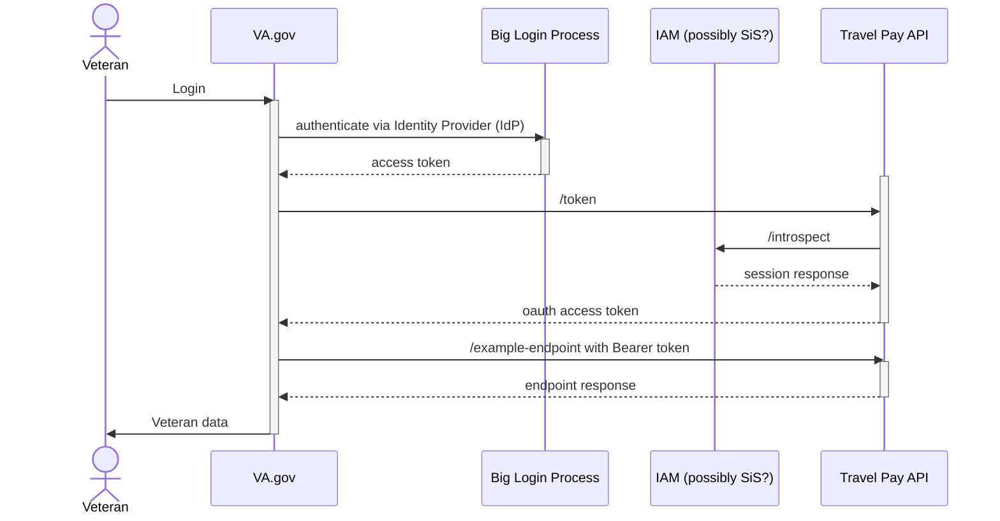

```mermaid
sequenceDiagram
  actor v as Veteran
  participant vagov as VA.gov
  participant blp as Big Login Process
  participant iam as IAM (possibly SiS?)
  participant tpapi as Travel Pay API

  v->>vagov: Login
  activate vagov
  vagov->>blp: authenticate via Identity Provider (IdP)
  activate blp
  blp-->>vagov: access token
  deactivate blp

  activate tpapi
  vagov->>tpapi: /token
  tpapi->>iam: /introspect
  iam-->>tpapi: session response
  tpapi-->>vagov: oauth access token
  deactivate tpapi

  vagov->>tpapi: /example-endpoint with Bearer token
  activate tpapi
  tpapi-->>vagov: endpoint response
  deactivate tpapi
  vagov->>v: Veteran data
  deactivate vagov
```
