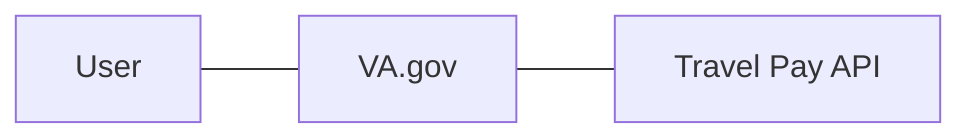
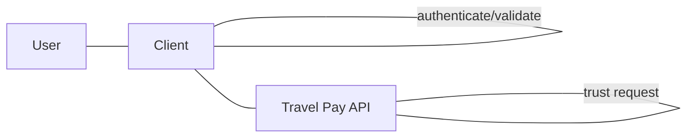
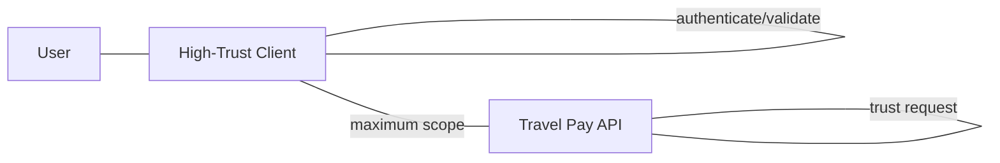
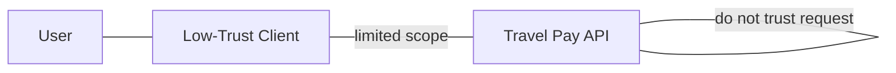
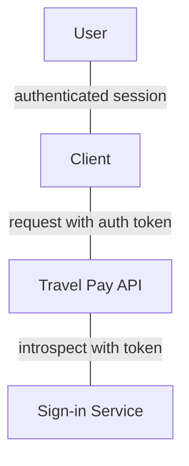
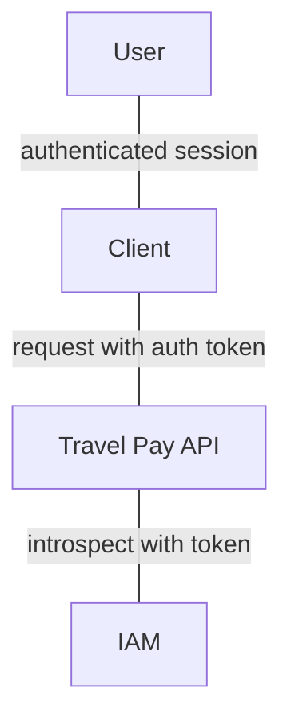
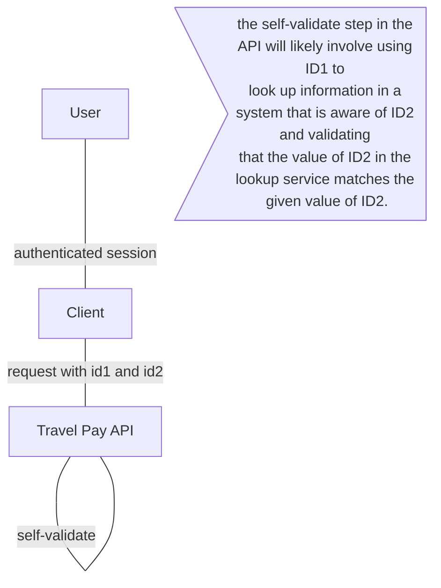

# Authentication paths 

## Context
We have prospective clients that use non-compatible authentication methods to validate their users are who they say they are. The goal of this is to decide on a path forward for allowing the Travel Pay API to prove or trust that the callers of the API only get the information that belongs to them. Note: These approaches do not remove the need for OAuth authorization/client scoping, etc.  They only cover authentication/ICN proof on the API.

## Approaches

### Trust all clients
This approach assumes that all clients of the Travel Pay API perform enough authentication and validation before calling the API that there’s no need to have additional proof.

#### Benefits
The benefit of this approach is that it's easy and immediate. No work other than the client authorization will need to be done.

#### Main Risk
The largest and most obvious risk is that at some point, a client may not perform the required authentication and id proofing. What was an easy and immediate start can quickly turn into a large rework/firefighting situation.

#### Mitigations
Require an integration “contract” with prospective clients. This has the risk of potentially making the integration process more turbulent. It will never be an enforceable contract, and I’m not sure it improves collaboration with clients/integration partners.
Consider clients other than VA.gov out of scope for this PoP. The caveat is that the API team would need to be extra clear about the limitations and future work needed to improve authentication on the API.

### Classify clients into trust groups
This approach extends the “Trust all clients” approach by separating clients into 2 groups: High trust clients, and low trust clients. The API team can consider a high-trust client to have proper authentication and validation, and wouldn’t feel the need to do further validations. Low-trust clients would be scoped to a smaller set of less-sensitive endpoints.

#### Benefits
This approach allow for a logical separation of clients. low-trust client know they'll need to do some work to gain "trusted" status. This approach will likely yield a more rigorously defined integration plan.

#### Main Risk
Similar risks to the "trust all clients" approach exist with this approach. In addition, due to business needs, there may be slippage of low-trust clients into the high-trust realm. E.g. “we really need this feature”, “it’ll only be temporary”, “better authentication is on our roadmap”.

#### Mitigations
Consider clients other than VA.gov out of scope for this PoP. The caveat is that the API team would need to be extra clear about the limitations and future work needed to improve authentication on the API.
Outline the things that the API team needs to ensure trust in a client. This could potentially increase integration time, but has the knock-on benefit of producing a well-defined integration plan by the API team.

### Use VA.gov Sign-in Service
The Sign-in Service (SiS) of VA.gov has an “introspect” endpoint that clients can use to get information about a user that has delegated VA.gov to take action on their behalf. The general approach is highly secure, and an industry standard.

#### Benefits
This approach is widely used in the industry and offers a simple, resilient approach to identity validation.

#### Main Risk
We’re not sure yet if access token required by the /introspect endpoint is specific to VA.gov. If it is, it means only users that sign in to VA.gov would be able to be “proven” by the Travel Pay API by calling /introspect. If SiS is not limited to VA.gov sessions, this is a good, simple way to incorporate the auth we need.

Another risk is the integration time. Though likely shorter than IAM, if the Sign-in Service is the approach we want to take, there will need to be some integration.

#### Mitigations
Spend the time/effort necessary to discover if SiS does what we want. If we do that, and it does do what we want, the risk is completely mitigated. If not, we should turn to another mitigation strategy or another approach altogether.
Consider clients other than VA.gov out of scope for this PoP. The caveat is that the API team would need to be extra clear about the limitations and future work needed to improve authentication on the API.

### Use IAM
SSOe/IAM is proven to work with other services not on the VA.gov platform

#### Benefits
This approach is proven to work with clients outside VA.gov. 

#### Main Risk
From all of the documentation we’ve seen, IAM, SSOe, and AccessVA go hand-in-hand. This is something we’re trying to get away from because [why?]. 

Another risk is that we've heard the integration time is upwards of 3 months. There's also word they may have a large backlog of integrations.

#### Mitigations
Research to see if we can avoid AccessVA while still leveraging the benefits of IAM

### Self-validation
Instead of relying on an external tool, such as SiS or IAM, require Veteran information from clients that would allow the API to perform validation itself.

#### Benefits
The main benefit of this approach is that it does not rely on any external service to do validate the information of the Veteran provided by the client. 

#### Main Risk
The main risk is that implementing this approach is that writing the code to do this will not be mature, well-tested code, just by virtue of being "new code". The other issue is that it's not an industry standard, meaning we have less resources to lean on. Finally, this would take more work both in the planning and implementation stages - what at least 2 pieces of information can the API require that can be used together to prove identity? How much more work would this be to implement?

#### Mitigations
There is a lighthouse team that does this already, could lean on their experience to guide the API
