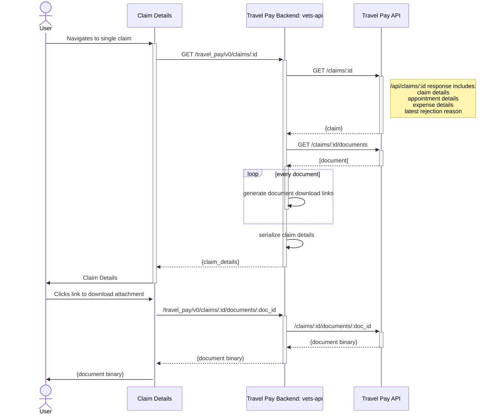

# Claims Management Sequence Diagram

"Claims Management" means taking action on a claim that has been denied. Taking action on a denied claim usually means appealing the claim. In order to do that, a Veteran needs access to their **decision letter**, **right-to-appeal form**, and the **reason their claim was denied**. The Travel Pay API will provide access to the Veteran's resources through various endpoints. They also need to be directed to the appeals process on VA.gov.

## Direct Entry

## Entry Through Claims Status
## Entry Through Appointments
