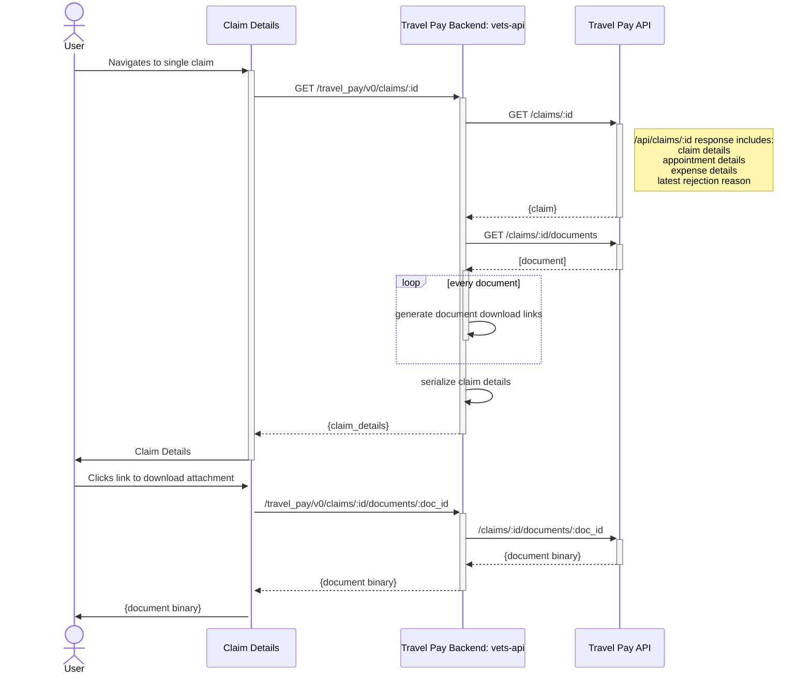

# Claims Management Sequence Diagram

"Claims Management" means taking action on a claim that has been denied. Taking action on a denied claim usually means appealing the claim. In order to do that, a Veteran needs access to their **decision letter**, **right-to-appeal form**, and the **reason their claim was denied**. The Travel Pay API will provide access to the Veteran's resources through various endpoints. They also need to be directed to the appeals process on VA.gov.

## Direct Entry

## Entry Through Claims Status
Currently, there is an entry point from the claims status list page to the claim details page. Because there are no major discrepencies in the data object retrieved from the `/claims` vs. `/claims/{id}` endpoints from the current v1.2 Travel Pay API, the API only makes a call to `/claims/{id}` if the user refreshes the page. ([Link to current (as of March 2025) `/claims` sequence diagram](https://github.com/department-of-veterans-affairs/va.gov-team/blob/master/products/health-care/beneficiary-travel/engineering/submit-claim/full-sequence-diagram.md#visiting-my-healthtravel-payclaims))

However, when looking for properties related to claims management, more data points will be added to the claim object retrieved from the `/claims/{id}` endpoint (available in the Travel Pay API v2.0 release) that will not be available in claim data retrieved from the `/claims` endpoint. 

The link from the claim status list page will remain the same, and will still navigate to the claim details page, as per current behavior, however, for claims management the claim data will need to be retrieved from the `/claims/{id}` endpoint in order to access to the rejection reasons and document IDs required in the diagram above (not available in the `/claims` API call).

## Entry Through Appointments
The existing entry point through Appointments on VA.gov will need no adjustments as it currently reaches out to the `/claims/{id}` endpoint upon reaching the claim details page to retrieve the claim data. 
