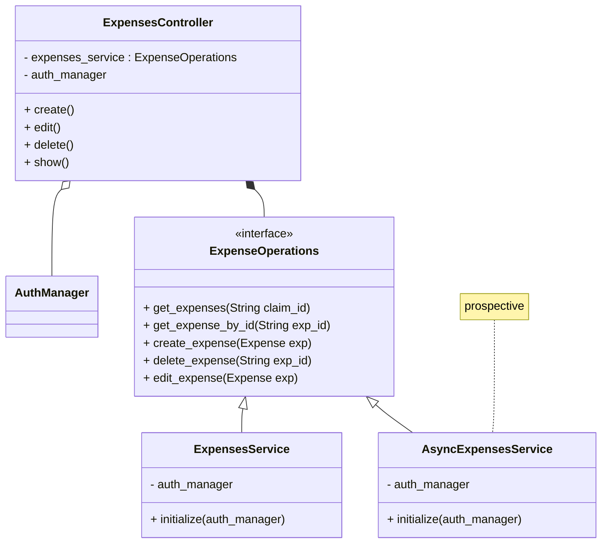

# Expense Operations

Requests from VA.gov to the Travel Pay API include:
1. vets-api request handling
2. TIC traversal
3. Travel Pay API request handling
4. Travel Pay API business logic (invoking plugins, etc)
5. TIC traversal
6. vets-api response handling (serialization, etc)

Even at 500ms each, this represents a 3-second end-to-end flow, and we often see 1+ second Travel Pay API business logic.

To mitigate, we will follow the open/closed principle to easily add asynchronous behavior in order to apply optimizations, like asynchronous request handling.

Idea: Understanding that Sidekiq is for long long running jobs or final submissions, with silent successes AND silent failures, can I just use Rails's ActiveJob for shorter-but-still-expensive calls to APIs? This would allow me to update the cached data as 'saved' for further processing

## TODO
- [ ] Verify "idiomaticism" - is this the "Ruby/Rails way"?
- [ ] Weigh complexity of approach with convenience/adherence to [Open/Closed Principle](https://en.wikipedia.org/wiki/Open%E2%80%93closed_principle).

## Class Diagram

