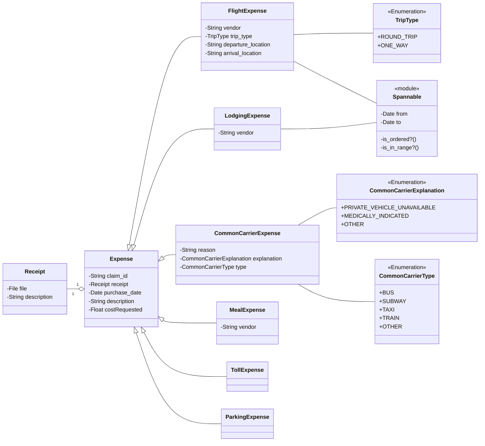

# Expense Types

## Implementation Details
Prototyped in [travel-pay/prototype/expense-types](https://github.com/department-of-veterans-affairs/vets-api/tree/travel-pay/prototype/expense-types/modules/travel_pay/app/models/travel_pay/expenses)

## Class Diagram

