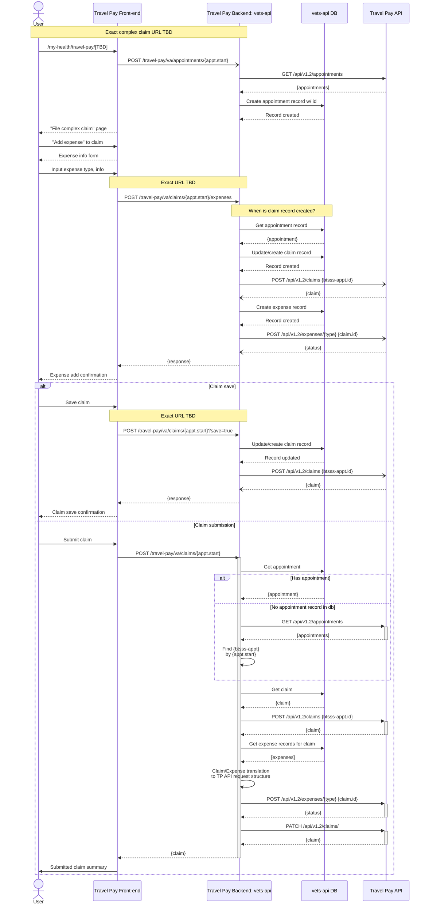

# Expenses Sequence Diagrams

```mermaid
sequenceDiagram
    actor user as User
    participant tp as Travel Pay Front-end
    participant tpm as Travel Pay Backend: vets-api
    participant db as vets-api DB
    participant tpapi as Travel Pay API

    Note over user,tpm: Exact complex claim URL TBD
    user ->> tp: /my-health/travel-pay/[TBD]
    tp -) tpm: POST /travel-pay/va/appointments/{appt.start}
    tpm ->> tpapi: GET /api/v1.2/appointments
    tpapi -->> tpm: [appointments]
    tpm ->> db: Create appointment record w/ id
    db -->> tpm: Record created

    tp -->> user: "File complex claim" page

    user ->> tp: "Add expense" to claim
    tp -->> user: Expense info form

    user ->> tp: Input expense type, info

    Note over tp,tpm: Exact URL TBD
    tp ->> tpm: POST /travel-pay/va/claims/{appt.start}/expenses

    Note over tpm,db: When is claim record created?
    tpm ->> db: Get appointment record
    db -->> tpm: {appointment}
    tpm ->> db: Update/create claim record
    db -->> tpm: Record created
    tpm -) tpapi: POST /api/v1.2/claims {btsss-appt.id}
    tpapi --) tpm: {claim}

    tpm ->> db: Create expense record
    db -->> tpm: Record created
    tpm -) tpapi: POST /api/v1.2/expenses/{type} {claim.id}
    tpapi --) tpm: {status}

    tpm -->> tp: {response}
    tp -->> user: Expense add confirmation

    alt Claim save
        user ->> tp: Save claim

        Note over tp,tpm: Exact URL TBD
        tp ->> tpm: POST /travel-pay/va/claims/{appt.start}?save=true
        tpm ->> db: Update/create claim record
        db -->> tpm: Record updated
        tpm -) tpapi: POST /api/v1.2/claims {btsss-appt.id}
        tpapi --) tpm: {claim}
        tpm -->> tp: {response}
        tp -->> user: Claim save confirmation
    else Claim submission
        user ->> tp: Submit claim
        tp ->> tpm: POST /travel-pay/va/claims/{appt.start}

        activate tpm
          tpm ->> db: Get appointment
          alt Has appointment
            db -->> tpm: {appointment} 
          else No appointment record in db
            tpm ->>+ tpapi: GET /api/v1.2/appointments
            tpapi -->>- tpm: [appointments]
            tpm ->> tpm: Find {btsss-appt}<br /> by {appt.start}
          end

          tpm ->> db: Get claim
          db -->> tpm: {claim}

          tpm ->>+ tpapi: POST /api/v1.2/claims {btsss-appt.id}
          tpapi -->>- tpm: {claim}

          tpm ->> db: Get expense records for claim
          db -->> tpm: [expenses]
          tpm ->> tpm: Claim/Expense translation<br/>to TP API request structure

          tpm ->>+ tpapi: POST /api/v1.2/expenses/{type} {claim.id}
          tpapi -->>- tpm: {status}

          tpm ->>+ tpapi: PATCH /api/v1.2/claims/#{claim.id}/submit
          tpapi -->>- tpm: {claim}

          tpm -->> tp: {claim}
        deactivate tpm

        tp ->> user: Submitted claim summary
    end
```
