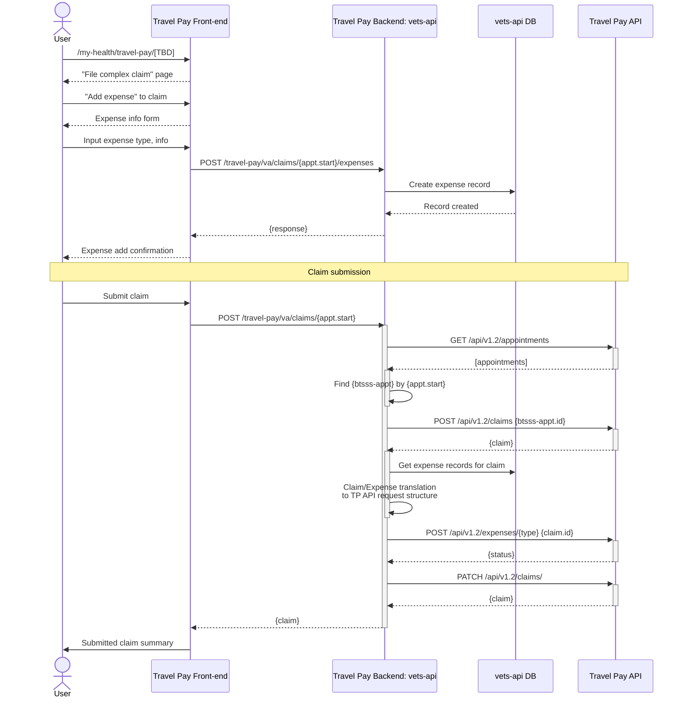

# Expenses Sequence Diagrams

```mermaid
sequenceDiagram
    actor user as User
    participant tp as Travel Pay Front-end
    participant tpm as Travel Pay Backend: vets-api
    participant db as vets-api DB
    participant tpapi as Travel Pay API

    user ->> tp: /my-health/travel-pay/[TBD]
    tp -->> user: "File complex claim" page

    user ->> tp: "Add expense" to claim
    tp -->> user: Expense info form

    user ->> tp: Input expense type, info
    tp ->> tpm: POST /travel-pay/va/claims/{appt.start}/expenses
    tpm ->> db: Create expense record
    db -->> tpm: Record created
    tpm -->> tp: {response}
    tp -->> user: Expense add confirmation

    Note over user,tpapi: Claim submission
    user ->> tp: Submit claim
    tp ->> tpm: POST /travel-pay/va/claims/{appt.start}


    activate tpm
      tpm ->>+ tpapi: GET /api/v1.2/appointments
      tpapi -->>- tpm: [appointments]

      activate tpm
        tpm ->> tpm: Find {btsss-appt} by {appt.start}
      deactivate tpm

      tpm ->>+ tpapi: POST /api/v1.2/claims {btsss-appt.id}
      tpapi -->>- tpm: {claim}

      activate tpm
          tpm ->> db: Get expense records for claim
          tpm ->> tpm: Claim/Expense translation<br/>to TP API request structure
      deactivate tpm

      tpm ->>+ tpapi: POST /api/v1.2/expenses/{type} {claim.id}
      tpapi -->>- tpm: {status}

      tpm ->>+ tpapi: PATCH /api/v1.2/claims/#{claim.id}/submit
      tpapi -->>- tpm: {claim}

      tpm -->> tp: {claim}
    deactivate tpm

    tp ->> user: Submitted claim summary
```
