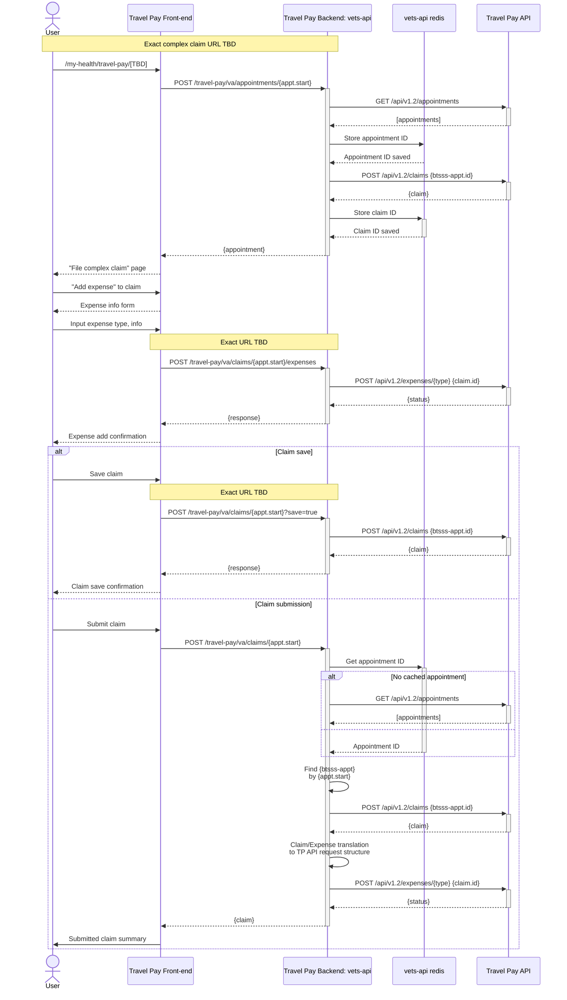

# Expenses Sequence Diagrams

```mermaid
sequenceDiagram
    actor user as User
    participant tp as Travel Pay Front-end
    participant tpm as Travel Pay Backend: vets-api
    participant cache as vets-api redis
    participant tpapi as Travel Pay API

    Note over user,tpm: Exact complex claim URL TBD
    user ->> tp: /my-health/travel-pay/[TBD]
    tp ->>+ tpm: POST /travel-pay/va/appointments/{appt.start}
    tpm ->>+ tpapi: GET /api/v1.2/appointments
    tpapi -->>- tpm: [appointments]
    tpm ->> cache: Store appointment ID
    cache -->> tpm: Appointment ID saved
    tpm ->>+ tpapi: POST /api/v1.2/claims {btsss-appt.id}
    tpapi -->>- tpm: {claim}
    tpm ->>+ cache: Store claim ID
    cache -->>- tpm: Claim ID saved
    tpm -->>- tp: {appointment}
    tp -->> user: "File complex claim" page

    user ->> tp: "Add expense" to claim
    tp -->> user: Expense info form

    user ->> tp: Input expense type, info

    Note over tp,tpm: Exact URL TBD
    tp ->>+ tpm: POST /travel-pay/va/claims/{appt.start}/expenses
    tpm ->>+ tpapi: POST /api/v1.2/expenses/{type} {claim.id}
    tpapi -->>- tpm: {status}

    tpm -->>- tp: {response}
    tp -->> user: Expense add confirmation

    alt Claim save
        user ->> tp: Save claim

        Note over tp,tpm: Exact URL TBD
        tp ->>+ tpm: POST /travel-pay/va/claims/{appt.start}?save=true
        tpm ->>+ tpapi: POST /api/v1.2/claims {btsss-appt.id}
        tpapi -->>- tpm: {claim}
        tpm -->>- tp: {response}
        tp -->> user: Claim save confirmation
    else Claim submission
        user ->> tp: Submit claim
        tp ->>+ tpm: POST /travel-pay/va/claims/{appt.start}
        tpm ->>+ cache: Get appointment ID
        alt No cached appointment
            tpm ->>+ tpapi: GET /api/v1.2/appointments
            tpapi -->>- tpm: [appointments]
        else
            cache -->>- tpm: Appointment ID
        end
        tpm ->> tpm: Find {btsss-appt}<br /> by {appt.start}

        tpm ->>+ tpapi: POST /api/v1.2/claims {btsss-appt.id}
        tpapi -->>- tpm: {claim}

        tpm ->> tpm: Claim/Expense translation<br/>to TP API request structure

        tpm ->>+ tpapi: POST /api/v1.2/expenses/{type} {claim.id}
        tpapi -->>- tpm: {status}

        tpm -->>- tp: {claim}
        tp ->> user: Submitted claim summary
    end
```
