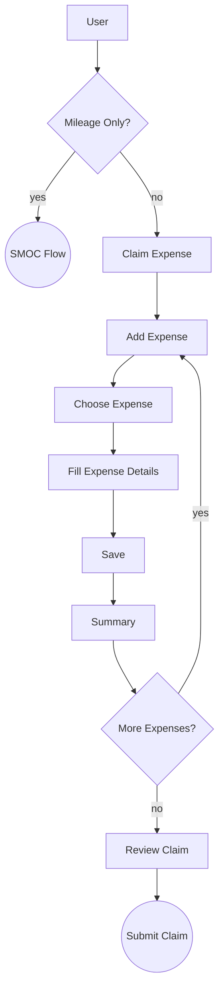
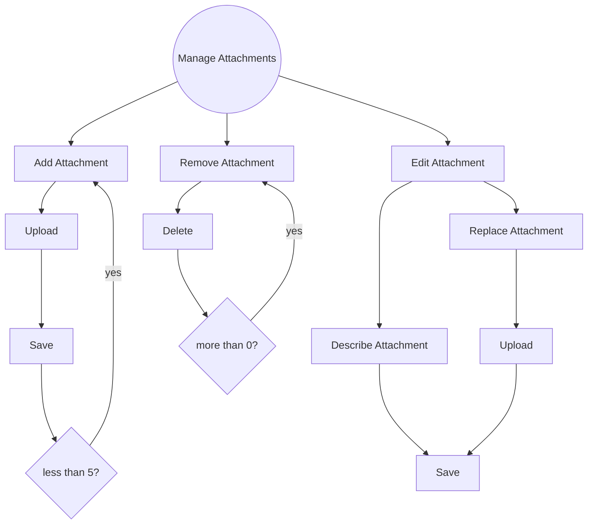

## Adding Expenses

```mermaid
flowchart TD
user[User]
isMo{Mileage Only?}
addExp[Add Expense]

user --> isMo
isMo -->|yes| smoc((SMOC Flow))
isMo -->|no| startClaim[Claim Expense]
startClaim --> addExp
addExp --> expType[Choose Expense]
expType --> expForm[Fill Expense Details]
expForm --> save[Save]
save --> summary[Summary]
summary --> hasMore{More Expenses?}
hasMore -->|no| review[Review Claim]
hasMore -->|yes| addExp
review --> submit((Submit Claim))
```

## Adding Attachments

```mermaid
flowchart TD
  start((Manage Attachments))
  add[Add Attachment]
  del[Remove Attachment]
  edit[Edit Attachment]
  describe[Describe Attachment]
  replace[Replace Attachment]
  maxLimit{less than 5?}
  minLimit{more than 0?}

  start --> add
    add --> u1[Upload]
    u1 --> s1[Save]
    s1 --> maxLimit
    maxLimit -->|yes| add

  start --> del
    del --> Delete
    Delete --> minLimit
    minLimit -->|yes| del

  start --> edit
    edit --> describe
    edit --> replace
    replace --> u2[Upload]
    describe --> s2[Save]
    u2 --> s2
```