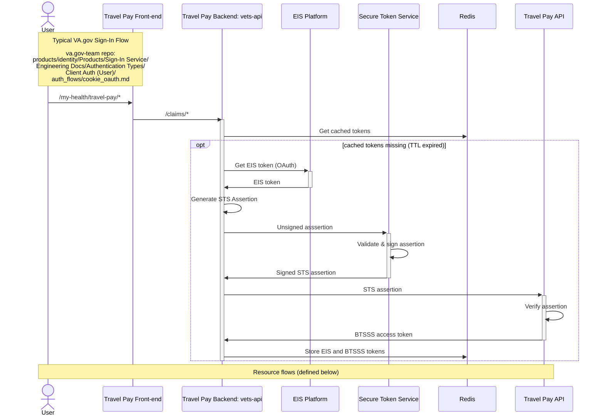
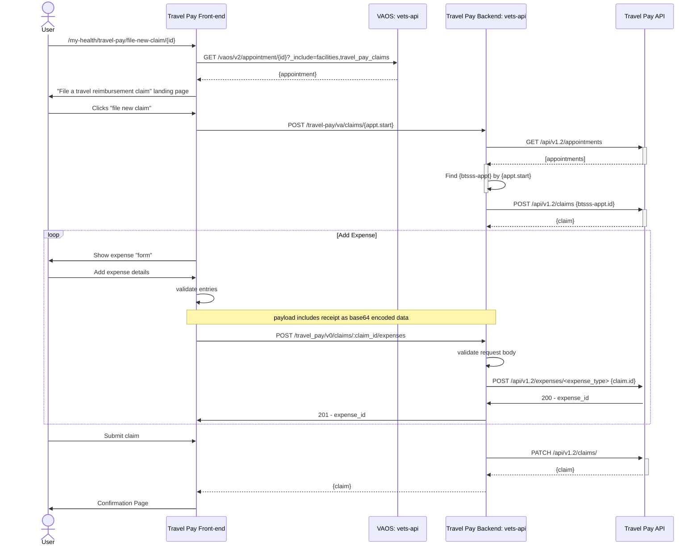
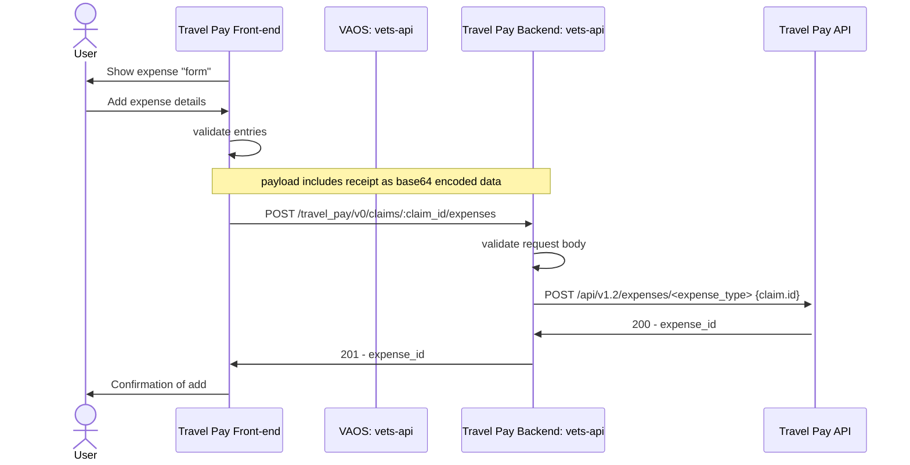
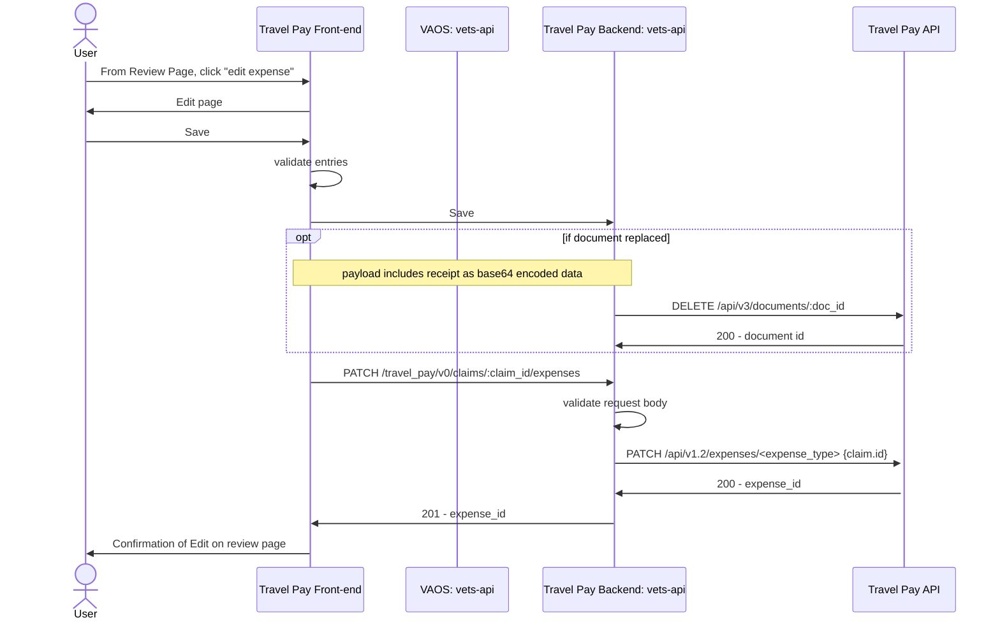
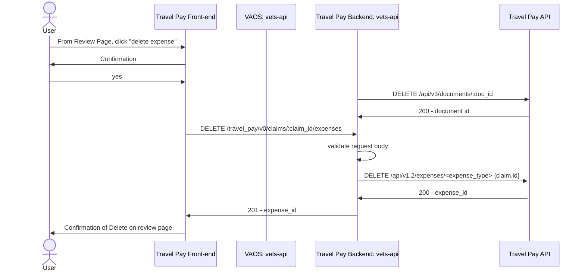

# Expenses Sequence Diagrams
## AuthN/AuthZ

```mermaid
sequenceDiagram
    actor user as User
    participant tp as Travel Pay Front-end
    participant tpm as Travel Pay Backend: vets-api
    participant eis as EIS Platform
    participant sts as Secure Token Service
    participant redis as Redis
    participant tpapi as Travel Pay API

    note over user,tp: Typical VA.gov Sign-In Flow<br/><br/>va.gov-team repo: <br/>products/identity/Products/Sign-In Service/<br/>Engineering Docs/Authentication Types/<br/>Client Auth (User)/<br/>auth_flows/cookie_oauth.md#sequence-diagram
    
    user->>tp: /my-health/travel-pay/*

    tp->>tpm: /claims/*

    activate tpm
        tpm ->> redis: Get cached tokens
        
        opt cached tokens missing (TTL expired)
            tpm ->>+ eis: Get EIS token (OAuth)
            eis ->>- tpm: EIS token

            tpm ->> tpm: Generate STS Assertion
            tpm ->>+ sts: Unsigned asssertion
            sts ->> sts: Validate & sign assertion
            sts ->>- tpm: Signed STS assertion

            tpm ->>+ tpapi: STS assertion
            tpapi ->> tpapi: Verify assertion
            tpapi ->>- tpm: BTSSS access token

            tpm ->> redis: Store EIS and BTSSS tokens
        end
    deactivate tpm

    note over user,tpapi: Resource flows (defined below)
```
## Happy Path

```mermaid
sequenceDiagram
    actor user as User
    participant tpfe as Travel Pay Front-end
    participant vaos as VAOS: vets-api
    participant tpm  as Travel Pay Backend: vets-api
    participant tpapi as Travel Pay API

    user ->> tpfe: /my-health/travel-pay/file-new-claim/{id}
    tpfe ->> vaos: GET /vaos/v2/appointment/{id}?_include=facilities,travel_pay_claims

    vaos -->> tpfe: {appointment}
    tpfe ->> user: "File a travel reimbursement claim" landing page
    
    user ->> tpfe: Clicks "file new claim"
    tpfe ->> tpm: POST /travel-pay/va/claims/{appt.start}

    tpm ->>+ tpapi: GET /api/v1.2/appointments
    tpapi -->>- tpm: [appointments]
    activate tpm
      tpm ->> tpm: Find {btsss-appt} by {appt.start}
    deactivate tpm

    tpm ->>+ tpapi: POST /api/v1.2/claims {btsss-appt.id}
    tpapi -->>- tpm: {claim}


    loop Add Expense
      tpfe ->> user: Show expense "form"
      user ->> tpfe: Add expense details
      tpfe ->> tpfe: validate entries
      note over tpfe,tpm: payload includes receipt as base64 encoded data
      tpfe ->> tpm: POST /travel_pay/v0/claims/:claim_id/expenses
      tpm ->> tpm: validate request body
      tpm ->>+ tpapi: POST /api/v1.2/expenses/<expense_type> {claim.id}

      tpapi ->> tpm: 200 - expense_id
      tpm ->> tpfe: 201 - expense_id
    end
    
    user ->> tpfe: Submit claim
    tpm ->>+ tpapi: PATCH /api/v1.2/claims/#{claim.id}/submit
    tpapi -->>- tpm: {claim}

    tpm -->> tpfe: {claim}
    tpfe ->> user: Confirmation Page
```

## Breakout: Expense Ops
### Add Expense

```mermaid
sequenceDiagram
  actor user as User
  participant tpfe as Travel Pay Front-end
  participant vaos as VAOS: vets-api
  participant tpm  as Travel Pay Backend: vets-api
  participant tpapi as Travel Pay API

  tpfe ->> user: Show expense "form"
  user ->> tpfe: Add expense details
  tpfe ->> tpfe: validate entries
  note over tpfe,tpm: payload includes receipt as base64 encoded data
  tpfe ->> tpm: POST /travel_pay/v0/claims/:claim_id/expenses
  tpm ->> tpm: validate request body
  tpm ->>+ tpapi: POST /api/v1.2/expenses/<expense_type> {claim.id}

  tpapi ->> tpm: 200 - expense_id
  tpm ->> tpfe: 201 - expense_id

  tpfe ->> user: Confirmation of add
```

### Edit Expense

```mermaid
sequenceDiagram
  actor user as User
  participant tpfe as Travel Pay Front-end
  participant vaos as VAOS: vets-api
  participant tpm  as Travel Pay Backend: vets-api
  participant tpapi as Travel Pay API

  user ->> tpfe: From Review Page, click "edit expense"
  tpfe ->> user: Edit page
  user ->> tpfe: Save
  tpfe ->> tpfe: validate entries

  tpfe ->> tpm: Save
  opt if document replaced
    note over tpfe,tpm: payload includes receipt as base64 encoded data
    tpm ->> tpapi: DELETE /api/v3/documents/:doc_id
    tpapi ->> tpm: 200 - document id
  end
  
  tpfe ->> tpm: PATCH /travel_pay/v0/claims/:claim_id/expenses
  tpm ->> tpm: validate request body
  tpm ->>+ tpapi: PATCH /api/v1.2/expenses/<expense_type> {claim.id}

  tpapi ->> tpm: 200 - expense_id
  tpm ->> tpfe: 201 - expense_id

  tpfe ->> user: Confirmation of Edit on review page
```

### Delete Expense

```mermaid
sequenceDiagram
  actor user as User
  participant tpfe as Travel Pay Front-end
  participant vaos as VAOS: vets-api
  participant tpm  as Travel Pay Backend: vets-api
  participant tpapi as Travel Pay API

  user ->> tpfe: From Review Page, click "delete expense"
  tpfe ->> user: Confirmation
  user ->> tpfe: yes
  
  tpm ->> tpapi: DELETE /api/v3/documents/:doc_id
  tpapi ->> tpm: 200 - document id

  tpfe ->> tpm: DELETE /travel_pay/v0/claims/:claim_id/expenses
  tpm ->> tpm: validate request body
  tpm ->>+ tpapi: DELETE /api/v1.2/expenses/<expense_type> {claim.id}

  tpapi ->> tpm: 200 - expense_id
  tpm ->> tpfe: 201 - expense_id

  tpfe ->> user: Confirmation of Delete on review page
```
