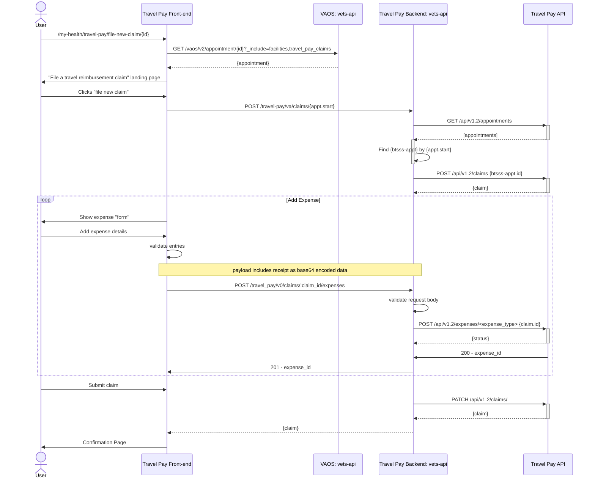

# Expenses Sequence Diagrams

## Happy Path

```mermaid
sequenceDiagram
    actor user as User
    participant tpfe as Travel Pay Front-end
    participant vaos as VAOS: vets-api
    participant tpm  as Travel Pay Backend: vets-api
    participant tpapi as Travel Pay API

    user ->> tpfe: /my-health/travel-pay/file-new-claim/{id}
    tpfe ->> vaos: GET /vaos/v2/appointment/{id}?_include=facilities,travel_pay_claims

    vaos -->> tpfe: {appointment}
    tpfe ->> user: "File a travel reimbursement claim" landing page
    
    user ->> tpfe: Clicks "file new claim"
    tpfe ->> tpm: POST /travel-pay/va/claims/{appt.start}

    tpm ->>+ tpapi: GET /api/v1.2/appointments
    tpapi -->>- tpm: [appointments]
    activate tpm
      tpm ->> tpm: Find {btsss-appt} by {appt.start}
    deactivate tpm

    tpm ->>+ tpapi: POST /api/v1.2/claims {btsss-appt.id}
    tpapi -->>- tpm: {claim}


    loop Add Expense
      tpfe ->> user: Show expense "form"
      user ->> tpfe: Add expense details
      tpfe ->> tpfe: validate entries
      note over tpfe,tpm: payload includes receipt as base64 encoded data
      tpfe ->> tpm: POST /travel_pay/v0/claims/:claim_id/expenses
      tpm ->> tpm: validate request body
      tpm ->>+ tpapi: POST /api/v1.2/expenses/<expense_type> {claim.id}
      tpapi -->>- tpm: {status}

      tpapi ->> tpm: 200 - expense_id
      tpm ->> tpfe: 201 - expense_id
    end
    
    user ->> tpfe: Submit claim
    tpm ->>+ tpapi: PATCH /api/v1.2/claims/#{claim.id}/submit
    tpapi -->>- tpm: {claim}

    tpm -->> tpfe: {claim}
    tpfe ->> user: Confirmation Page
```
