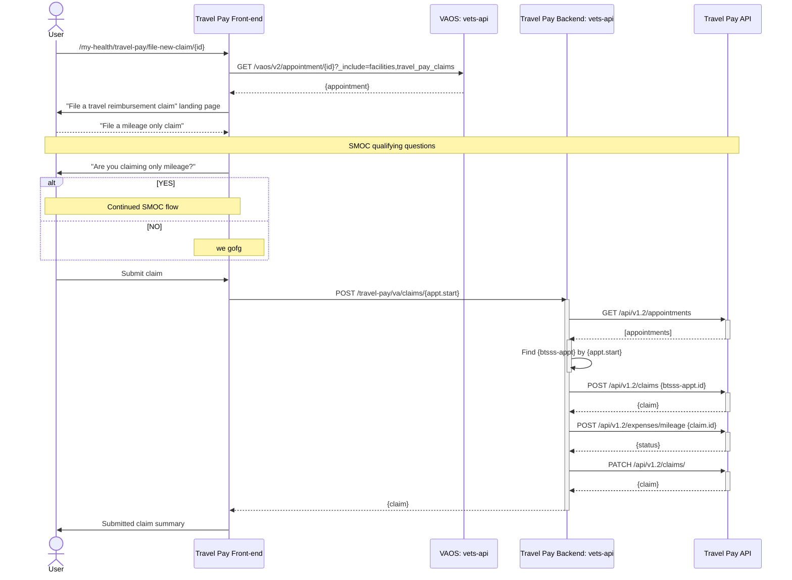
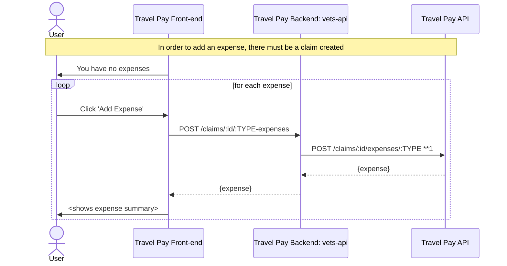

# Simple Mileage-only Claim

## Visiting `/my-health/travel-pay/file-new-claim/{id}`

## Add expense

`**N` denotes an assumption

* **1: assumes the endpoint will be structured this way (e.g `expenses/mileage`, `expenses/lodging`)