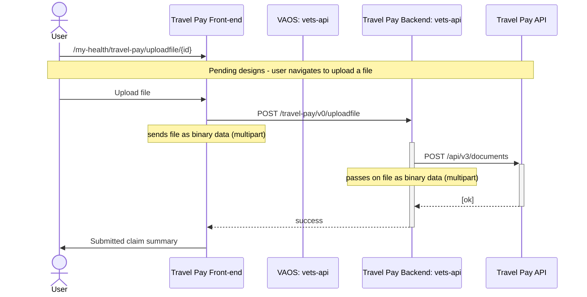

# Uploads Sequence Diagrams

These are highly dependend on designs, and even after designs are finalized, may change to incorporate async use of s3.

```mermaid
sequenceDiagram
    actor user as User
    participant uploadfe as Travel Pay Front-end
    participant vaos as VAOS: vets-api
    participant tpm  as Travel Pay Backend: vets-api
    participant tpapi as Travel Pay API

    user ->> uploadfe: /my-health/travel-pay/uploadfile/{id}

    Note over user,tpapi: Pending designs - user navigates to upload a file

    user ->> uploadfe: Upload file

    uploadfe ->> tpm: POST /travel-pay/v0/uploadfile
    Note over uploadfe: sends file as binary data (multipart)
    
    activate tpm
      tpm ->>+ tpapi: POST /api/v3/documents
      Note over tpm: passes on file as binary data (multipart)
      tpapi -->>- tpm: [ok]
      tpm -->> uploadfe: success
    deactivate tpm

    uploadfe ->> user: Submitted claim summary
```
