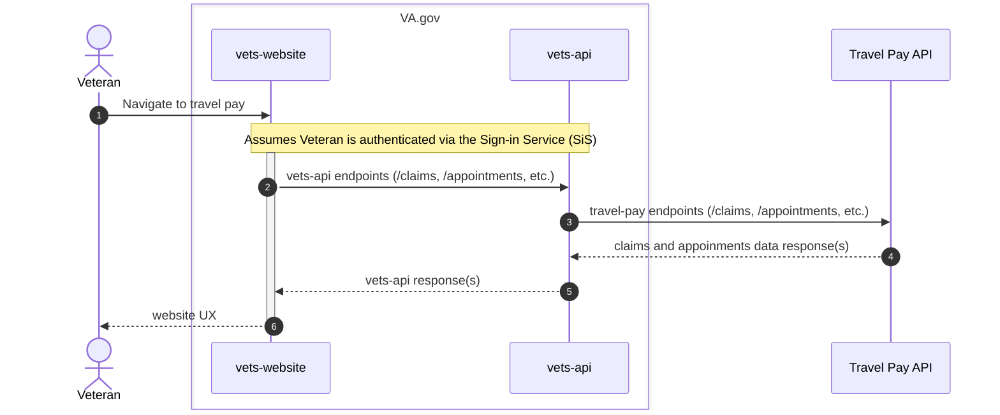

# BTSSS Sequence Flow

The basic sequence for how BTSSS data flows is straightforward:

## Outstanding Questions

### How do we handle potential discrepancies in profile data between the VA.gov user profile and contact information in BTSSS?

 According to the BTSSS team, when a veteran first logs in to the portal, their contact information "is dependent on their data in enrollment services" (see https://github.com/department-of-veterans-affairs/va.gov-team/issues/70474 for more context). Any contact updates from that point onward appear to be isolated within the portal and lack communication with external services.

Since this sequence has users coming from VA.gov that sources contact information from a user's VA.gov profile/VA Profile, VA.gov will need to account for any discrepancies in profile information between the two. Does this mean VA.gov will need a mechanism for updating BTSSS profile information, or should VA.gov consider its profile info the source of truth and not worry about updates?

### Is Redis caching needed for the responses from the travel-pay-api?

To be determined. Known performance bottlenecks exist in systems upstream of the `travel-pay-api`. If the `travel-pay-api` improves _that_ performance via caching or other optimizations of its own, `vets-api` might not need to worry about caching its responses from the `travel-pay-api`.

## Appendix

For more information on the Sign-in Service referenced in the diagram, see [here](https://github.com/department-of-veterans-affairs/va.gov-team/blob/master/products/identity/Products/Sign-In%20Service/auth_flows/cookie_oauth.md#sequence-diagram).
