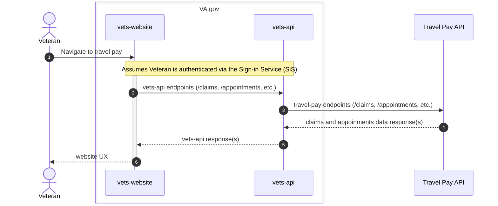

The basic sequence for most BTSSS is straightforward:

What's to be determined is how we deal with any profile information updates. According to the BTSSS team, when a veteran first logs in to the portal, their contact information "is dependent on their data in enrollment services." Any contact updates from that point onward appear to be isolated within the dynamics database used by the portal.

Since we'll have users coming from VA.gov with their information coming from their VA.gov profile/VA Profile, we'll need to account for any discrepancies between the two and update accordingly, with the VA.gov information being the source of truth.
