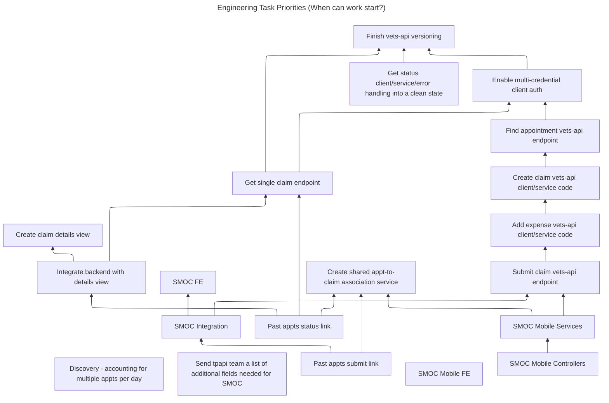

# Engineering tasks & dependencies

This document will be updated to reflect the current state of engineering dependencies each sprint. "Dependency" in this doc means "when can work start?"

Note: Position does not indicate priority or schedule. Outgoing arrows denote a tasks having a dependency on another. If a task has no outgoing arrows, it is independent.

## Sprint starting 09/09/2024

