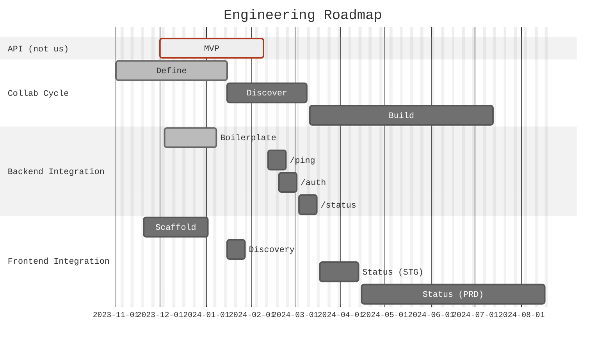

# WORK IN PROGRESS

```mermaid
%%{
  init: {
    "theme": "neutral",
    "fontFamily": "monospace",
    "gantt": {
        "barHeight": 25,
        "leftPadding": 150
    }
  }
}%%

gantt
    %% A week is 5 days
    %% A sprint is 10 days

    title Engineering Roadmap
    dateFormat YYYY-MM-DD
    excludes weekends

    section API (not us)
        MVP    :crit, active, api-mvp, 2023-12-01, 2024-02-09
    section Collab Cycle
        Define    :done, cc-def, 2023-11-01, 2024-01-15
        Discover  :cc-disc, 2024-01-15, 40d
        Build     :cc-build, after cc-disc, 90d
    section Backend Integration
        Boilerplate :done, bplate, 2023-12-04, 2024-01-08
        /ping    :ping, 2024-02-12, 10d
        /auth    :auth, 2024-02-19, 10d
        /status  :sts-be, after auth, 10d
    section Frontend Integration
        Scaffold        :scaff, 2023-11-20, 2024-01-02
        Discovery       :disc, 2024-01-15, 10d
        Status (STG)    :sts-fe-stg, after sts-be, 20d
        Status (PRD)    :sts-fe-prd, after sts-fe-stg, 90d
```

# WORK IN PROGRESS
