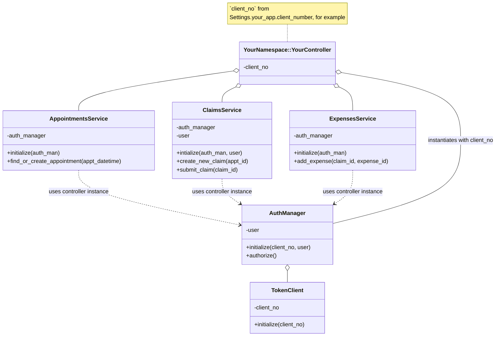

# Template for using a unique client number

> Custom controllers, shared services

The basic idea behind this approach is that each application should use their own controller and integrate with the services defined in the `travel_pay` vets-api module. The slogan for this approach is "Custom controllers, shared services."

## Pros of this approach
- Simple to define and use your own app's client number (e.g. your client_number is defined in your app's config in `settings.yml`)
- Simple to maintain ownership/accountability over your own application
- Follows patterns defined elsewhere in VA.gov
- Backend-only work - nothing changes on the frontend

## Cons of this approach
- Duplication of code if your controller very closely matches the `TravelPay::ClaimsController`
- Potentially more of an defined contract established between the owner of the services and the owner(s) of the controllers

We feel the cons of this approach are minimal or can be mitigated easily.

## Class Diagram

