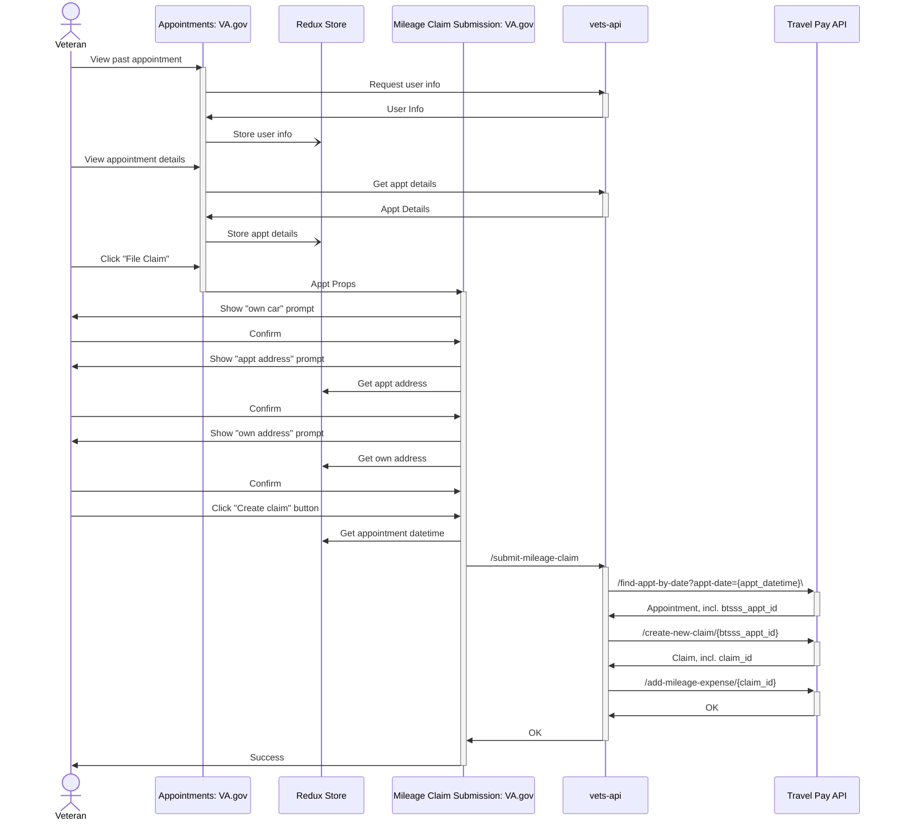
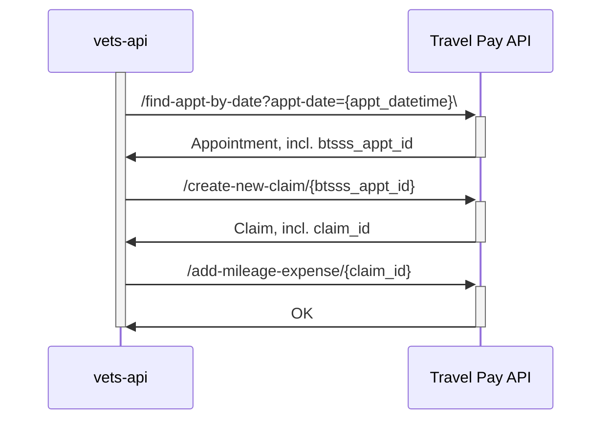
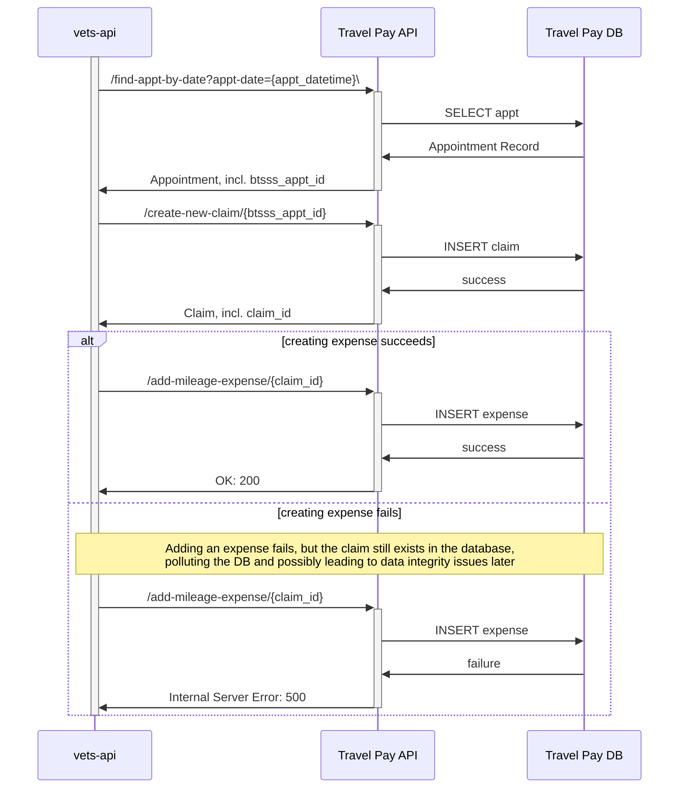

# DRAFT DRAFT DRAFT DRAFT DRAFT


## Thoughts & Considerations

- how can support both Simple (PCI) vs complex (turbotax) flows
- build claim to come back to later
- convert from simple to complex? Do we want to make that distinction? 
- Do we want to get rid the idea of simple vs complex in the API  
- what could we preload to make the submitting lighter?
- When *should* we create the claim/
  - When should we submit?
- Do not have abandoned claims on va.gov, do we care? yes?  
- Do we care about parody with the BTSSS system and the forms they are filling out on va.gov (for partial forms)
- Should we use the forms system? 
  - subform/wizard pattern: https://design.va.gov/patterns/help-users-to/complete-a-sub-task ?
- Is there a valid reason to ship something like the simple mileage claim as its own form and maintain two different forms?


## Full Flow of SMOC as of 08/06/2024


## Happy Path 3-part Backend-Only Flow of SMOC as of 08/06/2024

## Failure Path 3-part Backend-Only Flow of SMOC as of 08/06/2024

##  Failure Path 3-part Backend-Only Flow with Rollback of SMOC as of 08/06/2024
```mermaid
sequenceDiagram
  participant vapi as vets-api
  participant tpapi as Travel Pay API
  participant db as Travel Pay DB

  %% Should this all be transactional? E.g. what happens
  %% when a claim is created, but mileage expense creation
  %% fails? Delete the claim? Try mileage add again, then
  %% roll back? Does the API handle this already?
  activate vapi
    vapi ->>+ tpapi: /find-appt-by-date?appt-date={appt_datetime}\
    tpapi ->> db: SELECT appt
    db ->> tpapi: Appointment Record
    tpapi ->>- vapi: Appointment, incl. btsss_appt_id

    vapi ->>+ tpapi: /create-new-claim/{btsss_appt_id}
    tpapi ->> db: INSERT claim
    db ->> tpapi: success
    tpapi ->>- vapi: Claim, incl. claim_id

    alt creating expense succeeds
      vapi ->>+ tpapi: /add-mileage-expense/{claim_id}
      tpapi ->> db: INSERT expense
      db ->> tpapi: success
      tpapi ->>- vapi: OK: 200
    else creating expense fails
      vapi ->>+ tpapi: /add-mileage-expense/{claim_id}
      tpapi ->> db: INSERT expense
      db ->> tpapi: failure
      tpapi ->>- vapi: Internal Server Error: 500

      vapi ->>+ tpapi: /delete-claim/{claim_id}
      tpapi ->> db: DELETE claim
      db ->> tpapi: success
      tpapi ->>- vapi: OK: 200
    end

  deactivate vapi
  ```

## Alternate, LESS OPTIMAL 2-part Backend-Only Flow of SMOC as of 08/06/2024
  ```mermaid
sequenceDiagram
  participant vapi as vets-api
  participant tpapi as Travel Pay API
  participant db as Travel Pay DB

  %% Should this all be transactional? E.g. what happens
  %% when a claim is created, but mileage expense creation
  %% fails? Delete the claim? Try mileage add again, then
  %% roll back? Does the API handle this already?
  activate vapi
    vapi ->>+ tpapi: /find-appt-by-date?appt-date={appt_datetime}\
    tpapi ->> db: SELECT appt
    db ->> tpapi: Appointment Record
    tpapi ->>- vapi: Appointment, incl. btsss_appt_id

    vapi ->>+ tpapi: /create-new-mileage-claim/{btsss_appt_id}
    note over vapi,tpapi: Payload likely to be a large JSON object <br/> that includes claim metadata and expense information
    tpapi ->> db: INSERT claim and expense
    db ->> tpapi: success
    tpapi ->>- vapi: Claim, incl. claim_id

  deactivate vapi
  ```
  # DRAFT DRAFT DRAFT DRAFT DRAFT
