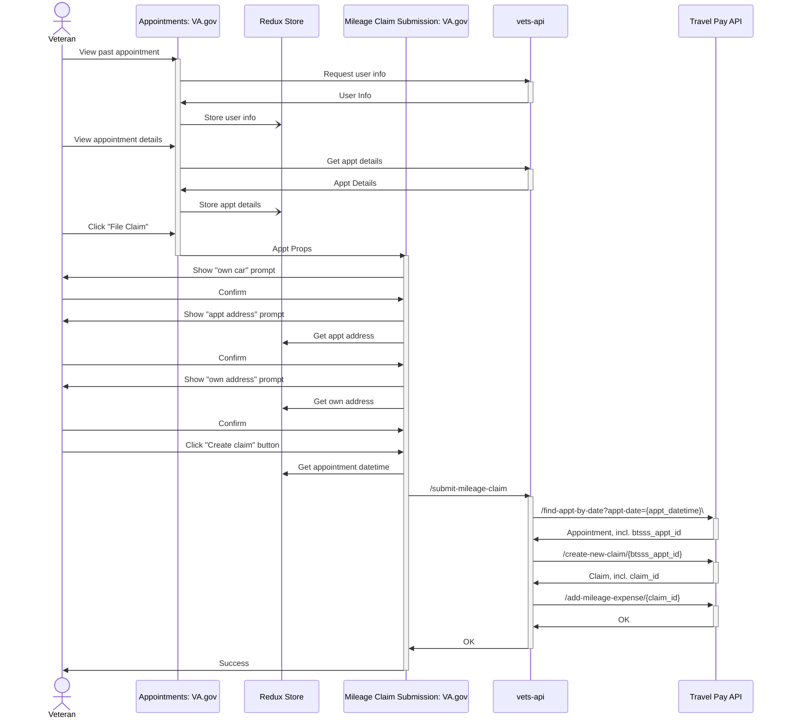

```mermaid
sequenceDiagram
  actor vet as Veteran
  participant appts as Appointments: VA.gov
  participant redux as Redux Store
  participant smoc as Mileage Claim Submission: VA.gov
  participant vapi as vets-api
  participant tpapi as Travel Pay API

  vet ->> appts: View past appointment
  activate appts
    appts ->> vapi: Request user info
    
    activate vapi
      vapi ->> appts: User Info
    deactivate vapi

    appts -) redux: Store user info
    
    vet ->> appts: View appointment details
    appts ->> vapi: Get appt details
    
    activate vapi
      vapi ->> appts: Appt Details
    deactivate vapi

    appts -) redux: Store appt details

    vet ->> appts: Click "File Claim"

    appts ->> smoc: Appt Props

  deactivate appts

  activate smoc
    smoc ->> vet: Show "own car" prompt
    vet ->> smoc: Confirm

    smoc ->> vet: Show "appt address" prompt
    smoc ->> redux: Get appt address
    vet ->> smoc: Confirm

    smoc ->> vet: Show "own address" prompt
    smoc ->> redux: Get own address
    vet ->> smoc: Confirm

    vet ->> smoc: Click "Create claim" button
    smoc ->> redux: Get appointment datetime
    smoc ->> vapi: /submit-mileage-claim

    %% Should this all be transactional? E.g. what happens
    %% when a claim is created, but mileage expense creation
    %% fails? Delete the claim? Try mileage add again, then
    %% roll back? Does the API handle this already?
    activate vapi
      vapi ->>+ tpapi: /find-appt-by-date?appt-date={appt_datetime}\
      tpapi ->>- vapi: Appointment, incl. btsss_appt_id

      vapi ->>+ tpapi: /create-new-claim/{btsss_appt_id}
      tpapi ->>- vapi: Claim, incl. claim_id

      vapi ->>+ tpapi: /add-mileage-expense/{claim_id}
      tpapi ->>- vapi: OK

      vapi ->> smoc: OK
    deactivate vapi

    smoc ->> vet: Success
  deactivate smoc
```