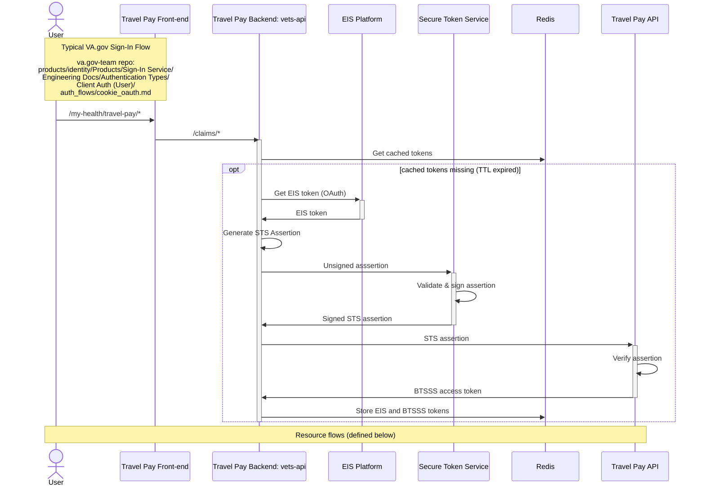
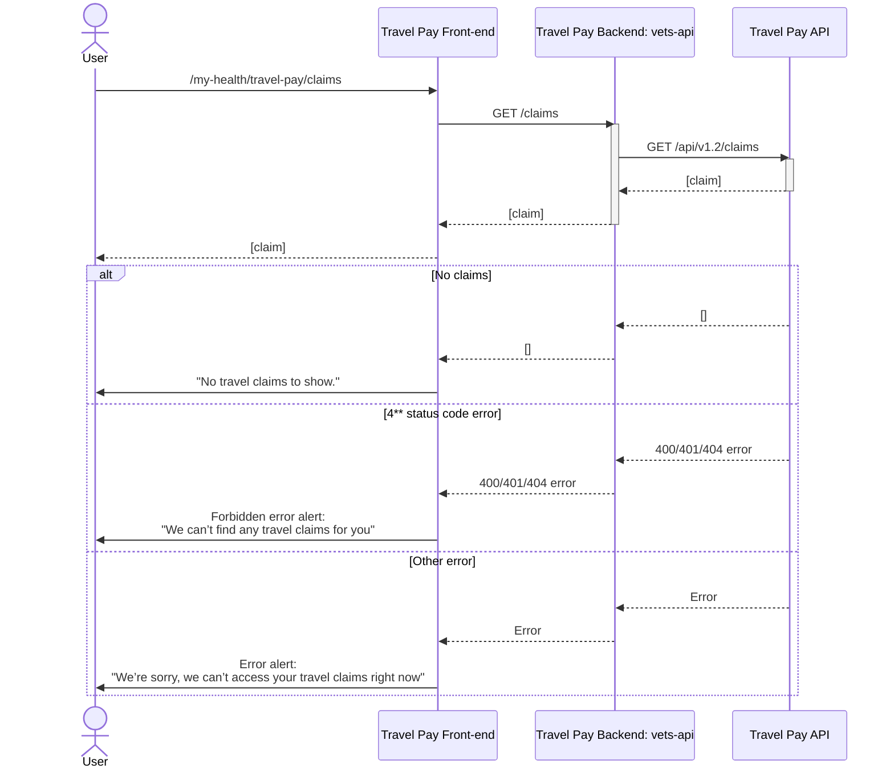
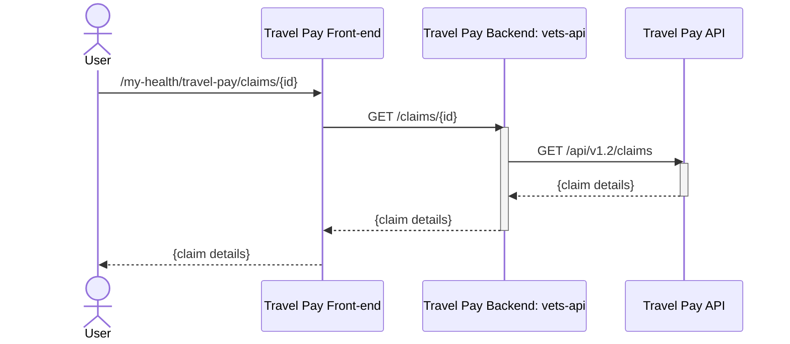
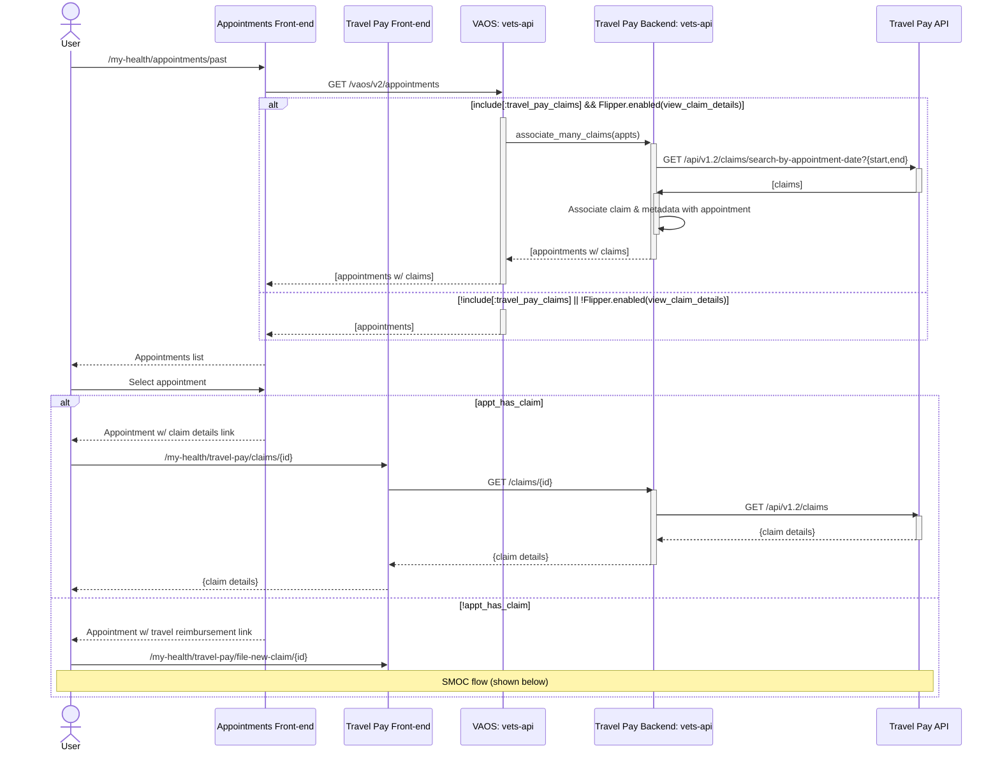
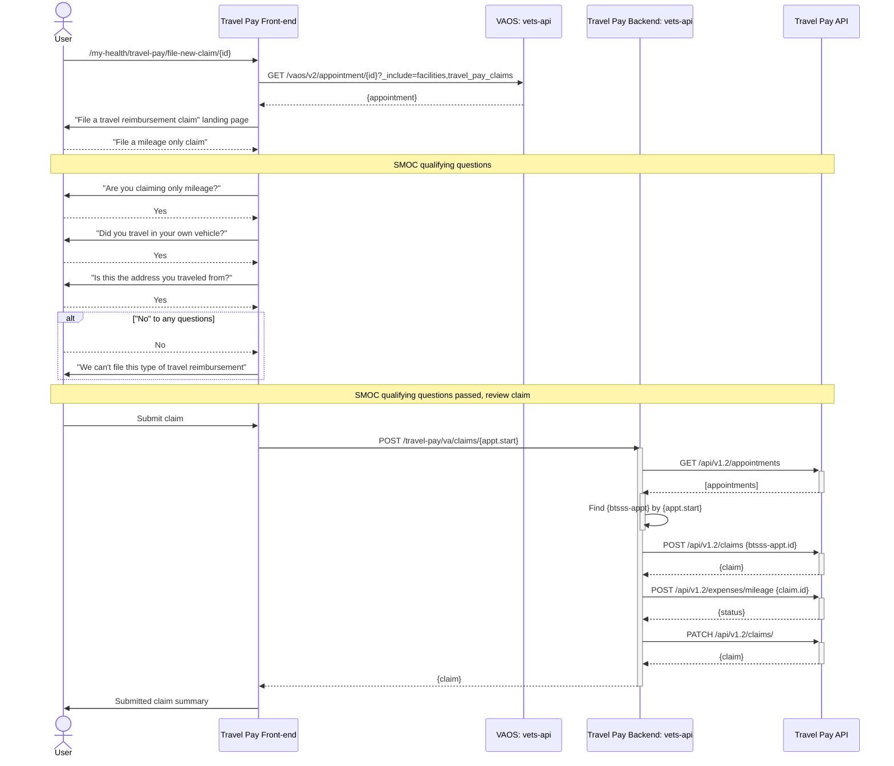

# Status

## AuthN/AuthZ

## Visiting `/my-health/travel-pay/claims`

# Claim Details

## Visiting `/my-health/travel-pay/claims/{id}` directly

# Travel Pay entry from apppointments

# Simple Mileage-only Claim

## Visiting `/my-health/travel-pay/file-new-claim/{id}`

