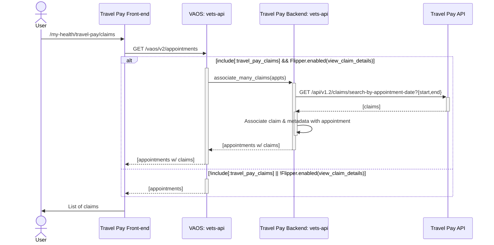
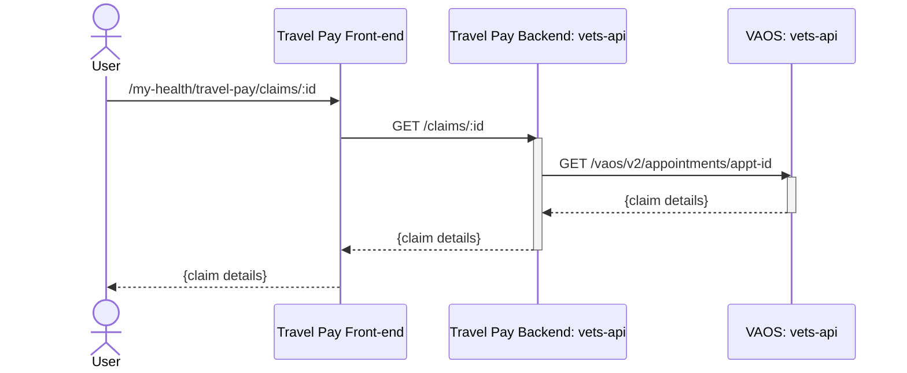
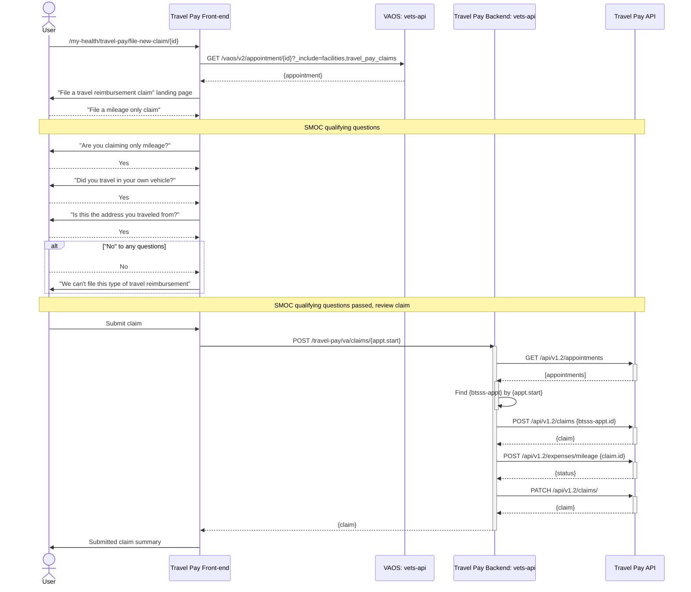

# Claim Status

`/my-health/travel-pay/claims`

```mermaid
sequenceDiagram
    actor user as User
    participant appts as Travel Pay Front-end
    participant vaos as VAOS: vets-api
    participant tpm  as Travel Pay Backend: vets-api
    participant tpapi as Travel Pay API

    user ->> appts: /my-health/travel-pay/claims
    appts ->> vaos: GET /vaos/v2/appointments

    alt include[:travel_pay_claims] && Flipper.enabled(view_claim_details)
      activate vaos
        vaos ->>+ tpm: associate_many_claims(appts)
        tpm ->>+ tpapi: GET /api/v1.2/claims/search-by-appointment-date?{start,end}
        tpapi -->>- tpm: [claims]

        activate tpm
          tpm ->> tpm: Associate claim & metadata with appointment
        deactivate tpm

        tpm -->>- vaos: [appointments w/ claims]
        vaos -->> appts: [appointments w/ claims]
      deactivate vaos
    else !include[:travel_pay_claims] || !Flipper.enabled(view_claim_details)
      activate vaos
        vaos -->> appts: [appointments]
      deactivate vaos
    end

    appts ->> user: List of claims
```

# Claim Details

`/my-health/travel-pay/claims/{id}`

```mermaid
sequenceDiagram
    actor user as User
    participant tp as Travel Pay Front-end
    participant tpm  as Travel Pay Backend: vets-api
    participant vaos as VAOS: vets-api

    user->>tp: /my-health/travel-pay/claims/:id

    tp->>tpm: GET /claims/:id
    activate tpm

    tpm ->> vaos: GET /vaos/v2/appointments/appt-id
    activate vaos
    vaos-->>tpm: {claim details}
    deactivate vaos

    tpm-->>tp: {claim details}
    deactivate tpm
    tp-->>user: {claim details}
```

# Simple Mileage-only Claim

`/my-health/travel-pay/file-new-claim/{id}`

```mermaid
sequenceDiagram
    actor user as User
    participant smoc as Travel Pay Front-end
    participant vaos as VAOS: vets-api
    participant tpm  as Travel Pay Backend: vets-api
    participant tpapi as Travel Pay API

    user ->> smoc: /my-health/travel-pay/file-new-claim/{id}
    smoc ->> vaos: GET /vaos/v2/appointment/{id}?_include=facilities,travel_pay_claims

    vaos -->> smoc: {appointment}
    smoc ->> user: "File a travel reimbursement claim" landing page
    user -->> smoc: "File a mileage only claim"
    Note over user,tpapi: SMOC qualifying questions
    smoc ->> user: "Are you claiming only mileage?"
    user -->> smoc: Yes
    smoc ->> user: "Did you travel in your own vehicle?"
    user -->> smoc: Yes
    smoc ->> user: "Is this the address you traveled from?"
    user -->> smoc: Yes
    alt "No" to any questions
      user -->> smoc: No
      smoc ->> user: "We can't file this type of travel reimbursement"
    end

    Note over user,tpapi: SMOC qualifying questions passed, review claim

    user ->> smoc: Submit claim

    smoc ->> tpm: POST /travel-pay/va/claims/{appt.start}

    activate tpm
      tpm ->>+ tpapi: GET /api/v1.2/appointments
      tpapi -->>- tpm: [appointments]

      activate tpm
        tpm ->> tpm: Find {btsss-appt} by {appt.start}
      deactivate tpm

      tpm ->>+ tpapi: POST /api/v1.2/claims {btsss-appt.id}
      tpapi -->>- tpm: {claim}

      tpm ->>+ tpapi: POST /api/v1.2/expenses/mileage {claim.id}
      tpapi -->>- tpm: {status}

      tpm ->>+ tpapi: PATCH /api/v1.2/claims/#{claim.id}/submit
      tpapi -->>- tpm: {claim}

      tpm -->> smoc: {claim}
    deactivate tpm

    smoc ->> user: Submitted claim summary
```
