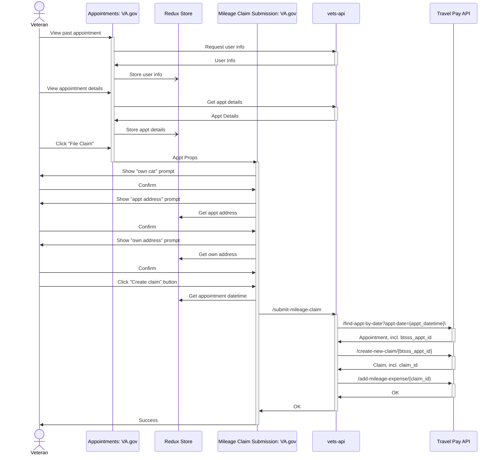
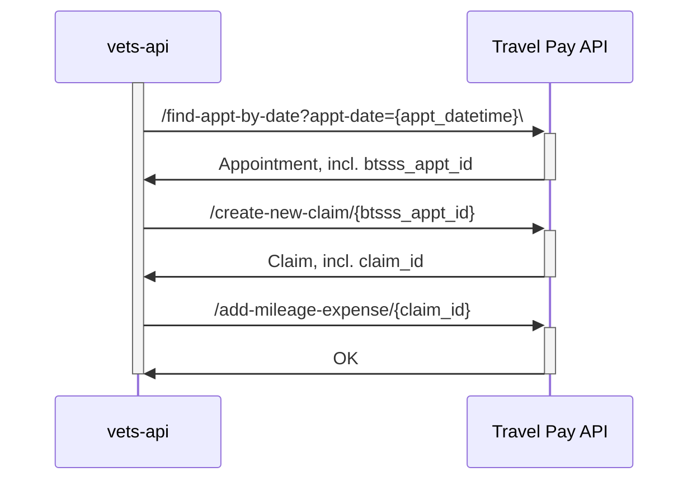
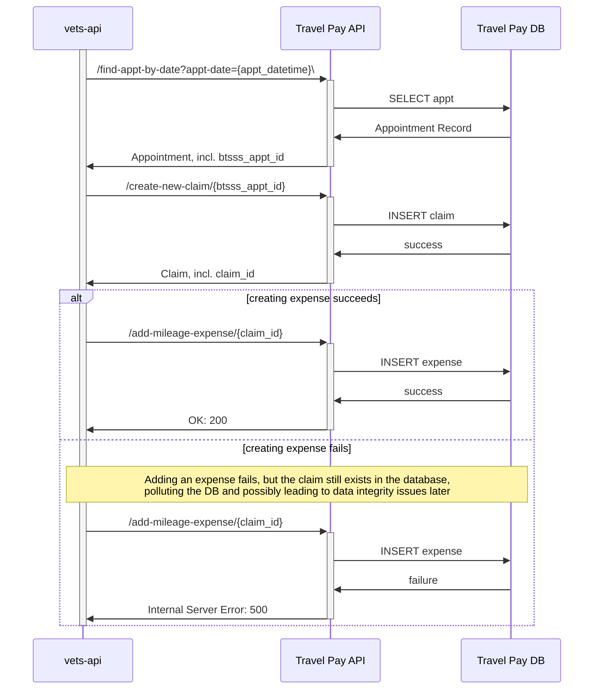
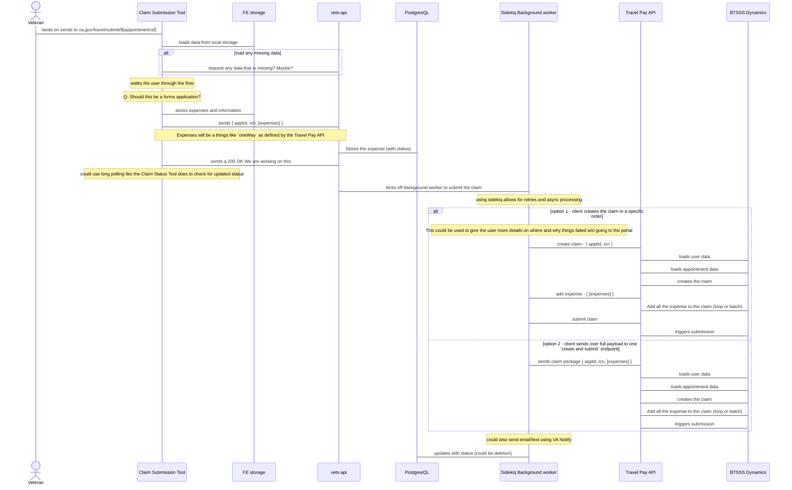

# DRAFT DRAFT DRAFT DRAFT DRAFT


## Thoughts & Considerations

- Simple mileage-only claims feature is not the end, so...
  - does adding expenses need to be transactional?
    - With SMOC, there's only 1 expense to 1 claim, so a transaction makes sense there
    - Beyond SMOC, there could be multiple expenses (or just one). What if 1 expense add fails, and another succeeds?
    - What if adding an expense fails for a user-input reason?
    - What if it fails for a system broken reason?
  - do we want to allow users to delete unsubmitted claims?
    - Is there such a thing as a created-but-unsubmitted claim?
      - it owuld make transactions mujch easier and safer

- how can support both Simple (PCI) vs complex (turbotax) flows 
- build claim to come back to later
- convert from simple to complex? Do we want to make that distinction? 
- Do we want to get rid the idea of simple vs complex in the API  
- what could we preload to make the submitting lighter?
- When *should* we create the claim/
  - When should we submit?
- Do not have abandoned claims on va.gov, do we care? yes?  
- Do we care about parity with the BTSSS system and the forms they are filling out on va.gov (for partial forms)
- Should we use the forms system? 
  - subform/wizard pattern: https://design.va.gov/patterns/help-users-to/complete-a-sub-task ?
- Is there a valid reason to ship something like the simple mileage claim as its own form and maintain two different forms?
- Does claim exist?

## Full Flow of SMOC as of 08/06/2024


## Happy Path 3-part Backend-Only Flow of SMOC as of 08/06/2024

## Failure Path 3-part Backend-Only Flow of SMOC as of 08/06/2024

##  Failure Path 3-part Backend-Only Flow with Rollback of SMOC as of 08/06/2024
```mermaid
sequenceDiagram
  participant vapi as vets-api
  participant tpapi as Travel Pay API
  participant db as Travel Pay DB

  %% Should this all be transactional? E.g. what happens
  %% when a claim is created, but mileage expense creation
  %% fails? Delete the claim? Try mileage add again, then
  %% roll back? Does the API handle this already?
  activate vapi
    vapi ->>+ tpapi: /find-appt-by-date?appt-date={appt_datetime}\
    tpapi ->> db: SELECT appt
    db ->> tpapi: Appointment Record
    tpapi ->>- vapi: Appointment, incl. btsss_appt_id

    vapi ->>+ tpapi: /create-new-claim/{btsss_appt_id}
    tpapi ->> db: INSERT claim
    db ->> tpapi: success
    tpapi ->>- vapi: Claim, incl. claim_id

    alt creating expense succeeds
      vapi ->>+ tpapi: /add-mileage-expense/{claim_id}
      tpapi ->> db: INSERT expense
      db ->> tpapi: success
      tpapi ->>- vapi: OK: 200
    else creating expense fails
      vapi ->>+ tpapi: /add-mileage-expense/{claim_id}
      tpapi ->> db: INSERT expense
      db ->> tpapi: failure
      tpapi ->>- vapi: Internal Server Error: 500

      vapi ->>+ tpapi: /delete-claim/{claim_id}
      tpapi ->> db: DELETE claim
      db ->> tpapi: success
      tpapi ->>- vapi: OK: 200
    end

  deactivate vapi
  ```

## Alternate, LESS OPTIMAL 2-part Backend-Only Flow of SMOC as of 08/06/2024
  ```mermaid

sequenceDiagram
  participant vapi as vets-api
  participant tpapi as Travel Pay API
  participant db as Travel Pay DB

  %% Should this all be transactional? E.g. what happens
  %% when a claim is created, but mileage expense creation
  %% fails? Delete the claim? Try mileage add again, then
  %% roll back? Does the API handle this already?
  activate vapi
    vapi ->>+ tpapi: /find-appt-by-date?appt-date={appt_datetime}\
    tpapi ->> db: SELECT appt
    db ->> tpapi: Appointment Record
    tpapi ->>- vapi: Appointment, incl. btsss_appt_id

    vapi ->>+ tpapi: /create-new-mileage-claim/{btsss_appt_id}
    note over vapi,tpapi: Payload likely to be a large JSON object <br/> that includes claim metadata and expense information
    tpapi ->> db: INSERT claim and expense
    db ->> tpapi: success
    tpapi ->>- vapi: Claim, incl. claim_id

  deactivate vapi
  ```
  # DRAFT DRAFT DRAFT DRAFT DRAFT


## More drafts

### Past Appointment flow 

Things to note

- Veteran should be able to view claims for an appointment if it exists
  - Agreed, whether that's a new single page view of a claim (e.g. claim details) or a highlighted, bubbled-up claim summary card on the existing claim status list is TBD
  - I (Kevin) have a strong opinion that implementing a dedicated claim details page will be faster to implement, simpler in the short, medium, and long terms, serve as a launching point for more features, etc (aka really worth it to set up now)
- maybe More features are here than are needed MVP (like the claim detail page)
  - Maybe, what are the alternatives?
  - I'm thinking we'd need _something_ to show the Veteran that they can't submit a claim because it already exists:
  ``` mermaid
  sequenceDiagram
    participant vet as Veteran
    participant appts as Appointment Details
    participant submit as Travel Claim Submit
    participant status as Travel Claim Status
  
    vet ->> appts: Enters 
    appts ->> appts: See if there's an existing claim
    alt NO CLAIM
      appts ->> vet: Show submit link
      vet ->> submit: GOTO submit flow
    else EXISTING CLAIM
      appts ->> vet: Show claims link
      vet ->> status: GOTO view ALL claim statuses page
    end
  ```
- Can we add a filter to the claims status to only get a smaller amount of claims
  - On the Travel Pay API side?
    - Probably, but it might take a while
    - some alternatives:
      - fast to implement, no addl integration, maybe slow perf-wise, maybe repeating what they already do on API: Use the "get all claims" endpoint we have and search through the list on vets-api
      - fast to implement, some addl integration, faster perf-wise, complexity passed to API: Use the "get claim details" endpoint the API has in their swagger doc, use that to find a single claim (may need claim ID, though)
      - slow to implement, addl integration, a little faster perf-wise, complexity on both sides: API endpoint allows a filter to narrow claims list for vets-api to then search through (I want this eventually, but maybe not highest priority?)
- Loading claims status can/should be a parallel call and we can paint the UI as data comes in
  - Do we mean on the travel pay claim status page? or the appt details page? Something else?
- Appointments team has a UI (or very nearly has one) for actions for a past appointment that we can plug into (AVS is also using this)
  - UAE work ^^
- urls are just place holders
- Passing data from appt to app via redux was tricky (impossible and had to use local storage) last time I tried it
  - I'm wondering now if we need any intermediate storage (redux, local, session, etc)
  - Can't we just provide all that the submit or claim pages need via the URL? Are there PII implications, something else?
- This the hand off to the submit claims form below

``` mermaid
sequenceDiagram
    actor vet as Veteran
    participant appts as Appointments: VA.gov
    participant redux as Redux Store
    participant vapi as vets-api
    participant tpapi as Travel Pay API
    participant submit as Claim Submission Tool
    participant claim_page as Claim Details Page

    vet -> appts: lands on 
    appts -> vapi: load appointments from OH/VistA
    appts -> vapi: request BTSSS claim status
    vapi -> tpapi: GET /claim_status (could add a filter?)
    vapi -> appts: returns list of claims
    appts -> redux: stores appointment information
    appts -> vet: shows appointments with claim status/number if available
    alt selects an eligible appointment without a claim
        vet -> appts: selects appt without claim to create a new claim
        vet -> redux: stores what is selected in the state/FE
        vet -> submit: sends to va.gov/travel/submit/${appointment-id}

    else selects an eligible appointment with an un-submitted claim
        vet -> appts: selects appt with an un-submitted claim to resume
        vet -> redux: stores what is selected in the state/FE
        vet -> submit: sends to va.gov/travel/submit/${appointment-id}/claim/{claim-id}
    
    else selects to view more claim detail
        vet -> appts: selects and appointment with a submitted claim to see more detail
        vet -> claim_page: sends to va.gov/travel/claim/{claim-id}
    end
```


### Create a new Claim Form Submission


otes
- borrowing flows and patterns form benefits teams
- The general flow is `collect all the data` -> `store in vets-api` -> `sidekiq to submit` -> `repeat step 2 and 3 until successful`
- This adds some complexity of a table storage in the vets-api
  - this could be handled by the Travel Pay API as well, but we already have patterns on va.gov that do this

Open Questions

- Should we use the forms system?
- How would statuses in our own database interact with the claim status apge
- Code Yellow considerations of what happens when a claim fails hard
- Notifications? Text? Email? This is long running, but not **that** long running
  - Mosty likely post MVP
-  If the claim creation is successful, but the submission/expense fail. Should we roll back or let the user try to re-submit the claim again depending on the failure case
  - AI: define some error list/flows



