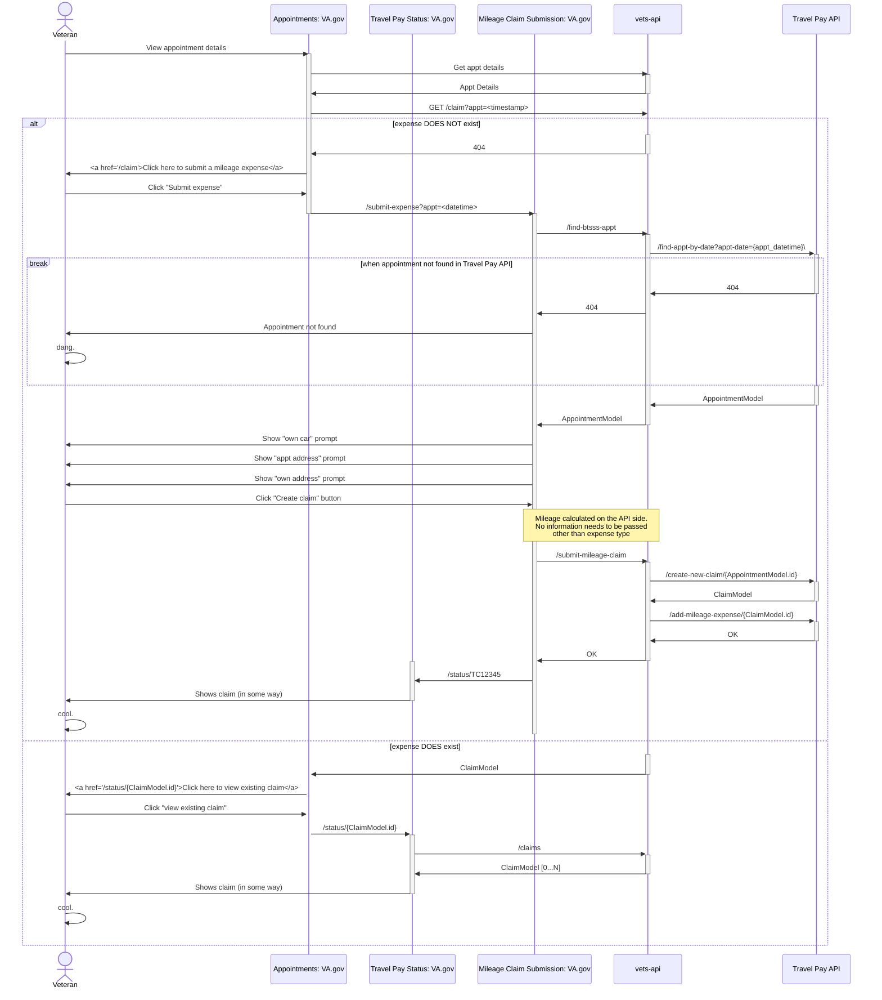

# Authenticated, Past Appointments Mileage-Only Claim Submission

## Work Identification
### VA.gov Travel Pay Team
* Travel Pay status FE updates/refinement
* Travel Pay status BE updates/refinement
* Travel Pay mileage expense submission flow FE
* Travel Pay mileage expense submission flow BE

Basically: All Travel Pay work on vets-api and self-contained Travel Pay apps on vets-website.

### Travel Pay API Team
*Potentially*:
* Updates to `/claims` endpoint
* Inclusion of `/claims-by-id` endpoint
* Any endpoints related to claim submission

Basically: Any API stuff

### UAE Team
* FE link to Travel Pay status page from relevant Appointment details
* FE link to Travel Pay submit mileage page from relevant Appointment details
* FE logic to determine whether to display "go to status" or "go to submit"

Basically: Integration work on vets-website that links appointments to mileage claims

## Integration Points
* **UAE Team** needs `/get-claim` endpoint on vets-api implemented by **Travel Pay Team**
* **Travel Pay Team** needs *appointment timestamp* from the link implemented by **UAE Team**
* **Travel Pay Team** needs `/get-appt` endpoint on Travel Pay API implemented by **API Team**
* **Travel Pay Team** needs `/create-claim` endpoint on Travel Pay API implemented by **API Team**
* **Travel Pay Team** needs `/add-expense` endpoint on Travel Pay API implemented by **API Team**
* **Travel Pay Team** *potentially* needs updated versions of existing endpoints on Travel Pay API implemented by **API Team**

## Diagram

