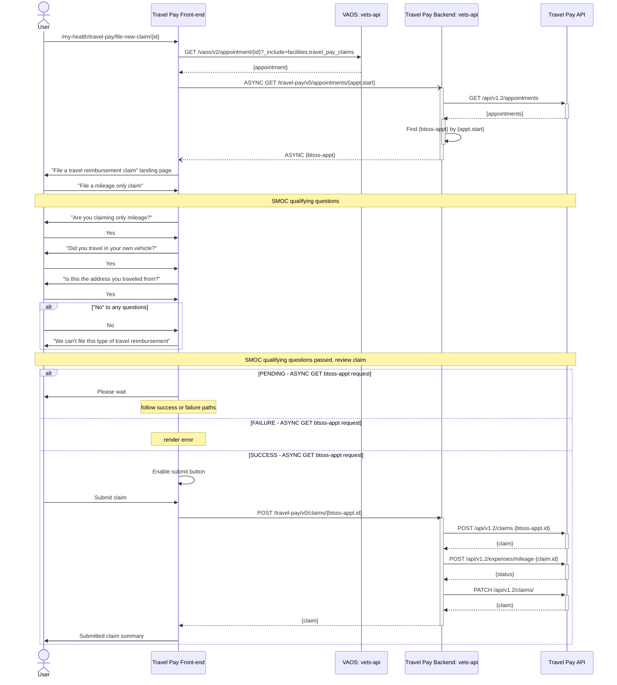
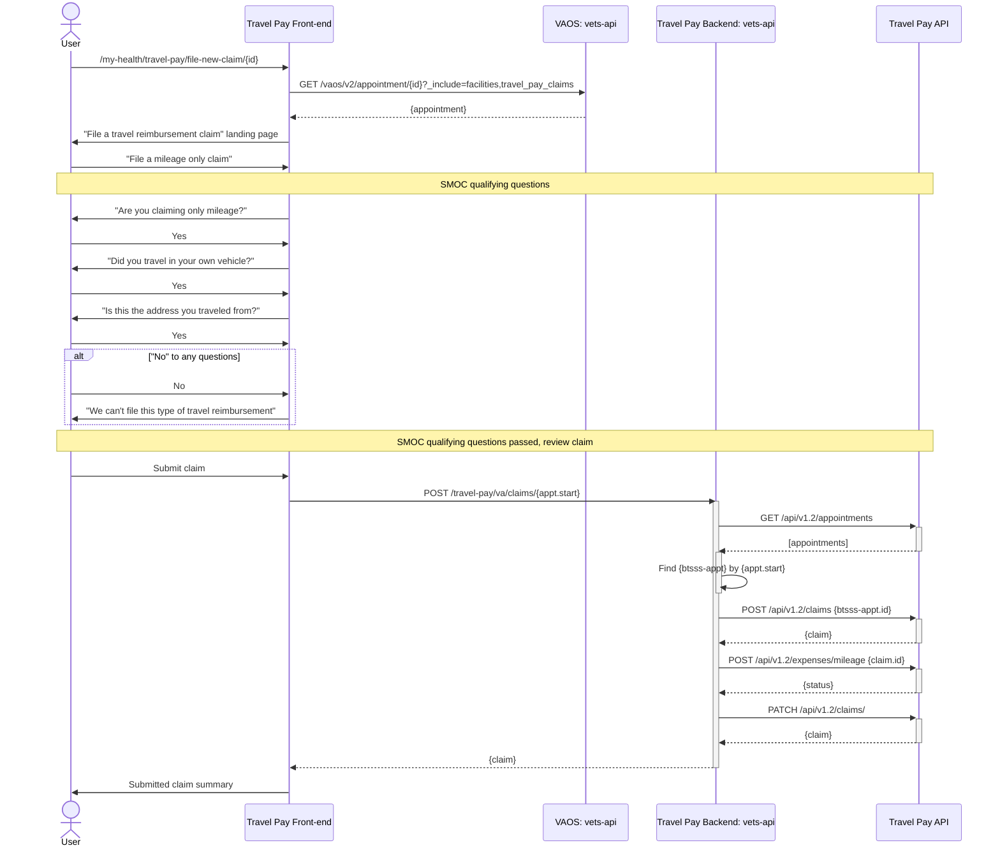

# Simple Mileage-only Claim

This proposal is intended to potentially reduce or eliminate the need for asynchronous processing of simple mileage only claims.

The bet is that the bulk of the processing time occurs in the `GET /appointments` request to the Travel Pay API, especially if the appointments need to be synced from VistA to BTSSS.

Making an _asynchronous_ call to a newly exposed `vets-api` endpoint to fetch and find a relevant appointment at the beginning of the flow could be a way to reduce the dependency on sidekiq.

Reducing the dependency on sidekiq can greatly reduce the occurence of silent failures and our dependence on VA Notify.

## PROPOSED: Visiting `/my-health/travel-pay/file-new-claim/{id}`

## CURRENT: Visiting `/my-health/travel-pay/file-new-claim/{id}`

