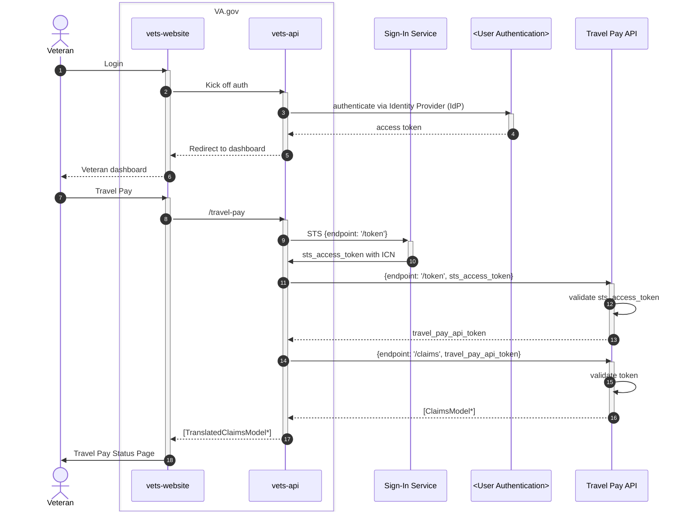

## Architecture showing up/down stream dependencies

### Travel Pay High-Level Architecture

### Travel Pay STS Sequence Diagram

## Use Case(s)
1. A Veteran signs into VA.gov using ID.me or Login.gov. They navigate to the Travel Claims status page on VA.gov, where they are shown a list of claims in various statuses so that they can take action on those claims outside of VA.gov.

## Datadog logs
* [Travel Pay datadog logs](https://vagov.ddog-gov.com/logs?query=service%3Avets-api%20%40http.url_details.path%3A%2Ftravel_pay%2F%2A%20%40named_tags.dd.env%3Aeks-staging%20&agg_m=count&agg_m_source=base&agg_t=count&cols=host%2Cservice&fromUser=true&messageDisplay=inline&refresh_mode=sliding&sort=time&storage=hot&stream_sort=desc&viz=stream&from_ts=1723576930102&to_ts=1723577830102&live=true)
* [STS logs](https://vagov.ddog-gov.com/dashboard/i72-yy8-i97/identity-sts-performance?fromUser=false&refresh_mode=sliding&tpl_var_payload.service_account_id%5B0%5D=a162aaef5fb869aa4ea5a227728a753f&view=spans&from_ts=1722973012906&to_ts=1723577812906&live=true)

## Integration testing
demo
