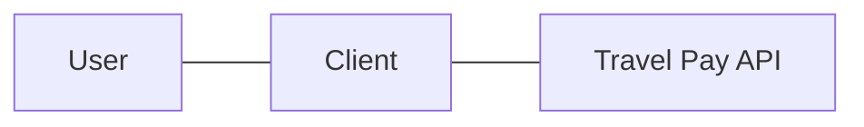

# Decision: User Validation Mechanism

## Background
We have prospective clients that use potentially non-compatible authentication methods to 
validate that their users are who they say they are. The goal of this decision doc is to 
decide on a user validation mechanism that allows the Travel Pay API to prove or trust 
that the callers of the API only get the information that belongs to them. 

In addition to clients that may independently authenticate their users, we will also need
users that have different roles (e.g. Veteran, caregiver, etc) that have implications on the
user validation mechanism chosen.

Note: The options considered here do not remove the need for basic OAuth 
authorization/client scoping, etc. They only describe user validation by the API.

## Considerations
We recognize the need to balance security with user experience. Ideally, our goal is to make a
decision that will gain us the most security and offer Veterans and other users the best experience. 
We know there is history in taking the path of least short-term resistance, but strive to improve 
the technological landscape of VA.gov and related services.

## Options

### Trust all clients
This approach removes user validation from the Travel Pay API.

More detail on this option can be found here: [User Validation Paths: Trust all
clients](https://github.com/department-of-veterans-affairs/va.gov-team/blob/master/products/health-care/beneficiary-travel/engineering/authentication-paths.md#trust-all-clients)

<table>
<tr>
<th>Benefits</th>
<td>Easy; Within a historical cohort</td>
</tr>
<tr>
<th>Risks</th>
<td>Burden of validation shifts to client, API cannot prove user validation has happened</td>
</tr>
<tr>
<th>Benefit Impact</th>
<td>Velocity increases over the short term</td>
</tr>
<tr>
<th>Risk Impact</th>
<td>Higher potential for PII leakage</td>
</tr>
</table>

### Classify clients into trust groups
This approach removes user validation from the Travel Pay API, but makes a stronger attempt to know which clients to trust.

More detail on this option can be found here: [User Validation Paths: Classify clients into trust groups](https://github.com/department-of-veterans-affairs/va.gov-team/blob/master/products/health-care/beneficiary-travel/engineering/authentication-paths.md#classify-clients-into-trust-groups)

<table>
<tr>
<th>Benefits</th>
<td>Easy; non-rigorous sense of which clients to trust</td>
</tr>
<tr>
<th>Risks</th>
<td>Burden of validation is still on the client, API cannot prove user validation has happened, even for trusted clients</td>
</tr>
<tr>
<th>Benefit Impact</th>
<td>Velocity increases over the short term; Potentially lower risk for PII leakage</td>
</tr>
<tr>
<th>Risk Impact</th>
<td>Re-discovery/planning & implementation likely needed in the medium-to-long term; more cumbersome client integration process</td>
</tr>
</table>

### Use VA.gov Sign-in Service
This approach leverages an industry standard introspection process, and uses a tool hosted on the VA.gov platform to ensure a client is acting on behalf of an authenticated user.

More detail on this option can be found here: [User Validation Paths: Use VA.gov Sign-in Service](https://github.com/department-of-veterans-affairs/va.gov-team/blob/master/products/health-care/beneficiary-travel/engineering/authentication-paths.md#use-vagov-sign-in-service)

<table>
<tr>
<th>Benefits</th>
<td>Industry standard introspection flow; rigorous proof of user delegation</td>
</tr>
<tr>
<th>Risks</th>
<td>As of 11/08/2023, it is unknown if the Sign-in Service works for arbitrary clients; potential for a lengthier integration</td>
</tr>
<tr>
<th>Benefit Impact</th>
<td>Extremely low risk of PII leakage; lower implementation time due to well-known flow</td>
</tr>
<tr>
<th>Risk Impact</th>
<td>Non-negligible effort needed if Sign-in Service only works for VA.gov clients</td>
</tr>
</table>

### Use IAM
This approach leverages an industry standard introspection process, and uses a service known to work on arbitrary, non-VA.gov clients.

More detail on this option can be found here: [User Validation Paths: Use SSOe/IAM](https://github.com/department-of-veterans-affairs/va.gov-team/blob/master/products/health-care/beneficiary-travel/engineering/authentication-paths.md#use-iam)

<table>
<tr>
<th>Benefits</th>
<td>Industry standard introspection flow; rigorous proof of user delegation; used for non-VA.gov clients</td>
</tr>
<tr>
<th>Risks</th>
<td>As of 11/08/2023, it appears IAM integration with clients is stalled due to a large backlog of work</td>
</tr>
<tr>
<th>Benefit Impact</th>
<td>Extremely low risk of PII leakage; potentially lower implementation time due to well-known flow</td>
</tr>
<tr>
<th>Risk Impact</th>
<td>Delivery delays due to integration slow down (typically 3 months, could be longer)</td>
</tr>
</table>

### Self-validation
This approach relies on a homegrown user validation solution, taking the burden of user validation off the client.

More detail on this option can be found here: [User Validation Paths: Self-validation](https://github.com/department-of-veterans-affairs/va.gov-team/blob/master/products/health-care/beneficiary-travel/engineering/authentication-paths.md#self-validation)

<table>
<tr>
<th>Benefits</th>
<td>Reasonable proof of user delegation; custom solution</td>
</tr>
<tr>
<th>Risks</th>
<td>More work needed, not mature software</td>
</tr>
<tr>
<th>Benefit Impact</th>
<td>Lower risk of PII leakage; custom solution can grow with the product; don't have to wait for 3rd party integration</td>
</tr>
<tr>
<th>Risk Impact</th>
<td>Delivery delays due to implementation time; risk of bugs and PII leakage</td>
</tr>
</table>

## Action Items
- [ ] Meet with VA.gov Platform Identity Team to discuss if the Sign-in Service will work for all or most of our use cases

## Decision Summary
