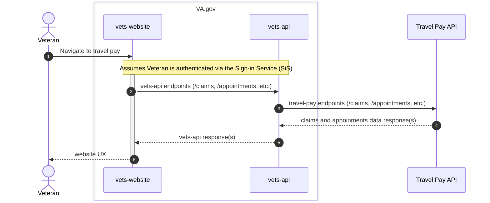

# Zero Silent Failures

## Product
This checklist is currently scoped to the "Get Status" tool, with interactions that are read-only

### Checklist

#### Start

- [x] Do you know when your application shipped to production?
	- Roughly mid-September 2024
- [x] Did your application use the same APIs when it shipped as it does today?
	- Yes

#### Monitoring

- [x] Do you monitor the API that you submit to via Datadog? 
 	- Yes, we have the following monitors set up:
  		- [Upstream service (Travel Pay API) error rate is high](https://vagov.ddog-gov.com/monitors/236850)
		- [Travel Pay error rate is very high](https://vagov.ddog-gov.com/monitors/236847)
		- [Travel Pay endpoint latency is high on VA.gov side in the last 10 minutes](https://vagov.ddog-gov.com/monitors/248803)
		- [Travel Pay endpoint latency is high on VA.gov side in the last 5 minutes](https://vagov.ddog-gov.com/monitors/236852)
		- [Travel Pay - Claim Status - Error rate above tolerance](https://vagov.ddog-gov.com/monitors/272156)
 - [x] Does your Datadog monitoring use the appropriate tagging?
	- Yes
- [x] Do errors detected by Datadog go into a Slack notifications channel?
	- Yes, #beneficiary-travel-team-alerts
- [x] Does more than one person look at the Slack notifications channel containing errors on a daily basis? 
	- Kevin and Mark both do this currently. As we scale feature flag access, we will more formally follow an on-call rotation to monitor errors
- [x] Do the team members monitoring the Slack channel have a system for acknowledging and responding to the errors that appear there? 
	- [Here is our formal incident response plan](https://github.com/department-of-veterans-affairs/va.gov-team/blob/master/products/health-care/beneficiary-travel/product/incident_response.md) 

⚠️ **Failure to have endpoint monitoring in place is a blocking QA standard at Staging review as of 9/10/24.** If you answered no to any of the questions above, you will be blocked from shipping at the Staging review touchpoint in Collab Cycle.

#### Reporting errors

- [x] Have you filed issues for errors that are appearing in Datadog / Slack?
	- Yes
- [x] Do all fatal errors thrown in your application end up visible to the end user either in the user interface or via email?
	- Yes, via the user interface

#### Documentation

- [x] Do you have a diagram of the submission path that user data your application accepts takes to reach a system of record? 

Additional engineering documentation can be found [here](https://github.com/department-of-veterans-affairs/va.gov-team/tree/master/products/health-care/beneficiary-travel/engineering).

- [x] Do you understand how the error is handled when each system in the submission path fails, is down for maintenance, or is completely down?
	- Yes, see the next question for more details
- [x] Has the owner of the system of record receiving the user's data indicated in writing that their system notifies or resolves 100% of fatal errors once in their custody?
	- We have an active partnership with the Travel Pay API team we integrate with. To the best of our knowledge, they are managing all internal errors and passing relevant failures downstream to us accordingly

#### User experience

- [x] Do you capture all of the potential points of failure and make those errors known to the user via email notification and/or through the application on VA.gov or the mobile application?
	Yes, the UI notifies the user when there is an error retrieving claims
