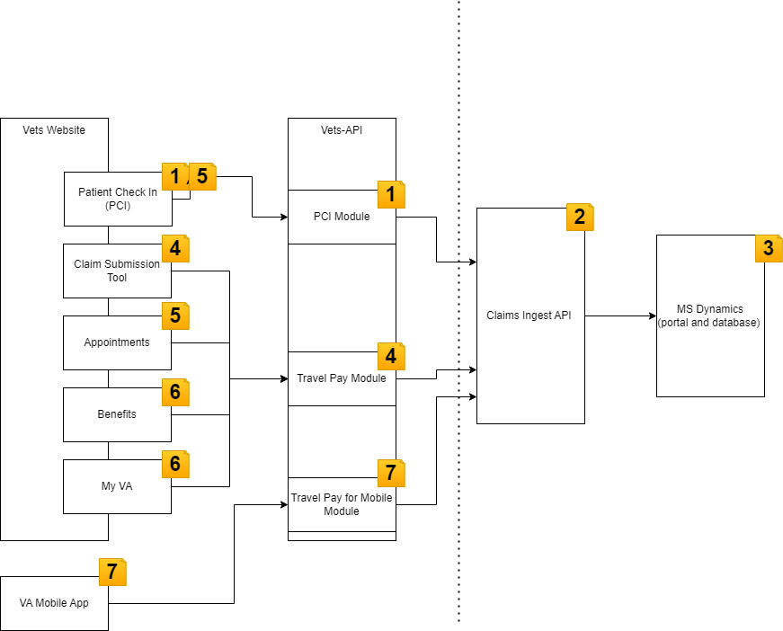

# [WIP] Travel Pay Migration Effort

> Period of Performance (PoP): 9/1/23 thru 8/29/24 

This document is a high level snapshot of where we are today and where we want to be at the end of this PoP

## Goals for this PoP

Full list of [OKRS](./OKRS.MD) and full project description in the [README](../README.md)

- Create a mobile friendly, accessible claims submission tool on va.gov for a fully authenticated user
- Create an integration with the BTSSS system and the Vets-api that can be leveraged for various products on the va.gov ecosystem

## Team Breakdowns and Key Personal

### Stakeholders/Clients

- OCTO
  - Mark Dewey
  - Chris Johnson
- OIT 
  - Chester Peyton
- VTP
  - Daryl Richardson

### API Team

This team will focus on iterating and expanding the Claims Ingest API 

### va.gov team

This team is focused on create the new experience on va.gov and integration vets-api with the Claims Ingest API

## After 1 year

- We should have made significant progress on the [road map](./roadmap.md) for the API and va.gov team 

### For the va.gov team

- A submission tool that is linked to from appointments page (and maybe check in experience)
- a vets-api integration that exposes functionality from the Claims Injest API to the va.gov apps 

### For the API team 

- A performant API that can be used to create valid claims
  

## Architecture 

Key: 

### 1: PCI Integration

- PCI Integration to allow claims being submitted during the check in process 
- Already exist today in production, using the Claims Ingest API
- The API Team will be supporting any production/integrations issues

### 2: CLaims Ingest API

- A proof of concept that got elevated to production. 
- The main goal is to expand this according to our [road map](./roadmap.md#next-for-api-focused-team---fall-2023)
- This what the API Team will be working on

### 3: Existing BTSSS Portal (MS Dynamics)

This is the current BTSSS experience. Veterans use this to submit a claim, though we can start to think about this as fancy database

### 4: va.gov submission tool

- This new functionality and applications we are creating on the va.gov
- This is a main goal of the va.gov team
- Here is the current proposed [road map](./roadmap.md#next-for-vagov-submission-tool-focused-team---fall-2023) 
- This includes a module that can accessed and reused by other teams on va.gov

### 5: Va.gov integration

- This work is adding functionality to an existing va.gov feature
- Primarily the va.gov will be working with the Appointments team to provide integration and guidance on integration with the va.gov submission tool

### 6: Future integrations
> Outside of the scope of this current PoP

- Potential integrations points to consider when building the underlying APIs

### 7: VA Mobile Integration  

- Jointly, both teams will be supporting the integration with the VA Mobile App
- There should be plenty of reuse here since the VA Mobile App uses vets-api
- Ideally, the Va.gov Team builds the internals that are being used in [4] and the Mobile team build the controllers

### 8: VA Mobile Experience

- We are not building this experience directly, but supporting by answering question.
- OCTO will field most of these questions with support from both teams.

