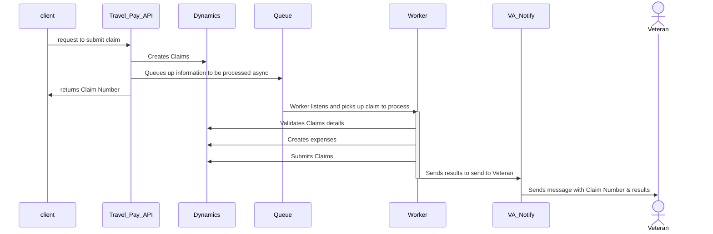

# Submit Claim v2 proposal

## Current Issues to Solve

**Problem**: The current  API endpoint makes over a dozen API calls and takes too long to complete. The client ends up waiting way too long

**Problem**: Due to the interactions of the underlying systems, (MPI, VIA, etc). There could be problems with connecting and calling so many systems.

**Problem**: Retrying a failed claim becomes a client's problem, even though we already some systems, business logic and understanding of the the problem space

**Problem**: Letting the Veteran know their claim failed falls to the client, we should want to provide a consistence experience across all modalities  

## Proposed Solution

### Core Idea

- What is the *bare* minium we need to do to create a claim.
- Use a queue based system to create/submit/retry claims
- Integrate with VA Notify to send results

### Diagram

### Key points

- most of the claim creation/validation/submission happens in the queue, asynchronously
- This only does the happy path
  - If there are errors during claim creation, we can retry later (a service down, etc) or send the message to the user with next steps (text message saying go to the portal)
- Requires a ton of error handling and observability so we don't lose claims
- We can use the async libary (Hangfire) for bunch of this. 
- In the Claims Ingest Async endpoint, I know there was a GUID that we could use to track the claim submission. The idea here is could we use the claim number instead of a new GUID
- We could use this in tandem with other endpoints that getting created, such as `get contact` or `get appointments`
- We would use the service VA Notify to send results. VA Notify is a RESTful API that was build this use case.
  
### Questions

- What is the minimum that we need to create the claim?
  - Could that be passed in from client?
- What are the imediate hurdles that we see?
