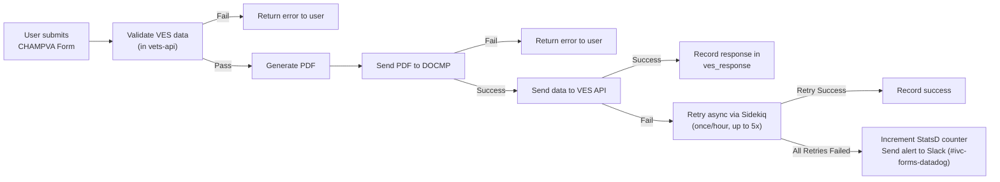

# Architecture Decision Record (ADR)

## Integration between IVC CHAMPVA Forms Backend (`vets-api`) and VES API

**Date:** 4/16/2025  
**Status:** Accepted

### Context

The IVC CHAMPVA team and the Veteran Enrollment System (VES) team are collaborating to integrate the online (VA.gov) version of the CHAMPVA application (Form 10-10d) with a newly developed VES API capable of ingesting CHAMPVA applications.

Currently, submission of the online CHAMPVA application generates a populated PDF, which is sent to the Delivery Operations Claims Management Platform (DOCMP) for processing.

The new VES API will enable storage (and later retrieval, processing, etc.) of structured data associated with each form submission.

As a result of this integration, CHAMPVA applications submitted on VA.gov will need to be sent to **two** downstream systems instead of one. This change introduces several implementation decisions.

### Key Decisions to Make

1. How should VES-specific data be stored/handled? (e.g., stored separately from existing submission data or combined?)
2. When and how should submissions to VES occur during the form submission lifecycle?
3. How should errors be handled now that two independent systems are involved?
   - Should there be automated, asynchronous retries for failed VES submissions?

### Decisions

After evaluating the requirements and considering the available options, the engineering team has decided the following:

#### 1. VES-specific data will be stored alongside existing submission data in the `IvcChampvaForm` database table.

The following new columns will be added:

- `ves_request_data`: An encrypted column that holds all form data entered by the user. This enables resubmission in case of service outages or non-data-related issues.
- `application_uuid`: A unique identifier designating each individual submission.
- `ves_response`: The HTTP response code and any relevant messages returned after submission to VES.

#### 2. VES submissions will occur immediately following a successful submission to DOCMP.

- The VES data is validated within `vets-api` using a custom validator that aligns with the API specification.
- The generated PDF is submitted to DOCMP. If successful, a success message is returned to the user on the front end.
- If the VES validation succeeds and the PDF submission to DOCMP is successful, the structured form data is sent to the VES API.

#### 3. Error handling logic based on point of failure:

1. **VES validation failure (within `vets-api`)**
   - Submission is halted, and an error is returned to the user.

2. **DOCMP submission failure**
   - Submission is halted, and an error is returned to the user.

3. **VES submission failure (post-successful validation and DOCMP submission)**
   - The submission appears successful to the user, even if the VES submission fails.
   - The submission is retried asynchronously using a Sidekiq job that runs once per hour for up to five hours.
   - If a retry succeeds, the `ves_response` field is updated, and retries stop.
   - If all retries fail, the `StatsD` counter `ivc_champva.ves_submission_failures` is incremented, and an alert is sent to the IVC team’s Slack channel `#ivc-forms-datadog`.

### Rationale

**User experience**  
Performing VES validation up front in `vets-api`, before any submissions to DOCMP or VES, allows us to catch invalid data early. This improves user experience by providing fast feedback and increasing confidence in downstream success.

**Ease of integration**  
These decisions were made to minimize disruption to existing backend workflows. By integrating the VES submission into the existing flow and handling retries with a background job, we reduce complexity and isolate concerns between DOCMP and VES interactions. Reusing the existing database table for VES-related data also avoids unnecessary schema complexity.

### Consequences

**Clear separation of concerns**  
Although VES submission logic is part of the normal submission flow, it remains clearly separated from DOCMP logic, supporting maintainability and easier future updates.

**Improved responsiveness**  
Front-end users receive faster error messages due to early validation in the submission process.
