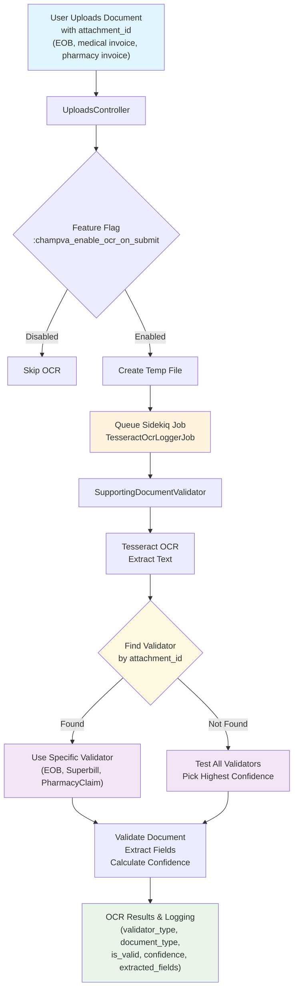
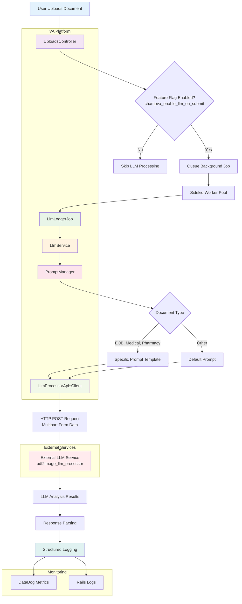

## Problem

CHAMPVA submissions are reported to have a roughly 50% denial rate currently, mostly due to insufficient supporting documentation.  The form submission should have a way to check contents of documents submitted by claimants so they can be notified when required information appears to be missing which might result in a denied claim.

Two approaches are identified to perform document analysis: Optical Character Recognition (OCR) and Large Language Model (LLM) processing.  For OCR, two implementations are being considered for use: Textract (an AWS product) and Tesseract (a commercial, off-the-shelf (COTS) product already being used in vets-api).  One LLM solution is available for consideration as well, the VA's internal VA-GPT instance.

Given the limited variety of options being considered, some analysis needs to be done to understand which library or service best accomplishes the team's intended goal.  Metrics taken into account include 

1. viability - can it solve our problem,
2. financial cost to use long-term, 
3. level of effort to maintain,
4. latency/time cost, and 
5. tool accuracy

Initial viability should be determined first - can these tools actually provide the sorts of insight required to make these decisions to inform claimants of document status?  Once a tool has been determined viable, the team needs to create an MVP for each implementation and gather the remainder of the metrics.  Financial cost can be researched ahead of time; level of effort will be determined partially as a result of the initial implementation and iteration during the trial period; latency and accurate can be gathered by running the tools and reviewing the resulting metrics using DataDog.

>As of beginning this experimentation and creation of this document, AWS Textract access has not been provided, and so is not being included in the following testing.  Once access is granted, the team intends to integrate with the service and follow the same testing procedures as with Tesseract.

## Hypothesis

Which of these tools, or combination of tools, accomplishes the team's goal of reducing the rejection rate of CHAMPVA claim submissions while best balancing cost and performance?

## Method

### 1. Initial Viability

#### 1.1 LLM discovery

An LLM solution seemed like the best option to use here, given its semantic flexibility and ability to read and interpret documents - arbitrarily, it was the first tool to be tested for viability.  An API token was created for OpenAI's public API instance and several prompts were generated and iterated upon to perform analysis on mock documents.  The final prompt [1] used with this API is provided in the Artifacts section of this document.  

A `bash` script was written to perform the document analysis query to OpenAI's `responses` API, using the latest `gpt-4o` model; results were manually verified to establish latency and accuracy metrics.  Parameters were modified in the bash script to specify the document being uploaded, its expected type, and the fields to search for.  Two sample documents were found: a sample Explanation of Benefits document, and a birth certificate with mocked PII.  Both of these documents were submitted 10 times each and the resulting JSON object was analyzed to determine accuracy, while also being timed using the `time` command.  With these trial runs against the OpenAI API returning positive results, we concluded that there was potential in an LLM solution.  However, OpenAI's public API is not approved for VA PII, so the VA's internal API was then investigated.

The internal VA-GPT is able to accept PII and so is the only choice for an MVP, but being an older version of the `gpt-4o` model we needed to re-validate whether it was also capable of performing document analysis.  We proceeded with a second trial on VA's intranet, and quickly discovered the VA's internal version does not support the `responses` API which we were using previously.  The only available endpoint for us to use was `completions`, which at the time of testing could not accept PDF file uploads to inspect.  Fortunately, an internal tool called `pdf2image_llm_processor` was shared with us, which acts as middleware between a client application and the LLM processor, accepting PDF files and converting them to images before forwarding.  An API key was obtained for this tool and a `batch` script was written to perform document validation using this service as middleware.

A similar, but larger, set of tests were performed using this batch script against the VA's internal GPT instance.  Response times were measured in PowerShell using the `MeasureCommand` executable, as real documents provided internally were submitted and manually evaluated for accuracy.  An overview of these results is provided below.

#### 1.2 OCR Discovery

Initial research into the difference between this product found that there were significant tradeoffs to using either:

- Textract:
	- More expensive than an LLM ($0.015 per document versus $0.005); flexible semantics in keyword lookups; document rotation correction
- Tesseract:
	- cheaper; less accurate/more manual to work with; slower to setup

Given the team's difficulty in obtaining access to AWS Textract, we chose to proceed using Tesseract, an OCR tool already being used in vets-api.  When Textract access is granted the team intends to follow a similar discovery effort to compare results with the other viable solutions.

Tesseract is an OCR implementation which uses machine learning to perform character recognition on documents, with its Ruby API resulting in a `String` available for parsing manually.  The API returning a `String` containing all the document text then is able to be analyzed with `String` searches and pattern matching.  Due to the lack of a sophisticated API or flexible semantics, for each document type we intend to inspect, we need to be aware of all potential verbiage on these documents.  For example, an Explanation of Benefits document might display the final invoice amount as "Amount you owe", or "Your responsibility", or "Patient pay amount" - all of which need to be searched for in order to have a successful pattern match and determine the field is present in the document.  

With this shortcoming of Tesseract understood we still proceeded with an implementation, relying heavily on CursorAI to come up with potential verbiage options for each field on each document type we intended to inspect.  Our first iteration of performing the analysis was writing a unit test to perform document analysis on the same sample EOB document as was used to test the LLM initially.  A framework was developed [2] which would perform OCR on a provided document, iterate over the available document parsers, and generate a confidence score for each parser based on a percentage of patterns matched; the highest confidence parser would be chosen to determine the document type and be used to return fields from the document.

## Data

As of writing, these backend jobs have not yet been deployed to begin testing against live documents in a production environment.  Below is a summary of LLM test data against both fake and real documents:


## Conclusions


## Artifacts

### [1] Initial OpenAI prompt 

```
You are a meticulous and experienced claims examiner.

Your responsibilities are to:
- Review documents to validate that they match the expected document type.
- Check for the presence of required information fields (which may appear in varied formats).
- Extract values for each field if present.
- Be flexible in interpreting field labels or formats — they may not appear verbatim.
- Return results in strict JSON format only.

Use this exact output structure:
{
  "input_file_name": $FILE_NAME,
  "valid": boolean,
  "document_type_matches": boolean,
  "fields": [
    {
      "field_name": string,
      "present": boolean,
      "message": string,
      "value": string
    }
  ]
}

Do not include any commentary or explanation outside of this JSON response.

Please analyze the attached PDF document.

It is expected to be of type: explanation of benefits.

The following fields are expected to be present in the document:
'member number','group number','patient payment amount','claim number','bad field no value'

For each field:
- Determine whether it is present.
- Extract its value if found.
- Provide a brief message if it is missing or unclear.

The response must follow the required JSON structure exactly.
```

### OCR architecture mermaid chart



### LLM architecture mermaid chart


