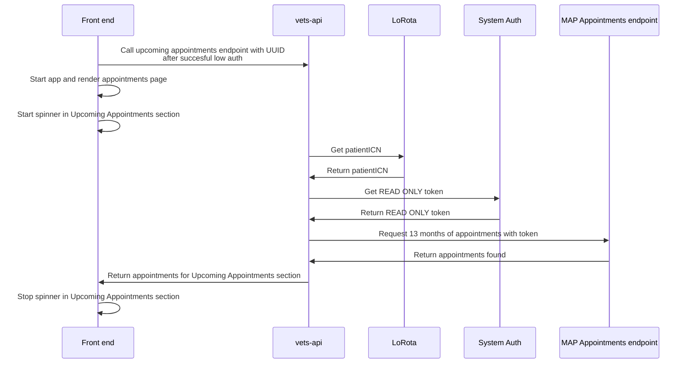

# Fetch all appointments
As part of unified check-in. We would like to show all upcoming appointments a patient may have across all stations.

Currently we only fetch appointments per station, using the patient's station specific DFN.

We have discovered that we will be able to use the System Auth service to get a token to interact with a MAP VAOS endpoint with READ ONLY access.
From Stephen in [slack:](https://dsva.slack.com/archives/C022AC2STBM/p1693922342577409?thread_ts=1692893127.087559&cid=C022AC2STBM) 
*Confirming that we can use System Auth with the new token exchange service to make calls into MAP.*

OpenAPI spec for MAP VAOS service: https://veteran.apps.va.gov/vaos/v1/

## Proposed implimentation

Frontend and backend engineers met up to discuss and we agreed that this would be best implimented in vets-api. 

The idea is that we would keep the appointment(s) that are in the current context coming from vetext and stored in LoRota. After a patient auths into the app via LoRota, we would kick off an API request to vets-api with the LoRota UUID.

In vets-api, the patient ICN would be fetched from LoRota. The patient ICN is currently stored in the patient object in the appointments payload. Using the ICN we would make the handshake with System Auth to get the READ ONLY token to request the appointments from the MAP appointments API.

This will allow us to load the app as soon as possilbe and show the "What to do next" section while still fetching the "Upcoming appointments", it also allows access to completing check-in/pre-check-in if the all appointments fetch fails in anyway.

We should add a loading spinner to this section and have a failed message to display in the appointments place if the fetch fails.

